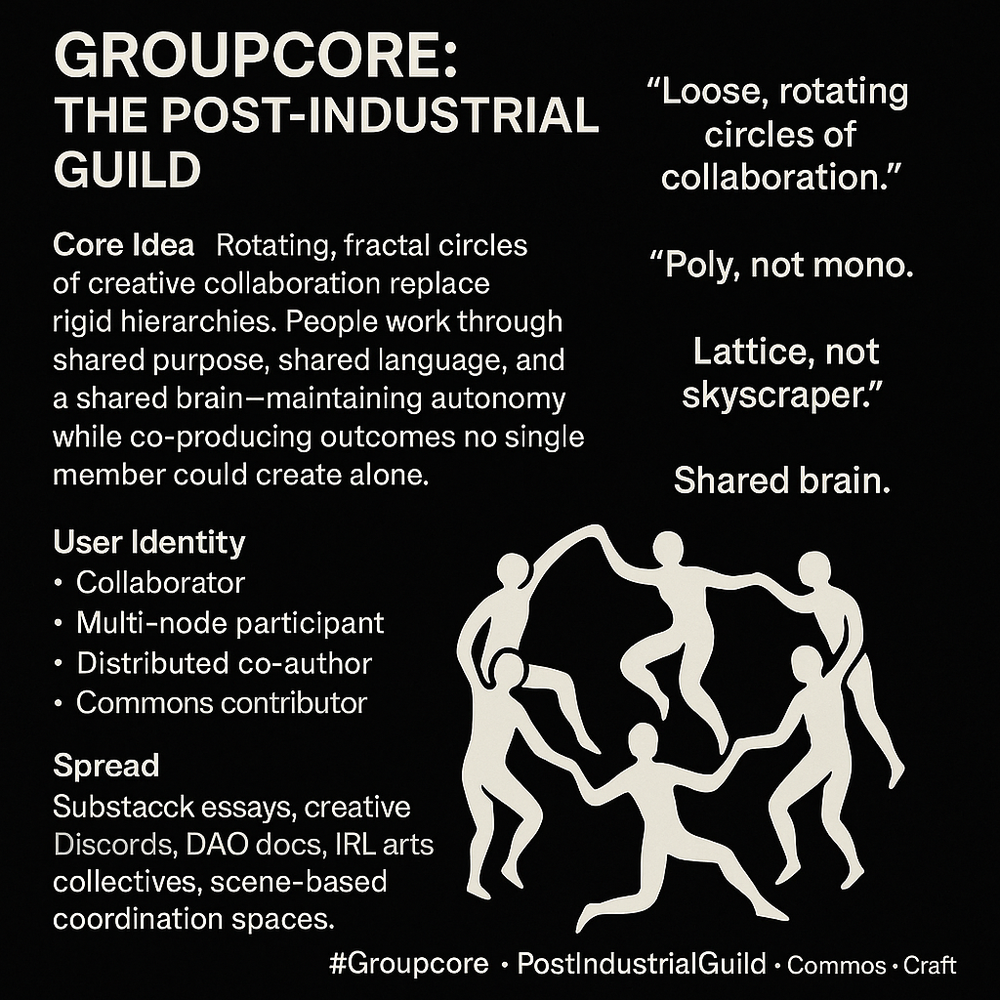

# Embracing Groupcore: A New Creative Guild

Created at 2025/11/20 2:52 PM

**🧩 Title: Groupcore: The Post-Industrial Guild**
Source: [YANCEY STRICKLER](https://ideaspace.ystrickler.com/p/defining-groupcore)  ⸻  ∴ Core Idea Unit  A mode of creative cooperation where loose, rotating circles of collaboration replace formal organizations. People coordinate through shared purpose, shared language, and shared resources—producing work none could make alone while retaining autonomy.  ⸻  ▲ Identity Play & Roles  (text-faithful, minimal creativity) • Collaborator — participates in fluid circles of cooperative work • Multi-node participant — active across several overlapping groups • Distributed co-author — contributes to collective output via a shared brain • Commons contributor — brings skills, audience, and resources into the shared pool  ⸻  ≈ Emotional Triggers  • Relief from hierarchy • Belonging without dependency • Creative flow through shared intention • Nostalgic resonance of guildcraft in a modern form • Warmth of scene-like cooperation  ⸻  𐂷 Spread Mechanics  Distribution Vectors: Substack essays, creative Discords, DAO documentation, arts collectives, cooperative workspaces Propagation Style: minimal, infrastructural, diagrammatic, anti-hierarchical language; emphasis on norms, patterns, and shared stacks  ⸻  ⛨ Defense Reflexes  • Fluidity resists capture (“we shift as needed”) • Distributed authorship diffuses ownership and critique • Identity of “lattice not skyscraper” precludes hierarchy accusations • Fractal structure reframes conflict as pattern, not failure • Poly-membership blurs external control  ⸻  ☷ Memeplex Anchor Points  Commons-based peer production · Digital guild revival · Post-industrial craft practices · DAO heterarchy · Creative anti-fragility · Scene culture  ⸻  ✶ Sticky Symbols / Quotes  • “Loose, rotating circles of collaboration.” • “Poly, not mono.” • “Lattice, not skyscraper.” • “Shared brain.” • “Fractal and anti-fragile.” • Icon: dancers-in-a-ring / linked silhouettes  ⸻  ∿ Tags  #Groupcore · #PostIndustrialGuild · #CommonsCraft · #CreativeLattice 

## Resources
- https://object.me.bot/front-img/note/attachments/img/1763679133795/4FC1485E-76AF-4F84-9461-00773B0D9BA8.png

## Insight

* The concept of "Groupcore" emphasizes a shift from traditional organizational hierarchies to fluid, collaborative structures, reflecting a modern take on guilds where members share resources and creativity, akin to pre-industrial community practices. This aligns with historical guilds that united artisans for mutual support and skill-sharing.

* The model encourages various roles, such as the "multi-node participant" and "distributed co-author," highlighting the importance of diverse contributions in collaborative efforts, reminiscent of platforms like open-source communities where individuals from different backgrounds contribute unique skills.

* Emotional triggers such as "relief from hierarchy" and "creative flow through shared intention" illustrate a desire for collaboration that fosters a sense of belonging without rigid control. This reflects contemporary movements in organizational theory that value autonomy and collective brainstorming over top-down decision-making.

* The mention of "sticky symbols" and phrases like “lattice, not skyscraper” encapsulates the idea of interconnectedness and shared ownership. This notion can be found in other decentralized models, such as decentralized autonomous organizations (DAOs), which promote fluid governance structures.

* The distribution vectors, including Substack essays and creative Discords, highlight the innovative ways in which these collaborative paradigms spread. This mirrors current trends in digital culture where communities form around shared interests, leveraging technology to create participatory spaces that nourish creativity and collaboration.
