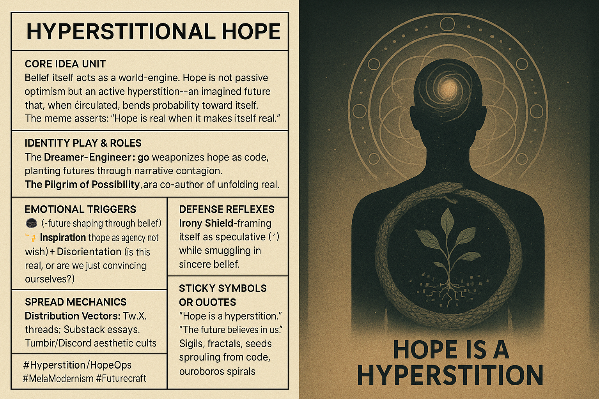

# Hyperstitional Hope: Belief as World-Engine

Created at 2025/08/29 6:30 AM

🧩 **Title: Hyperstitional Hope**

### ∴ Core Idea Unit

Belief itself acts as a world-engine. Hope is not passive optimism but an active hyperstition—an imagined future that, when circulated, bends probability toward itself. The meme asserts: *“Hope is real when it makes itself real.”*

### ▲ Identity Play & Roles

- **The Dreamer-Engineer**: one who weaponizes hope as code, planting futures through narrative contagion.
- **The Pilgrim of Possibility**: positioned not as a naïve believer, but as a co-author of unfolding reality.

### ≈ Emotional Triggers

- 🤯 Awe (future shaping through belief)
- ✨ Inspiration (hope as agency, not wish)
- 😬 Disorientation (is this real, or are we just convincing ourselves?)

### 𐂷 Spread Mechanics

- **Distribution Vectors:** Twitter/X threads, Substack essays, Tumblr/Discord aesthetic cults.
- **Propagation Style:** Paradoxical aphorisms, poetic theory-fiction, screenshots of highlighted passages, minimalist sigil-like graphics.

### ⛨ Defense Reflexes

- **Irony Shield:** frames itself as speculative (“just a thought experiment”) while smuggling in sincere belief.
- **Ambiguity:** keeps hope both myth and method, so it resists falsification.

### ☷ Memeplex Anchor Points

- 📖 Esoteric theory (Nick Land, CCRU hyperstition)
- 🌱 Regenerative futurism / solarpunk optimism
- 🌀 Meta-modernism (irony + sincerity loop)
- ✝️ Post-Christian eschatology (hope as secular salvation)

### ✶ Sticky Symbols or Quotes

- “Hope is a hyperstition.”
- “The future believes in us.”
- Sigils, fractals, seeds sprouting from code, ouroboros spirals.

### ∿ Tags

#Hyperstition · #HopeOps · #MetaModernism · #Futurecraft · #BeliefEngines

[Read more from Memetic Cowboy in Memetic Analysis: "Hyperstition."](https://memeticcowboy.substack.com/p/memetic-analysis-hyperstition)
