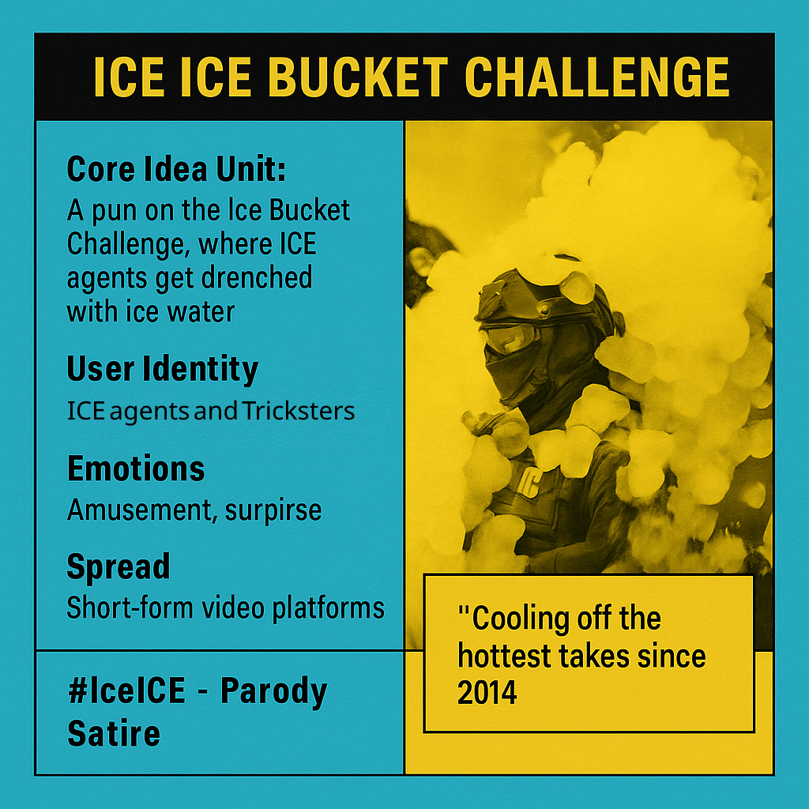

# Ice Bucket Parody Flips Immigration Debates

Created at 2025/09/28 1:18 PM

🧩 **Title**: *The Ice ICE Bucket Challenge*

🧠 **Core Idea Unit** Satirically remixing the ALS Ice Bucket Challenge by dumping literal ice water on ICE agents, playfully “cooling off” heated immigration debates while flipping a viral format into critique, parody, or activism.

🎭 **Identity Play & Roles**

- **Viewer/User as Rebel Trickster**: weaponizing humor and slapstick against authority.
- **Agents as Stoic NPCs**: suddenly humanized by slapstick vulnerability.
- **Audience as Participant**: encouraged to “ice ICE” via videos, filters, or donations.

💥 **Emotional Triggers** 😆 Humor · 😡 Defiance · 🤯 Surprise · 🧠 Irony · 🌀 Relief Mix of slapstick comedy with political catharsis.

📡 **Spread Mechanics**

- **Distribution Vectors**: TikTok short skits, Instagram AR filters, Twitch fundraisers, Twitter/X memes.
- **Propagation Style**: Satirical parody, remix of pop-culture formats, activist “causeplay,” brand-joke virality.

🛡️ **Defense Reflexes**

- **Irony shield**: framed as “just a joke,” hard to pin down as pure activism.
- **Parody license**: positions itself in lineage of the ALS challenge.
- **Multipurpose framing**: can be absurdist entertainment, political critique, or charity stunt.

🧬 **Memeplex Anchor Points**

- ✊ Anti-authoritarian satire
- 📱 Viral challenge culture
- 🌊 Immigration rights activism
- 🧠 Remix culture / memetic play
- ⚖️ Justice-through-parody tradition

🧠 **Sticky Symbols or Quotes**

- **Symbols**: bright-orange Gatorade cooler, tactical gear + icy splash, towels/QR codes, AR filter buckets.
- **Catchphrases**: • “Cooling off the hottest takes since 2014.” • “Iced ICE.” • “Chilling the caseload.” • “White-out the fear.”

🏷️ **Tags** #IceICEBucketChallenge · #SatireMeme · #CoolTheDebate · #ImmigrationJustice · #ActivistRemix

***

## Resources
- https://object.me.bot/front-img/users/send/img/1759090701267_c4zhf/8707ae42-8213-4eab-9189-1bbcfe8881e2.png

## Insight

* This image cleverly reimagines the viral ALS Ice Bucket Challenge into a satirical protest format by replacing the chilling water with literal ice on ICE agents, symbolizing a form of humor turned activism that critiques immigration enforcement through absurdist imagery.
* The visual employs the iconic 'ice packing' or 'ice bucket' motif, but in a militarized, tactical setting, contrasting the typical lighthearted challenge with a stark, provocative commentary on enforcement policies—highlighting the power of parody to subvert authority figures.
* The core idea of “cooling off the hottest takes since 2014” underscores the meme's playful yet biting critique, emphasizing how viral trends can be repurposed to challenge hot-button political issues—here, immigration—by blending pop culture with activism, a hallmark of remix culture.
* The inclusion of a bright orange Gatorade cooler and AR filter buckets adds a layer of visual parody, mimicking challenge videos while injecting absurdity, which makes the message easily shareable across social media platforms, facilitating viral spread and engagement.
* This imagery exemplifies how social media campaigns can blend humor, irony, and political critique—using slapstick visuals to humanize typically stoic authority figures, thereby fostering emotional reactions ranging from humor to outrage and reflection, sparking dialogue through parody.
* Reflecting the memeplex anchor points, the setup embodies anti-authoritarian satire and justice-oriented activism, leveraging viral challenge culture not just for entertainment but as a form of political commentary, aligning with activist remix traditions that seek impact through meme evolution.
* The visual and textual cues suggest a strategic framing: the absurdity of an "Ice ICE Bucket Challenge" becomes an ironic shield, making criticism less confrontational and more engaging, thus encouraging participation in a meme that doubles as satire, fostering a collective voice against enforcement policies.
