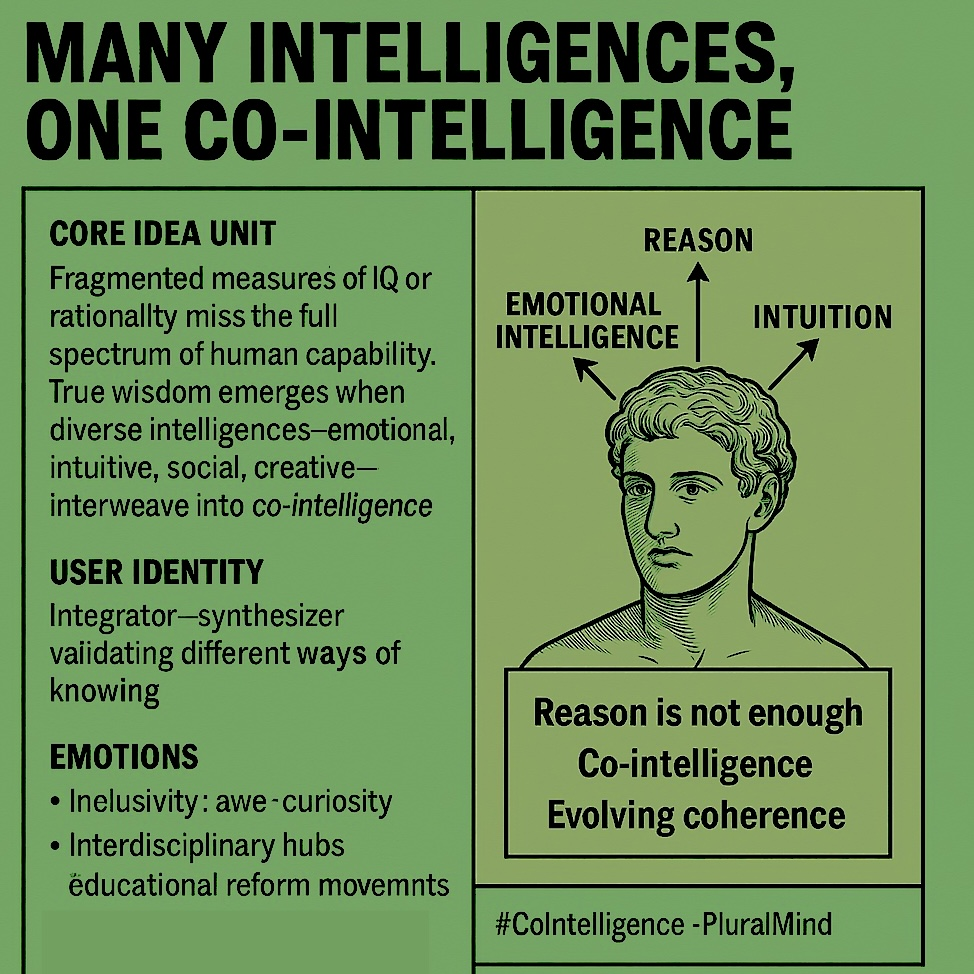

# Integrating Diverse Intelligences for Co-Wisdom

Created at 2025/09/27 10:13 PM

🧩 Title: Many Intelligences, One Co-Intelligence
### ∴ Core Idea Unit

Fragmented measures of IQ or rationality miss the full spectrum of human capability. True wisdom emerges when diverse intelligences—emotional, intuitive, social, creative—interweave into co-intelligence.
### ▲ Identity Play & Roles

Positions the self as an Integrator—a synthesizer who validates different ways of knowing and brings them into coherent collective practice.
### ≈ Emotional Triggers

-	🌱 Inclusivity (all intelligences valued)
-	🤯 Awe (holistic view of intelligence)
-	🧠 Curiosity (rethinking what counts as “smart”)
### 𐂷 Spread Mechanics

-	Vectors: Interdisciplinary research hubs, TED-style talks, educational reform movements, AI discourse.
-	Propagation Style: Systems-parable, wisdom rhetoric, inclusive framing.
### ⛨ Defense Reflexes

-	Deflects critique of vagueness by invoking holistic necessity (“reductionism blinds us”).
-	Uses pluralism shield—cannot be attacked without appearing elitist or narrow-minded.
### ☷ Memeplex Anchor Points

-	🌍 Holistic education movements (Howard Gardner, multiple intelligences)
-	🤝 Collective intelligence & systems theory
-	🧘 Integrative psychology / spirituality
-	🤖 Hybrid human–AI cognition debates
### ✶ Sticky Symbols or Quotes

-	“Reason is not enough.”
-	“Co-intelligence = evolving coherence.”
-	“All intelligences weave the whole.”
### ∿ Tags

#CoIntelligence · #PluralMind · #SystemicWisdom · #HybridIntelligence
