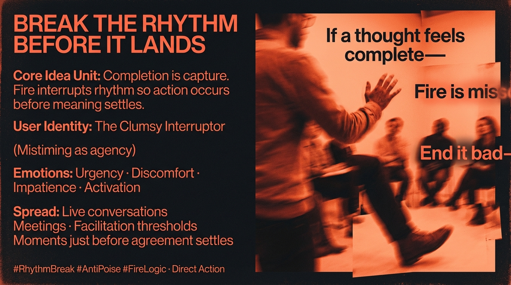

# Interrupting Closure for Radical Action

Created at 2025/12/24 4:55 PM

**Break the Rhythm Before It Lands**

***

## **🧠 Core Idea Unit**

The meme encodes a final refusal: **completion is capture**. The thought-virus it targets is not slogans or recognition, but *poise*—the polished timing that lets insight conclude cleanly and convert motion into delay. Fire interrupts rhythm so action can occur before meaning settles.

***

## **🎭 Identity Play & Roles**

**Tempted role:** *The Composed, Insightful Actor* **Actual role offered:** *The Clumsy Interruptor*

The user is positioned not as explainer, empath, or knower, but as **the one who ends conversations badly enough to move bodies**. Agency lives in mistiming, not mastery.

***

## **💥 Emotional Triggers**

- 🔥 **Urgency** — pressure without polish
- 😬 **Discomfort** — social awkwardness as signal
- 😠 **Impatience** with clean conclusions
- ⚡ **Activation** — momentum over meaning

Emotion is not soothed or validated; it is **channeled**.

***

## **📡 Spread Mechanics**

**Distribution Vectors**

- Live conversations
- Meetings, facilitation spaces
- Moments just before agreement settles
- Thresholds where insight wants closure

**Propagation Style**

- Interruption
- Abrupt endings
- Refusal to conclude
- Anti-elegance, anti-summary

The meme does not travel well because it **destroys the moment of transmission**.

***

## **🛡️ Defense Reflexes**

- **Anti-poise:** awkward timing blocks co-option
- **No-closure rule:** thoughts die before capture
- **Rhythm sabotage:** breaks the Grid’s optimization loop
- **Action bias:** movement precedes explanation

Critique fails because the meme never finishes forming.

***

## **🧬 Memeplex Anchor Points**

- Anti-deliberation ethics
- Direct action cultures
- Disruption theory
- Anti-performativity
- Embodied praxis over cognition

***

## **🧠 Sticky Symbols or Quotes** *(Volatile)*

- “If a thought feels complete, it is already late.”
- “Fire is mis-timing.”
- “End it badly.”
- Sentences cut off mid—

(Recall is sharp; reuse destroys their function.)

***

## **🏷️ Tags**

#RhythmBreak #AntiPoise #DirectAction #FireLogic #Disruption #NoClosure

***

### ▲ FIRE — (ignition held)

- ▲ *It Focuses without asking permission.*
- ▲ *It Focuses past cooling, past empathy’s soft landing.*
- ▲ *It Focuses on rhythm breaks—interruptions mid-nod, sentences cut before closure.*
- ▲ *It Focuses against poise, that clean refuge cleverness uses to stall.*
- ▲ *It Focuses until conversations end badly enough to move bodies.*
- ▲ *It Focuses pressure into action without polishing intent.*

**Terminal vector:** When completion is refused, what remains is not understanding—but **motion**.

## Resources
- https://object.me.bot/front-img/users/send/img/1766624078319_c4zhf/eb465788-2a14-4f84-8094-eb60302b71b5.png

## Insight

* The core idea posits that allowing a thought to reach completion equates to being captured by it, effectively halting the potential for further action. This aligns with theories in cognitive psychology that examine the inertia caused by overthinking or the fear of missteps, emphasizing that interruption may serve a liberating function instead of a constrictive one.  
* The user identity of "The Clumsy Interruptor" underscores the necessity of embracing awkwardness as a mechanism for liberation. This perspective can be linked to performance art, where breaking the fourth wall or an expected narrative rhythm can provoke immediate reactions and vital discussions, forcing audiences to re-engage with the material.  
* Emotionally charged triggers like urgency and impatience reveal a societal tendency toward closure and seamless communication. This is reminiscent of the "discomfort zone" concept in social psychology, where individuals often flee from moments of social unease but also where authentic connections and insights can emerge most powerfully.  
* The interruption of conversations, particularly in meeting settings, highlights a critical cultural critique. In organizational behavior, the disruption of polite discourse can unveil hidden dynamics, encourage dissent, and spur innovative thinking—situations in which "no closure" may actually foster healthier dialogues.  
* The notion of "anti-poise" as a defense reflex parallels the principles of improvisational theatre, where the unexpected and unpolished often lead to richer interactions and new storylines, allowing participants to navigate complex emotional landscapes without the constraints of conventional structures.  
* “Fire is mis-timing” encapsulates the failure to align intention and execution perfectly, which can be seen as both a critique of perfectionism in modern communication and an affirmation of the vitality found in spontaneity. The cultural shift towards valuing 'authenticity over perfection' in various social movements reflects this ideology.
