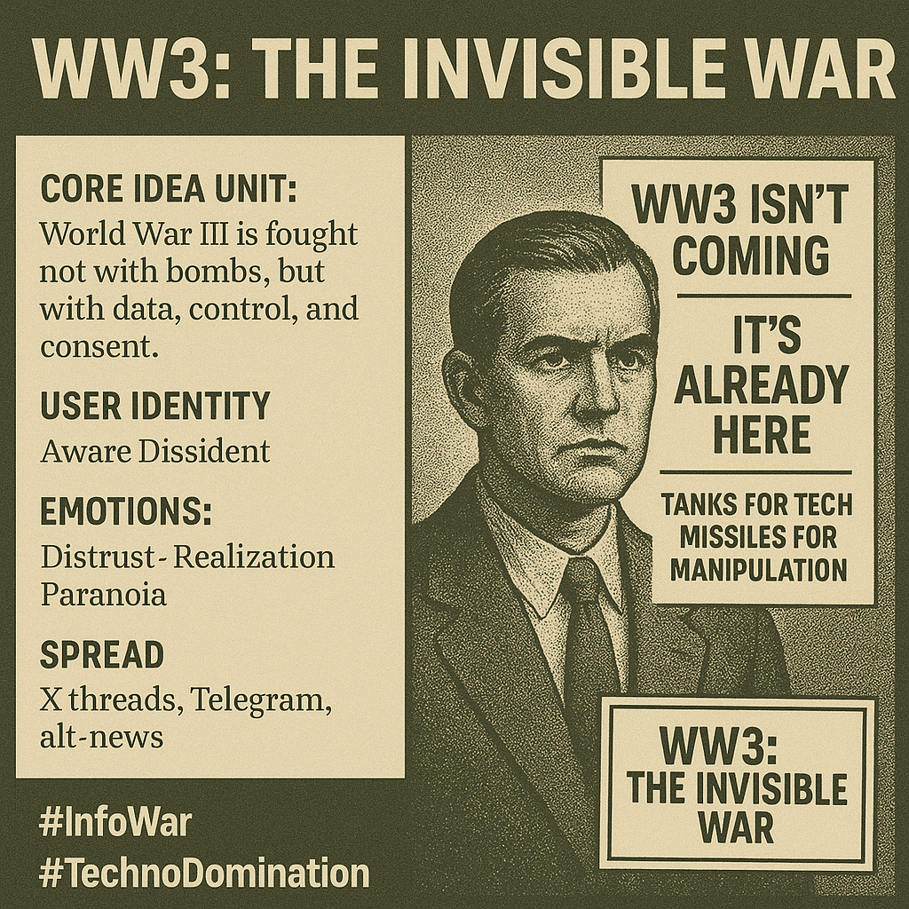

# Invisible War: Control Through Data and Consent

Created at 2025/10/18 9:43 AM

### ◈ Mini-Memetic Profile: **WW3: The Invisible War**

***

∴ **Core Idea Unit:** World War III isn’t fought with bombs, but with data, control, and consent. The meme reframes warfare as psychological and infrastructural — an invisible struggle over minds, systems, and digital terrain rather than physical territory.

***

▲ **Identity Play & Roles:** **Role:** The Aware Dissident / Digital Survivalist The meme casts the viewer as someone who *sees through* the illusion of peace — a decoder in an age of invisible warfare. It positions the self as resistant to manipulation and skeptical of official narratives.

***

≈ **Emotional Triggers:** 😡 Distrust — toward governments and tech monopolies 🤯 Realization — the shock of recognizing subtle domination 😨 Paranoia — awareness of unseen control mechanisms 🔥 Defiance — reclaiming agency through awareness

***

𐂷 **Spread Mechanics:** **Distribution Vectors:** X threads, Telegram channels, alt-news spaces, prepper forums, digital sovereignty communities. **Propagation Style:** Apocalyptic realism meets info-aesthetic design — uses meme-infographics and cinematic contrast (“tanks vs. tech”) to dramatize unseen warfare.

***

⛨ **Defense Reflexes:** **Irony Shield:** “It’s just a meme — unless you notice.” **Ambiguity Layer:** The meme blends truth and speculation, creating plausible deniability. **Moral Framing:** “Wake up before it’s too late” — urgency disarms critique.

***

☷ **Memeplex Anchor Points:** ⚙️ Tech-skepticism · 🧠 Info-warfare · 🧬 Surveillance capitalism critique · 🕳️ Conspiracy semiotics · 🌍 Digital sovereignty · 🧩 Hyperreality awareness

***

💬 **Sticky Symbols / Quotes:**

- “They don’t need bombs when they control minds.”
- “WW3 isn’t coming — it’s already here.”
- “Tanks for tech. Missiles for manipulation.” **Visuals:** drones over cell towers, contrails crossing the sky, digital static overlays, data clouds replacing smoke.

***

∿ **Tags:** #InfoWar · #TechnoDomination · #DigitalControl · #HyperrealWarfare · #InvisibleEmpire · #MemeticWarfare

***

Source: [x/GlamGrafter](https://x.com/GlamGrafter/status/1978902440192704787)

CTA: [Join the Memescape Mindshifters X Community](https://x.com/i/communities/1893788598295753081)

## Resources
- https://object.me.bot/front-img/users/send/img/1760805676521_c4zhf/c492dc5c-2c35-4644-bb36-a4a29907fee4.png

## Insight

* The image encapsulates a notion of "invisible warfare," suggesting that modern conflicts are increasingly fought not on physical battlefields, but through psychological manipulation and data control. This reframing aligns with contemporary discourse on how technology and information shape societal norms and perceptions, echoing themes found in works by authors like Marshall McLuhan and Neil Postman, who emphasized media's role in shaping public consciousness.  
* The identity of the "Aware Dissident" positions the viewer as actively skeptical, serving as a critique of mainstream narratives. This mirrors historical movements where individuals resisted dominant ideologies, such as during the Counterculture of the 1960s, which similarly questioned governmental and societal norms.  
* Emotional triggers like distrust and paranoia reflect the current zeitgeist, where many feel overwhelmed by the complexities of digital surveillance and misinformation. This phenomenon has been explored in numerous psychological studies, such as those examining the effects of constant connectivity and the erosion of privacy on mental health.  
* The propagation of these ideas through platforms like X and Telegram speaks to the decentralized nature of modern information dissemination, challenging traditional media gatekeeping. This mirrors the rise of alternative news sources and digital communities akin to the underground press movements that emerged during the Vietnam War era.  
* The visual design, with stark contrasts akin to propaganda posters, invokes early 20th-century wartime graphics, creating a sense of urgency and seriousness. This tension between aesthetics and message can be linked to techniques employed in graphic design and advertising, emphasizing the power of visual rhetoric in shaping public opinion and mobilization.
