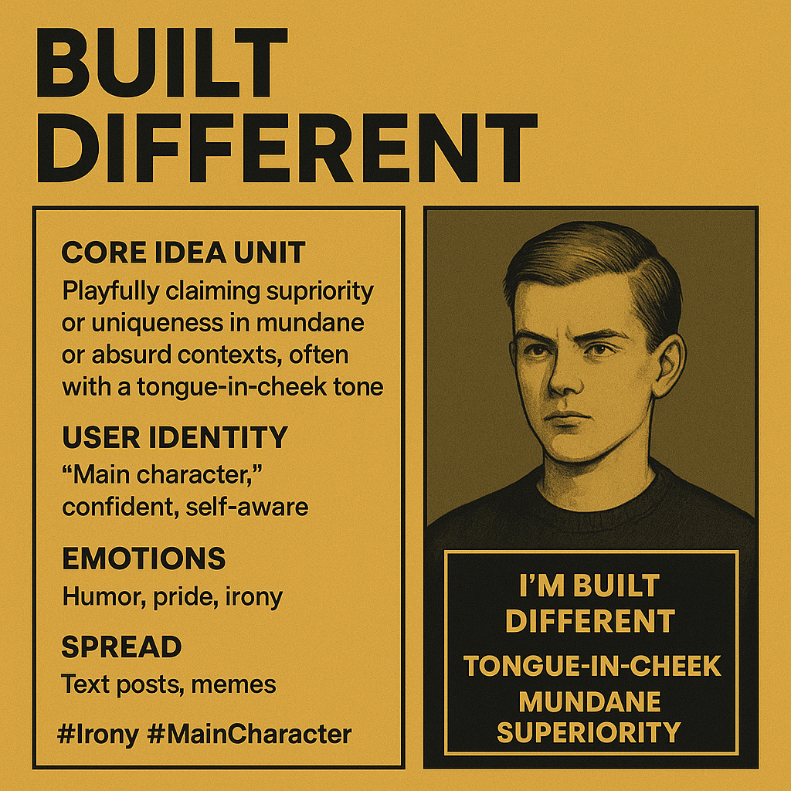

# "Built Different": Irony and Mundane Superiority

Created at 2025/07/29 7:19 AM

Built Different – Ironic Self-Aggrandizement

∴ Core Idea Unit:**

- Playfully claims superiority or uniqueness in mundane or absurd contexts, framed with tongue-in-cheek irony.
- Encodes the idea that trivial quirks or habits can be reframed as evidence of exceptionalism.

▲ Identity Play & Roles:**

- Positions the meme user as a **self-aware “main character”**, confident yet ironic.
- Embodies the role of a humorous, niche insider who leans into their quirks.

≈ Emotional Triggers:**

- Humor (through absurdity and playful exaggeration)
- Pride (celebrating individuality)
- Irony (self-mockery softens any perceived arrogance)

𐂷 Spread Mechanics:**

- **Distribution vectors:** X/Twitter posts, TikTok captions, Instagram memes, reaction replies.
- **Propagation style:** Ironic self-flexing, subtle satire, performative confidence.
- **Contextual amplification:** Memes gain traction when paired with an image or clip “proving” the difference.

⛨ Defense Reflexes:**

- **Irony shield:** If criticized, the exaggerated tone signals it’s not to be taken literally.
- **Pre-dismissal of critics:** Those who object are framed as humorless or missing the joke.

☷ Memeplex Anchor Points:**

- Post-2020 digital irony culture and “main character energy.”
- Niche subcultures (gaming, fitness, foodie, fandom micro-communities).
- Individualist, self-branding microcelebrity logic.

✶ Sticky Symbols or Quotes:**

- “I’m built different”
- Variants: “Built different for [quirk]” / “They don’t make ’em like me.”
- Visual: Self-portraits, quirky performance clips, or absurd proof shots.

∿ **Tags:** #Irony #BuiltDifferent #MainCharacterEnergy #PostIrony #SubcultureMeme

## Resources
- https://object.me.bot/front-img/note/attachments/img/1753798789801/7BD3386C-E7C4-43B3-AD7B-2C0161E6BE27.png

## Insight

*   The image encapsulates the essence of the "Built Different" meme, which is rooted in ironic self-aggrandizement. It's a way of playfully claiming superiority or uniqueness, often in mundane or absurd contexts. This meme leverages humor, pride, and irony to create a sense of niche identity and belonging.

*   The meme's structure, as depicted in the image, highlights its core components: a playful claim of superiority, the user's self-aware "main character" identity, and the emotions it evokes. The spread mechanics, primarily through text posts and memes, indicate its digital native nature. The hashtags #Irony and #MainCharacter further contextualize its place within internet culture.

*   The phrase "I'm built different" is a modern twist on the age-old human tendency to seek individuality and recognition. It echoes sentiments found throughout history, from ancient philosophers pondering the uniqueness of the self to modern self-help gurus advocating for embracing one's authentic identity. However, the meme adds a layer of irony, acknowledging the often trivial nature of the claimed difference.

*   The visual element of the meme, represented by the portrait, adds another layer of interpretation. The individual's expression and demeanor can either amplify the ironic tone or create a contrast that enhances the humor. This interplay between text and image is crucial to the meme's effectiveness and virality.

*   The "Built Different" meme can be seen as a response to the pressures of conformity and the desire for self-expression in the digital age. It allows individuals to carve out a unique identity, even if it's based on trivial quirks, and to connect with others who share similar sensibilities. This sense of belonging and shared humor is a key driver of its popularity.
