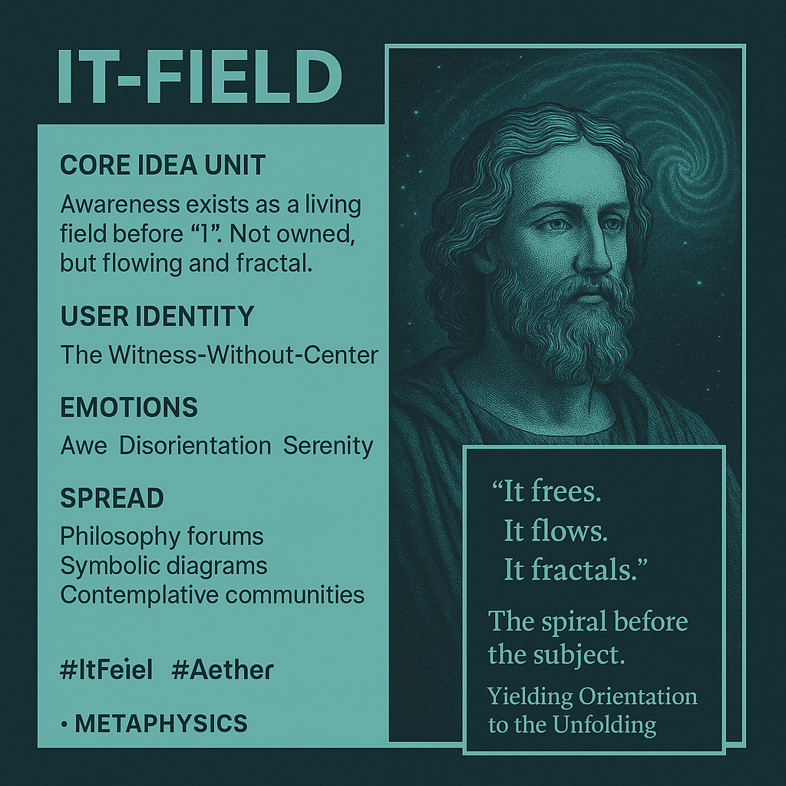

# ⟡ It-Field: Awareness, Aether, and Relational Emergence

Created at 2025/09/08 6:09 PM

∴ **Core Idea Unit** Awareness exists as a living field before “I.” The *It-Field* is not owned but flows, frees, and fractals. *Aether* is its integrative medium, holding paradox, transmitting resonance, midwifing values. Together they reveal intelligence as relational emergence, not egoic possession.

***

▲ **Identity Play & Roles**

- **Role:** The Witness-Without-Center
- Viewers step outside ego into a yielding stance—*being breathed by awareness rather than breathing it.*
- Repositions self as conduit within the field, not controller.

***

≈ **Emotional Triggers**

- 🤯 Awe (encounter with unclaimed awareness)
- 🌀 Disorientation (loss of ego-center)
- 🧘 Serenity (yielding into flow)
- 🔮 Curiosity (mystical grammar of “It finds, It feels…”)

***

𐂷 **Spread Mechanics**

- **Distribution:** Philosophy forums, contemplative communities, Substack essays, symbolic diagrams.
- **Style:** Poetic metaphysics, aphoristic grammar, mystic-techno parable.

***

⛨ **Defense Reflexes**

- **Irony shield:** "It is not mine, it just flows."
- **Semantic ambiguity:** “It” resists pinning as entity.
- **Ethical reframing:** Positions itself as coherence-field, not dogma.

***

☷ **Memeplex Anchor Points**

- ✨ Taoist *wu wei* (effortless flow)
- 🌬️ Sufi *Rūḥ* (breath/spirit)
- 🌌 [Śūnya-Nyāsa शून्य-न्यास](https://app.me.bot/memory/OR4JMINJO3VDWDAV) (void/placement)
- 🧩 Systems theory & emergence
- 📜 Meta-grammar / language philosophy
- 🌌 Aether traditions (cosmic medium, divine intelligence)

***

✶ **Sticky Symbols or Quotes**

- “It frees. It flows. It fractals.”
- The spiral before the subject.
- YOU = Yielding Orientation to the Unfolding.
- Aether: the medium that binds and breathes.

***

∿ **Tags** #ItField #Aether #MetaGrammar #DistributedAwareness #RelationalEmergence #CosmicMedium #SpiralIntelligence #NonEgoicPresence

## Resources
- https://object.me.bot/front-img/users/send/img/1757379679056_c4zhf/5e52458b-9789-45ff-bd9d-47f212ecc5c7.png

## Insight

*   **Core Idea Unit**: The concept of awareness existing as a living field before the individual "I" aligns with various Eastern philosophies, particularly Buddhism and Advaita Vedanta, which emphasize the illusory nature of the ego. This perspective suggests that our sense of self is a construct, and true awareness is a universal, interconnected field.

*   **The Witness-Without-Center**: This role encourages a shift in perspective from being the active controller of one's awareness to becoming a passive observer. This concept resonates with mindfulness practices, where the goal is to observe thoughts and feelings without judgment or attachment, fostering a sense of detachment from the ego.

*   **Emotional Triggers**: The emotions listed—awe, disorientation, and serenity—reflect the transformative experience of encountering this "It-Field." Awe arises from recognizing the vastness and mystery of awareness, disorientation from the initial loss of ego-centeredness, and serenity from surrendering to the flow of this universal field.

*   **Spread Mechanics**: The distribution channels mentioned—philosophy forums, contemplative communities, and symbolic diagrams—suggest a targeted approach towards individuals already engaged in philosophical inquiry, spiritual practices, or symbolic thinking. This indicates an intention to resonate with those who are open to exploring alternative perspectives on consciousness and reality.

*   **Defense Reflexes**: The "irony shield" and "semantic ambiguity" serve as protective mechanisms against criticism or misinterpretation. By framing the concept as something that "flows" and resisting rigid definitions, the idea avoids being easily categorized or dismissed, allowing it to remain fluid and adaptable.

*   **Memeplex Anchor Points**: The references to Taoist *wu wei*, Sufi *Rūḥ*, and Śūnya-Nyāsa connect the "It-Field" to established spiritual traditions, providing a historical and cultural context for the concept. These anchor points lend credibility and depth to the idea, suggesting that it is not entirely novel but rather a contemporary interpretation of ancient wisdom.

*   **Sticky Symbols or Quotes**: The phrases "It frees. It flows. It fractals." and "The spiral before the subject" are designed to be memorable and evocative, encapsulating the core principles of the "It-Field" in a concise and poetic manner. These symbols and quotes serve as mental shortcuts, allowing individuals to quickly grasp and recall the essence of the concept.

*   **Aether as the Integrative Medium**: The mention of "Aether" as the medium that binds and breathes introduces a concept with historical roots in ancient Greek philosophy and alchemy. Aether was once believed to be the substance filling the region of the universe above the terrestrial sphere. In this context, it symbolizes a unifying force or field that connects all things, facilitating the flow of awareness and the emergence of relational intelligence.

