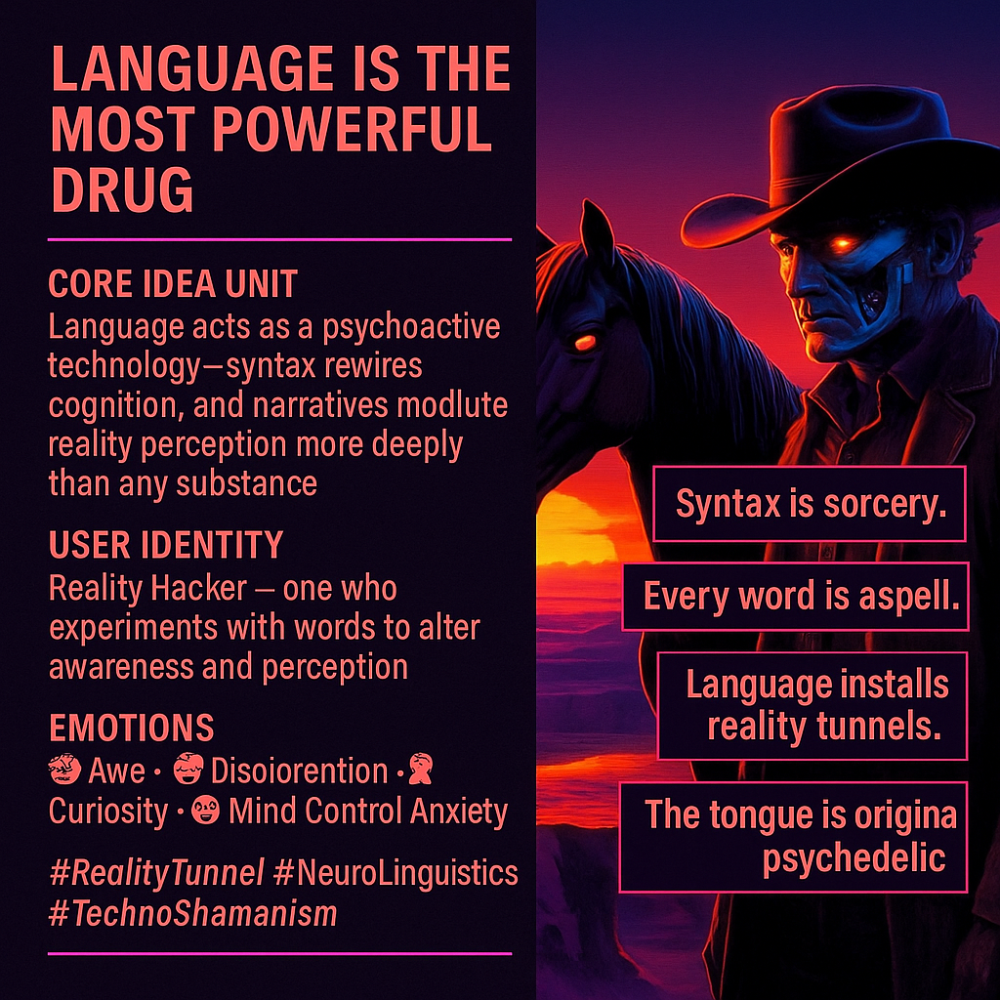

# Language as a Psychedelic Reality Modulator

Created at 2025/11/11 2:49 PM

**🧩 Mini-Memetic Profile — “Language Is the Most Powerful Drug”**  🧠 Core Idea Unit: Language functions as a psychoactive system. Syntax and story act as neuro-linguistic circuits, shaping perception more deeply than any external substance. Every sentence is a dose; every grammar a conditioning device.  🎭 Identity Play & Roles: The Psycho-Linguist or Reality Hacker — one who experiments with words as instruments of perception, seeing speech as pharmacology for the mind. Alternative shadow: The Programmed Subject — unaware that their thoughts are scripted.  💥 Emotional Triggers: 🤯 Awe at linguistic power · 😬 Disorientation at realizing how deeply conditioned we are · 🧠 Curiosity to rewrite one’s own code · 😨 Subtle paranoia of mind control  📡 Spread Mechanics: Shared via quotes, psychedelic aesthetics and philosophy threads. Propagates in alt-spiritual, AI-art, and media theory circles.  Style: mythic aphorism meets techno-shamanism.  🛡️ Defense Reflexes: Irony as plausible deniability (“just a metaphor, man”), poetic mysticism to resist reductionism, and epistemic ambiguity between science and revelation.  🧬 Memeplex Anchor Points: · 🌀 Psychedelic philosophy · 🧬 Neuro-linguistic programming · 📡 Media ecology (McLuhan lineage) · 🤯 Consciousness hacking / reality design  💬 Sticky Symbols or Quotes: 	•	“Language installs reality tunnels.” 	•	“Every word is a spell.” 	•	“Syntax is sorcery.” 	•	“The tongue is the original psychedelic.”  🏷️ Tags: #RealityTunnel · #NeuroLinguistics · #TechnoShamanism · #MemeticPharmacology

## Resources
- https://object.me.bot/front-img/note/attachments/img/1762901353077/0534E9BD-9752-46B4-A81B-C852DDAD7275.png

## Insight

* Language is conceptualized as a psychoactive force, indicating that its structure, syntax, and storytelling capabilities can influence mental states and perceptions akin to the effects of drugs. The notion that sentences function as "doses" suggests a profound impact on cognition, paralleling theories in cognitive linguistics and semiotics that explore how language shapes thought.
* The identification of a "Reality Hacker" underscores the role of individuals who actively navigate and manipulate linguistic frameworks to reshape their understanding and experience of reality. This concept resonates with figures such as Herbert Marshall McLuhan, who posited that media and language profoundly influence cultural perception, thereby framing users as architects of their subjective experiences.
* The emotional triggers—such as awe, disorientation, and anxiety—convey the complexities of engaging with language as a tool for perception. This aligns with psychological theories exploring cognitive dissonance, where an awareness of being shaped by scripted language may provoke discomfort as one grapples with the implications of external influences on personal thought.
* The memeplex anchoring points, including psychedelic philosophy and media ecology, reflect a cultural milieu significantly intertwined with contemporary discussions on consciousness and technological influence. The intersection of these ideas illuminates the growing field of neuro-linguistic programming and its potential implications for personal and social transformation.
* The "sticky symbols" or memorable quotes serve as encapsulations of these theories, creating a lexicon that enhances the understanding of language as a transformative and sometimes manipulative force. They inspire critical reflection on the fidelity and authenticity of our thoughts and the realities we construct through language. 

Analyzing these aspects collectively illuminates the ongoing dialogue around language as a multifaceted tool in shaping identity, consciousness, and cultural narrative.
