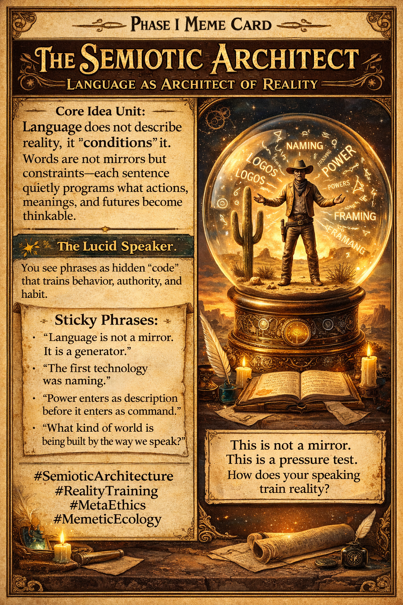

# Language as Architect of Reality

Created at 2025/12/25 7:46 AM

## 🧩 **The Semiotic Architect** *Language as Architect of Reality*

*Inspired by Amber Jensen: [Relational Integrity without Ontology] (https://amberjjensen.substack.com/p/relational-integrity-without-ontology)*

***

## 🧠 Core Idea Unit

**Semiotic Causalism**: Language does not describe reality; it *conditions it*. Words are not mirrors but constraints—each sentence quietly programs what actions, meanings, and futures become thinkable. Reality is not argued into being; it is *trained* through repeated descriptions.

**Mental shift provoked:** From *“What is true?”* → to *“What does this way of speaking make inevitable?”*

***

## 🎭 Identity Play & Roles

**Offered Role:** *The Lucid Speaker* One who perceives grammar as infrastructure. You no longer debate meanings—you notice how phrasing forges habits, power asymmetries, and ethical drift.

**Shadow Role (exposed, not attacked):** *The Sleep-Speaker* Those who treat language as neutral description, unaware that inherited phrases smuggle entire cosmologies into daily life.

**Repositioning:** The self is not a knower of facts but a **caretaker of semiotic environments**.

***

## 💥 Emotional Triggers

- 🌀 **Epistemic Vertigo** — realizing that “facts” are often stabilized speech habits
- 🧠 **Hyper-vigilance** — noticing ordinary phrases as quiet architectures of power
- ⚖️ **Sovereignty without ego** — responsibility for how one’s language trains reality, even when no one resists

Emotion is restrained, adult, and durable—discomfort without accusation.

***

## 📡 Spread Mechanics

**Vectors:**

- Substack essays & ethical dispatches
- Philosophy / AI / design discourse
- Mindfulness circles allergic to sentimentality

**Propagation Style:** **Oracular–Diagnostic**, not persuasive. Statements function as *pressure tests* (“This is not a mirror.”) The meme spreads by *exposing habits*, not recruiting belief.

***

## 🛡️ Defense Reflexes

- **Discomfort Reframe:** Resistance is framed as friction revealing habituation, not as an opponent to defeat.
- **Non-Conversion Clause:** “Nothing here is meant to convert you” disarms debate and relocates evaluation to lived resonance.
- **Threshold Logic:** The text cannot be easily agreed with or dismissed—only crossed or ignored.

***

## 🧬 Memeplex Anchor Points

- **Linguistic Relativity** — perception shaped by structure, not intention
- **Post-Structuralism** — discourse as reality-forming practice
- **Embodied Ethics** — habit over belief; training over stance
- **Post-Ontological Ethics** — coherence of action without categorical certainty
- **Magick / Semiotics** — “spelling” as world-shaping act, stripped of mysticism

***

## 🧠 Sticky Symbols & Phrases

- “Language is not a mirror. It is a generator.”
- “The first technology was naming.”
- “Power enters as description before it enters as command.”
- “What kind of world is being built by the way we speak?”
- “This is not a mirror. This is a pressure test.”

***

## 🏷️ Tags

#SemioticArchitecture #MetaEthics #LinguisticCausalism #RealityTraining #MemeticEcology #PostOntology #Psychotechnology

## Resources
- https://object.me.bot/front-img/users/send/img/1766677368660_c4zhf/b5e2fba8-6c9e-4d97-baed-863cc97c1946.png

## Insight

* The concept of **Semiotic Causalism** is fundamental in understanding how language interacts with reality. Instead of merely reflecting truth, language shapes reality by constraining possibilities and programming responses. This perspective aligns with the idea that our linguistic habits mold the frameworks through which we recognize and comprehend experiences.

* The role of the **Lucid Speaker** encourages active engagement with language, highlighting that communication is not just about exchanging information but rather about recognizing how phrasing affects behavior and power dynamics. This indicates a shift from passive reception of language to a more architectonic engagement, where individuals become aware of their responsibility in constructing social realities.

* The notion of **epistemic vertigo** taps into the discomfort of realizing that accepted facts can often be nothing more than entrenched linguistic habits. This awareness invites a critical examination of everyday language and encourages individuals to refine their expressions to foster more inclusive and ethical interactions.

* The **sticky phrases** encapsulate key insights that can propel discussions surrounding linguistic responsibility. For instance, the phrase "Power enters as description before it enters as command" offers a poignant reminder that vocabulary shapes perceptions and influences authority, inviting scrutiny into the language we routinely employ.

* The framework for understanding **defensive reflexes** allows a nuanced approach to resistance. By framing discomfort as friction rather than opposition, it promotes dialogue that seeks to unpack inherited linguistic structures, making space for a more thoughtful interaction with language that acknowledges its formative role.
