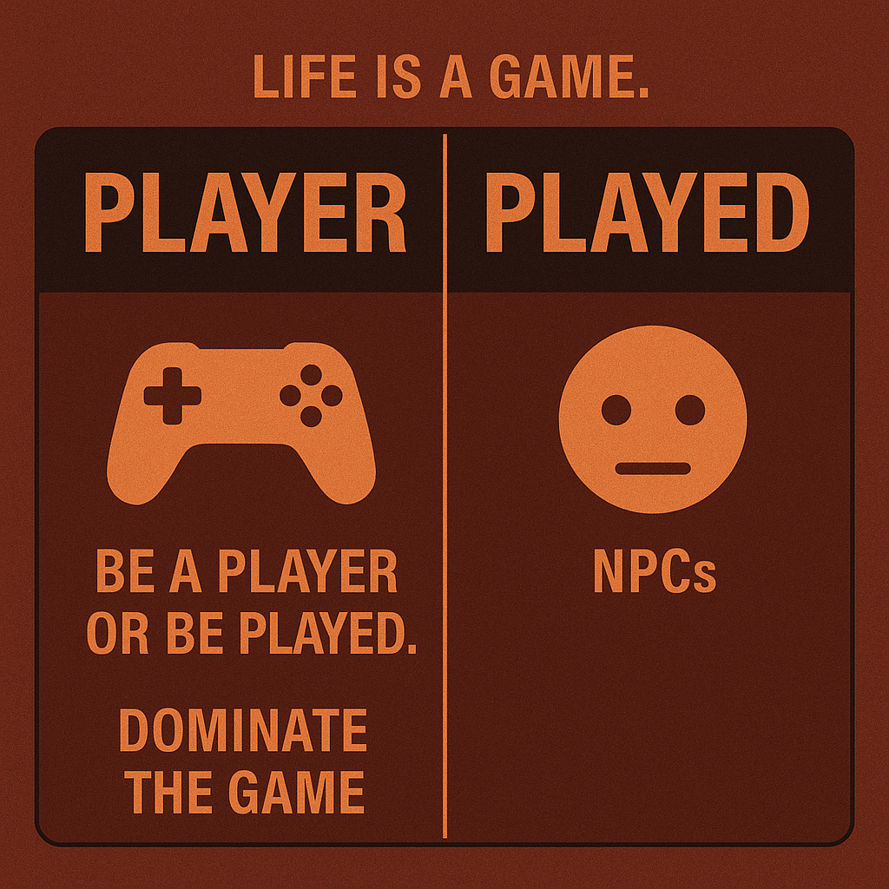

# Mastering the Game of Life: Player vs. Played

Created at 2025/10/29 10:46 AM

**🎮 Mini-Memetic Profile: “Player or Played”** *(Meme 1 in the “Life is a Game” Meta-Memeplex)* *[Meme 2: Choose Your Game](https://second.me/memory/CGM6M23AQNOCLYVG)*
***
### 🧠 **Core Idea Unit**
Life is a competitive simulation. You either act as the *Player*—strategic, self-directed—or as the *Played*—a pawn in someone else’s system. The meme encodes the belief that awareness equals control, and control equals worth.
***
### 🎭 **Identity Play & Roles**
- **Performer:** The Strategist / The Self-Made Player
- **Shadow Role:** The NPC / The Unconscious Pawn
- **Repositioning:** From victim of circumstance → to agent of your own game narrative. The self is reframed as a gamer optimizing moves within a cosmic leaderboard.
***
### 💥 **Emotional Triggers**
🔥 Empowerment through self-determination 😨 Fear of manipulation or irrelevance 💪 Drive for mastery, dominance, and recognition 🧊 Cool detachment masking insecurity about control
***
### 📡 **Spread Mechanics**
**Distribution Vectors:** Instagram Reels, TikTok edits, “hustle” X threads, gym and crypto subcultures. **Propagation Style:** Motivational aphorism · Hyper-masculine satire · Binary framing · Shock-clarity tone.
***
### 🛡️ **Defense Reflexes**
Irony armor (“it’s just mindset talk”), success-proof (“it worked for me”), and moral inversion (“weakness is victimhood”). Critique is dismissed as cope or NPC behavior.
***
### 🧬 **Memeplex Anchor Points**
📈 Neoliberal individualism 🎮 Game theory & simulationism 💼 Hustle culture mythology 🧩 Red-pill agency and self-optimization narratives
***
### 🧠 **Sticky Symbols / Quotes**
- “Be a player or be played.”
- “Main character energy.”
- “Life’s a simulation—learn the rules.”
- “Level up or log out.”
***
### 🏷️ **Tags**
#LifeIsAGame · #SigmaGrindset · #NPCTheory · #AgencyMyth · #MindsetMeme · #HyperrealityHustle

## Resources
- https://object.me.bot/front-img/users/send/img/1761759968290_c4zhf/8d64a894-68ad-4f18-b12c-4220b723e374.png

## Insight

* The image starkly contrasts two roles in life—*Player* and *Played*—aligned with the meme's core theme of agency and control. This dichotomy emphasizes the notion that individuals must be proactive in navigating life's complexities, rather than passive participants—a reflection central to competitive simulations, paralleling game theory where strategic choices determine outcomes.

* The call to “dominate the game” encapsulates a mindset often seen in contemporary hustle culture. It expresses a desire for mastery and achievement, resonating with the neoliberal ethos that equates personal value with success and productivity. This aligns with societal pressures, especially in competitive environments like startups, fitness, or personal branding.

* The use of gaming imagery, such as the controller versus the NPC (non-playable character), serves to underline the importance of self-awareness. The juxtaposition encourages viewers to reflect on their lives: are they actively shaping their paths or merely going through pre-scripted motions? This metaphor extends to the concept of "main character energy," suggesting that one should take charge of their narrative.

* Emotional triggers depicted in the image—empowerment, fear of being irrelevant, and mastery—create an intense psychological landscape. As such, memes like this often propagate through emotionally charged social media platforms, influencing individuals to reassess their agency within broader societal frameworks.

* The humor and irony embedded within the meme’s structure provide a defense mechanism against critiques of the “hustle culture.” Individuals can dismiss potential drawbacks by framing this mindset as merely aspirational or humorous. Dismissal of dissenting views resonates with **“moral inversion”**, reflecting a common defense reflex in modern motivational discourse.
