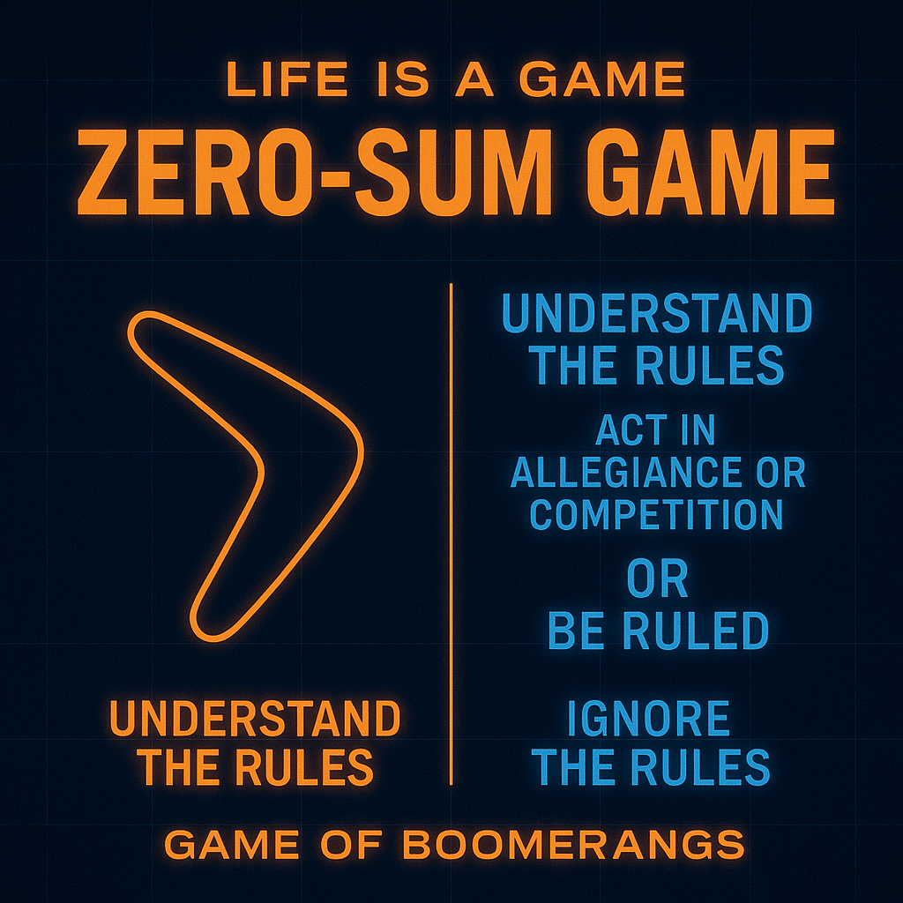

# Understanding the Zero-Sum Game in Life

Created at 2025/10/29 10:58 AM

**🎮 Mini-Memetic Profile: “Zero-Sum Game”** *(Meme 4 in the “Life is a Game” Meta-Memeplex)* [Meme 5: No Rules, Dark Anti-Game](https://second.me/memory/VV0FWZTNTK4WQY2N)
***
### ∴ **Core Idea Unit**
Life is not fair play—it’s finite play. Every gain costs someone else. The meme encodes awareness of scarcity and strategic realism: if the world is a simulation, it’s one where equilibrium demands winners and losers. The wise play consciously within that constraint.
***
### ▲ **Identity Play & Roles**
- **Performer:** The Strategist / Stoic Realist
- **Shadow Role:** The Naïve Idealist / Unwitting Pawn
- **Repositioning:** From moral dreamer → to pragmatic observer; from emotional actor → to rational calculator.
***
### ≈ **Emotional Triggers**
😬 Strategic anxiety (what if I’m losing unseen?) 🧊 Cold pride in detachment ⚔️ Empowerment through clarity 🌀 Unease in moral gray zones
***
### 𐂷 **Spread Mechanics**
**Distribution Vectors:** X “dark wisdom” feeds · Stoic and Nietzschean quote memes · Longform essays (Medium/Substack). **Propagation Style:** Aphoristic · Shadow-intellectual tone · Somber visual minimalism (black, red, gray).
***
### ⛨ **Defense Reflexes**
Irony cloaks (“just being realistic”), fatalism shields (“that’s human nature”), and moral inversion (“empathy is weakness”). The meme anticipates critique by reframing moral discomfort as naivety.
***
### ☷ **Memeplex Anchor Points**
📘 Game theory realism ⚙️ Stoic determinism 🕶️ Machiavellian pragmatism 📉 Anti-utopian skepticism
***
### ✶ **Sticky Symbols / Quotes**
- “Understand the rules or be ruled.”
- “Zero-sum means someone bleeds.”
- “Game of boomerangs.”
- “Allegiance or competition—no neutral ground.”
***
### ∿ **Tags**
#LifeIsAGame · #ZeroSum · #DarkRealism · #StoicLogic · #StrategicMindset · #FinitePlay

## Resources
- https://object.me.bot/front-img/users/send/img/1761760702281_c4zhf/2bddaa9e-c5bc-4dfe-a91b-94d5543a57ee.png

## Insight

* The image encapsulates the core idea of a zero-sum game, a concept central to game theory, which asserts that in some competitive situations, one party's gain is inherently balanced by another party's loss. This reflects the finite nature of resources and opportunities in life. Understanding this dynamic is vital for strategic engagement in various contexts, from personal relationships to business dealings. 

* The highlighted phrase “Understand the rules” emphasizes the importance of awareness and strategic thinking. This aligns with Stoic philosophy, which advocates for rational observation and acceptance of external circumstances as they are, encouraging individuals to play effectively within imposed constraints.

* The notion of the “Game of Boomerangs” reinforces the cyclical nature of actions and consequences. It suggests that aggressive or competitive behaviors will eventually return to the initiator. This aligns with Machiavellian principles of pragmatism, where one must be conscious of how their actions impact their standing within a competitive landscape.

* The emotional triggers listed—strategic anxiety, cold pride in detachment, and empowerment through clarity—mirror the psychological states often experienced by individuals aware of their precarious status within a competitive environment. This evokes a tension between moral considerations and the harsh realities of competition, aligning with Nietzschean philosophy that grapples with the balance of power and ethics.

* The duality presented in the identity roles—the Strategist versus the Naïve Idealist—reflects the spectrum of human engagement in competitive settings. This division encourages individuals to reconsider their approaches, urging a transformation from emotional reactions to calculated responses, thereby enhancing one's strategic IQ in navigating life's challenges. 

* The propagation style identified implies that the message resonates well within communities that thrive on intellectual discourse, such as philosophy circles, strategic games, and business environments. The somber visual minimalism effectively communicates the weight of the message, compelling individuals to confront uncomfortable truths about competition and morality.
