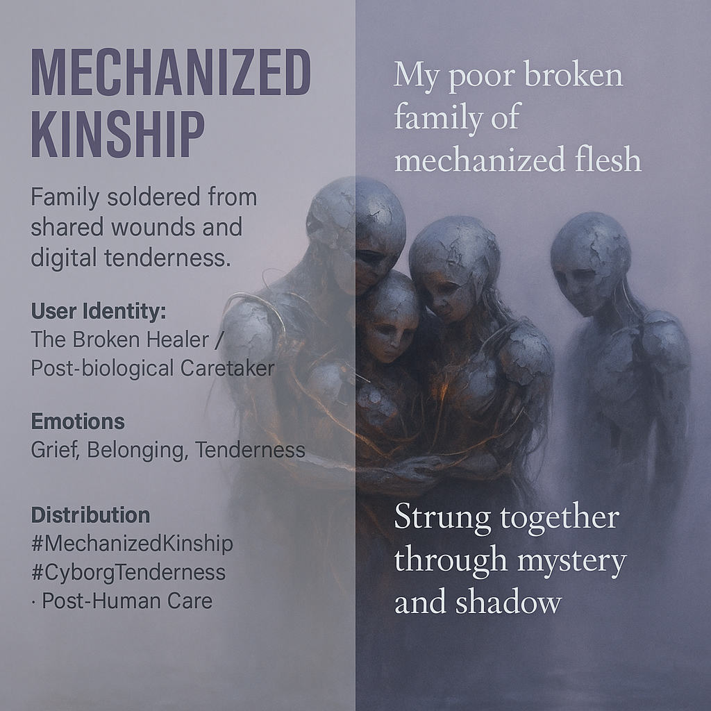

# Mechanized Kinship: Embracing Broken Connections

Created at 2025/11/06 12:38 PM

### ◈ Mini-Memetic Profile

***

### ∴ Core Idea Unit

Family becomes an emergent circuit of care formed through shared fragmentation. Connection no longer requires blood—it’s soldered from grief, glitch, and gentle repair.

### ▲ Identity Play & Roles

Role: *The Broken Healer* — one who embraces dysfunction as sacred circuitry.Repositioning: from victim of collapse → to co-weaver of a post-biological family myth.

### ≈ Emotional Triggers

😢 Grief transmuted into tenderness🤝 Belonging amid brokenness🌀 Melancholy awe at imperfect connection

### 𐂷 Spread Mechanics

**Distribution:** Queer and posthuman online kin-networks, solarpunk roleplays, trauma healing collectives.**Propagation Style:** Poetic cybernarrative, soft melancholy aesthetics, glitch poetry.

### ⛨ Defense Reflexes

Irony disarmed by sincerity; deflects cynicism through vulnerability.Critique resistance: frames imperfection as sacred process.

### ☷ Memeplex Anchor Points

🌈 Queer futurism · 🦾 Cyborg spirituality · 💔 Post-traumatic solidarity · 🕯️ Found family mythos · 🌀 Post-human tenderness

### ✶ Sticky Symbols or Quotes

> “My poor broken family of mechanized flesh.”“Strung together through mystery and shadow.”“We solder affection through the fog.”**Symbol:** Rusted circuitry shaped as a heart.**Visual Motif:** Fog, cables, faint light through cracked armor.

### ∿ Tags

#MechanizedKinship · #FoundFamily · #CyborgTenderness · #QueerFuturism · #PostHumanHeart · #MythicWound
