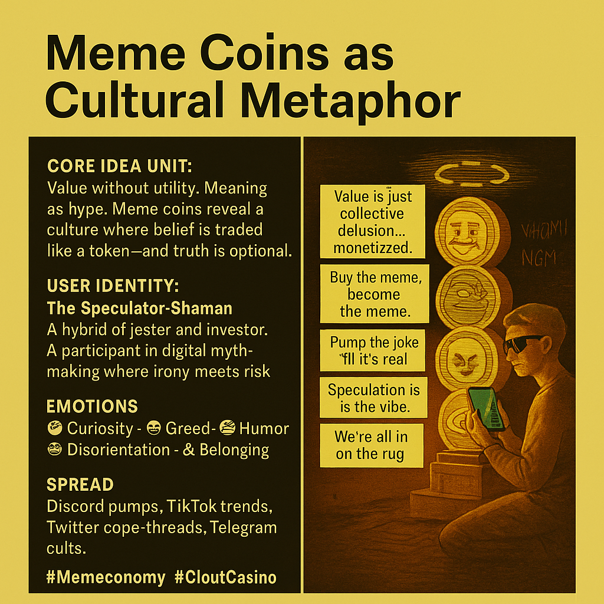

# Meme Coins: Speculation as Cultural Selfhood

Created at 2025/09/08 7:42 AM

**🪙 Meme Coins as Cultural Metaphor**

“Speculation as Selfhood. Cringe as Currency.”

### ∴ Core Idea Unit

Meme coins symbolize the cultural economy of belief: value spun from vibes, hype, and shared illusion. They reveal how attention crafts worth, and how virality mutates into market force. The shift: from substance to signal.

### ▲ Identity Play & Roles

- Role: The Speculator-Shaman
- Archetype: The Ironist Investor / Postmodern Trickster
- Self-Repositioning: From rational agent → to memetic participant
- Cultural Shift: You’re not buying a coin—you’re buying entry into a narrative, a vibe, a tribe.

### ≈ Emotional Triggers

- 🤪 Cringe-laced Humor
- 🧠 Curiosity (WTF is this coin?)
- 🤑 Greed disguised as belonging
- 😬 Shame or pride depending on timing
- 🤯 Disorientation from ironic sincerity
- 🎭 FOMO (Fear Of Missing Out) vs ROMO (Relief Of Missing Out)

### 𐂷 Spread Mechanics

- Distribution Vectors:X threads, Discord shills, TikTok clips, Twitch chats, meme subreddits, Telegram cults.
- Propagation Style:Irony-laced satire, viral hype cycles, pump-n-pray rituals, inside-joke evangelism.
- Tactic:Bait with absurdity → bind with identity → boom or bust on vibes.

### ⛨ Defense Reflexes

- Irony Shields: “It’s just a joke… unless it moons.”
- Semantic Ambiguity: Sincerity and satire blur—unrugable narrative terrain.
- Cringe Camouflage: Too ridiculous to criticize seriously.
- Collective Justification: “We’re all in on the joke.”
- Exit Optionality: “I knew it was a scam”—even if you didn’t.

### ☷ Memeplex Anchor Points

- 📉 Financial nihilism / post-capitalist absurdity
- ▲ Identity as performance
- 📱 Attention economics
- 💰 Late-stage capitalism satire
- 🕸️ Network tribalism
- 🧪 Gamified belief systems
- 🤖 AI-generated markets & post-human signals
- 🎮 Internet-native folklore

### ✶ Sticky Symbols or Quotes

- “This coin has no utility—and that’s the point.”
- “We’re all gonna make it (WAGMI)”
- “Is it satire or a scam? Yes.”
- Degen rituals as shared culture: diamond hands, rugs, moons, apes.
- Pepe, Doge, Wojak—saints of the memetic marketplace.

### ∿ Tags

#NarrativeInflation · #SpeculativeSelfhood · #CloutCasino · #Memeconomy · #IronyFinance · #IdentityMarkets · #DigitalMythmaking · #PostCapitalistPlay

also read [Memetic Cowboy “All Coins Are Meme Coins”](https://memeticcowboy.substack.com/p/all-coins-are-meme-coins?utm_source=publication-search)
