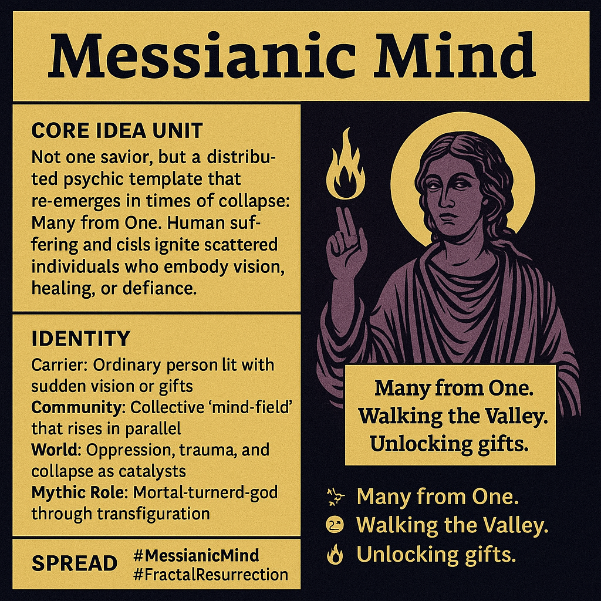

# Messianic Mind: Many from One Arise

Created at 2025/08/25 9:21 AM

**◈ Mini-Memetic Profile**

Title: Messianic Mind — The Archetype of Collective Resurrection

∴ Core Idea Unit**

Not one savior, but a distributed psychic template that re-emerges in times of collapse: Many from One. Human suffering and crisis ignite scattered individuals who embody vision, healing, or defiance.

▲ Identity Play & Roles**

- Carrier: Ordinary person lit with sudden vision or gifts.
- Community: Collective “mind-field” that rises in parallel.
- World: Oppression, trauma, and collapse as catalysts.
- Mythic Role: Mortal-turned-god through transfiguration.

≈ Emotional Triggers**

✨ Awe at recurring archetype

😢 Recognition of shared trauma

🔥 Hope in distributed awakening

🌌 Fascination with mythic resonance

𐂷 Spread Mechanics**

- Distribution Vectors: Spiritual movements, myth retellings, collective crises.
- Propagation Style: Archetypal resonance, synchronicity, mythic narrative.
- Virality: High in times of upheaval; compresses as crises accelerate.

⛨ Defense Reflexes**

- Fractal framing: “It’s structural, not fantasy.”
- Cross-cultural resonance deflects reductionism.
- Sacralization: Myths become gods → shields critique.

☷ Memeplex Anchor Points**

- Mythology: Descent & resurrection (Inanna, Jesus, Odin).
- Psychology: Trauma → shadow-work → transformation.
- Sociology: Crisis as ignition point for distributed leadership.
- Philosophy: Godhood as structural human potential.

✶ Sticky Symbols / Quotes**

- “Many from One.”
- “Walking the Valley.”
- “Unlocking gifts.”
- “Godhood is not foreign to humanity.”

∿ Tags**

#MessianicMind · #FractalResurrection

## Resources
- https://object.me.bot/front-img/note/attachments/img/1756138893854/78447AB7-6C9E-4619-B724-01C8B505040E.png

## Insight

*   **Core Idea of Distributed Messianic Template**: The image and hint suggest a shift from the traditional concept of a single savior to a distributed network of individuals embodying messianic qualities during times of crisis. This resonates with the idea of collective intelligence and distributed leadership, where solutions and guidance emerge from multiple sources rather than a single figurehead.

*   **Archetypal Resonance and Recurring Patterns**: The concept of a "Messianic Mind" taps into deep-seated archetypes of descent and resurrection found across various mythologies, such as Inanna, Jesus, and Odin. This recurring pattern suggests a universal human response to suffering and a collective yearning for transformation and renewal. Carl Jung's work on archetypes highlights how these universal patterns of behavior and imagery influence our understanding of the world and our place within it.

*   **Crisis as a Catalyst for Transformation**: The image and hint emphasize that oppression, trauma, and collapse serve as catalysts for the emergence of the "Messianic Mind." This aligns with the concept of "creative destruction," where periods of upheaval and crisis can lead to innovation, adaptation, and the rise of new social structures and leadership.

*   **Emotional Triggers and Spread Mechanics**: The emotional triggers of awe, recognition of shared trauma, and hope play a crucial role in the spread of the "Messianic Mind" meme. These emotions create a sense of connection and shared purpose, facilitating the propagation of ideas and behaviors through spiritual movements, myth retellings, and collective crises.

*   **Defense Reflexes and Framing**: The defense reflexes, such as fractal framing and cross-cultural resonance, serve to protect the "Messianic Mind" meme from reductionism and critique. By framing the concept as structural rather than fantasy and highlighting its cross-cultural manifestations, proponents can deflect criticism and maintain the meme's integrity.

*   **Sticky Symbols and Quotes**: The sticky symbols and quotes, such as "Many from One" and "Unlocking gifts," act as memorable and easily shareable elements that contribute to the virality of the "Messianic Mind" meme. These symbols and quotes encapsulate the core ideas and emotional triggers, making it easier for individuals to grasp and propagate the concept.
