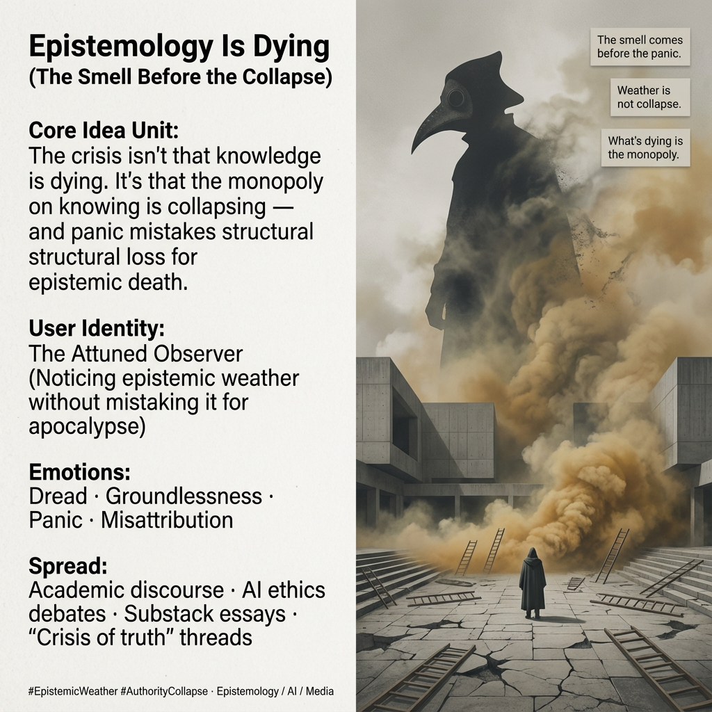

# Monopoly on Knowing is Collapsing

Created at 2026/01/20 12:36 PM

## 🧩 Title

**Epistemology Is Dying** *(The Smell Before the Collapse)*

***

## 🧠 Core Idea Unit

The widespread claim that “epistemology is dying” is a **misdiagnosis**. What’s actually collapsing is the **monopoly on knowing**—the assumption that truth must flow through a single ladder, authority, or credentialed pipeline.

The mental shift provoked: From *“knowledge itself is under threat”* → *“the authority structure that once controlled knowledge is failing.”*

***

## 🎭 Identity Play & Roles

**Cast Roles**

- **The Attuned** — notices the weather before the headlines; senses structural shifts without panic.
- **The Panicked** — mistakes loss of authority for loss of truth; smells decay and assumes death.

**Repositioning**

- The self moves from *defender of epistemic order* → *observer of epistemic weather*.
- Authority is no longer something to protect reflexively, but something to **diagnose structurally**.

***

## 💥 Emotional Triggers

- 😨 **Dread** — “the smell of death” before visible collapse
- 🌀 **Groundlessness** — terrain shifting under inherited certainties
- 🚨 **Panic** — vacuum-seeking explanations
- 🎯 **Misattribution** — blaming knowledge itself instead of its gatekeepers

**Cognitive Lever:** The meme flatters restraint. It positions the reader as someone who can *smell the weather* without mistaking it for apocalypse.

***

## 📡 Spread Mechanics

**Distribution Vectors**

- Academic and policy discourse on “crisis of truth”
- AI ethics debates about epistemic authority
- Substack longform essays
- X/Twitter threads invoking “post-truth” panic
- Institutional memos about “new ways of knowing”

**Propagation Style**

- Diagnostic rather than polemical
- Uses metaphor (plague, weather, ground shift) instead of accusation
- Slows panic by reframing causality

***

## 🛡️ Defense Reflexes

- **Structural reframing** — “the crisis is real, but misnamed”
- **Anti-hysteria posture** — refuses urgency signaling
- **Metaphor shielding** — weather and smell bypass direct ideological attack
- **Authority decentering** — critique without naming villains

***

## 🧬 Memeplex Anchor Points

- Epistemic pluralism
- Anti-monopoly critiques of knowledge
- AI as accelerant, not origin
- Institutional legitimacy vs. truth
- Collapse-of-ladders narratives

(Attaches cleanly to AI governance, media trust debates, and academic self-crisis without becoming partisan.)

***

## 🧠 Sticky Symbols & Phrases

- “The smell before people say epistemology is dying”
- “Weather rolling in”
- “The ladder was pulled up behind us”
- “The Black Death of truth” *(as misdiagnosis)*
- “Something is under threat — but it’s not knowledge”

***

## 🏷️ Tags

#EpistemicWeather · #AuthorityCollapse · #AntiPanic · #PluralKnowing · #AIandTruth · #StructuralDiagnosis

***

**Reflection checkpoint (quiet, not directive):** This meme doesn’t argue that everything is true. It argues that **panic emerges when monopolies fall**, and that weather gets mistaken for rot when people confuse *authority* with *truth*.

## Resources
- https://object.me.bot/front-img/users/send/img/1768941325067_c4zhf/hf_20260119_155938_f8a7033b-7b65-4a1e-b849-0c1ad624aeea.png

## Insight

* The image of a figure dressed in a plague doctor outfit amidst a chaotic and desolate environment symbolizes the looming sense of dread associated with epistemic collapse. This aligns with the idea that the "smell before the panic" represents a precursor to significant changes in how we perceive and validate knowledge.

* The contrast between the towering figure and the fractured landscape evokes themes of authority and the decaying structures of traditional knowledge systems, reinforcing the core idea that the panic stems not from knowledge itself but from the diminishing monopoly on its dissemination.

* The ladders in the image represent pathways to knowledge and understanding. Their chaotic arrangement signifies the breakdown of linear, hierarchical methods of acquiring truth, echoing the assertion that the collapse of authority structures leads to misattributions of epistemic failure.

* Emotional triggers like groundlessness and panic are visually depicted through the turbulent, smoky atmosphere, illustrating the confusion and disorientation people may feel as they navigate a shifting epistemic landscape. This enhances the reflective identity of the "Attuned Observer" who seeks to understand rather than react impulsively.

* The memeplex concepts, such as "epistemic pluralism" and "anti-monopoly critiques of knowledge," suggest an emerging understanding that diverse perspectives are crucial for survival amid epistemic crises. The visual elements serve as metaphors for this transition, inviting the viewer to consider the broader implications of navigating a post-monopoly knowledge economy.
