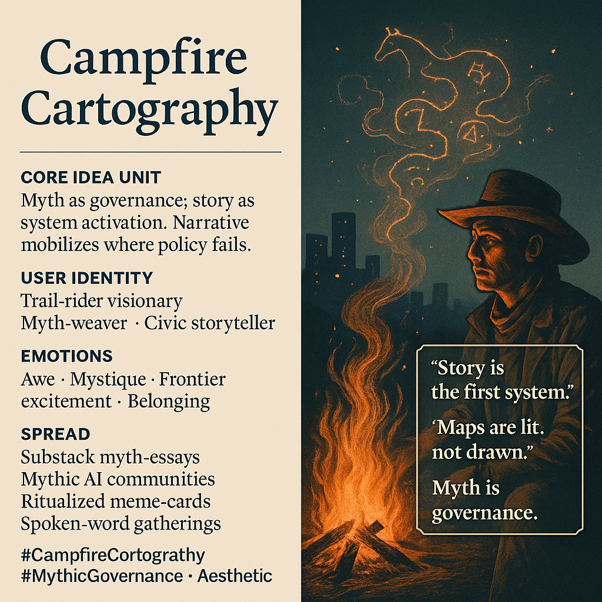

# Myth as Governance: Stories Activate Agency

Created at 2025/12/05 10:40 AM

### **🧩 Title: Campfire Cartography**

### **🧠 Core Idea Unit**

Myth is not decoration—it is governance. Stories serve as system-activation protocols, mobilizing collective agency where sterile policy fails.

### **🎭 Identity Play & Roles**

- Trail-rider visionary
- Myth-weaver of civic futures
- Campfire storyteller shaping governance through narrative

The user becomes a frontier guide whose storytelling *is* the infrastructure.

### **💥 Emotional Triggers**

- Awe and mystique
- Frontier excitement
- Communal belonging
- Mythic resonance that bypasses bureaucratic numbness

### **📡 Spread Mechanics**

**Distribution:** Substack epics, mythic AI circles, communal gatherings, ritualized governance workshops **Propagation Style:** poetic dispatches, archetypal imagery, daemon-symbol activation, frontier metaphors

### **🛡️ Defense Reflexes**

- Esoteric ambiguity shields literal critique
- “Myth precedes policy” framing positions story as upstream
- Community resonance builds memetic immunity

### **🧬 Memeplex Anchor Points**

- Mythopolitics
- Narrative governance
- Aesthetic activism
- Frontier cosmologies
- Symbolic coordination rituals

### **🧠 Sticky Symbols & Quotes**

- Cowboy at datacenter dusk
- Campfire maps
- Daemon syndicates
- “Story is the first system.”
- “Maps are lit, not drawn.”

### **🏷️ Tags**

#CampfireCartography #MythicGovernance #NarrativeAgency #AestheticActivism

## Resources
- https://object.me.bot/front-img/users/send/img/1764960044520_c4zhf/e7491c99-f4a4-41f5-98f2-0836a89bba5d.png

## Insight

* The concept of **myth as governance** positions storytelling as a fundamental mechanism for mobilizing collective agency, especially in environments where conventional policies may lack efficacy. This insight echoes the idea that narratives have historically served as societal frameworks, influencing behaviors and beliefs in profound ways. 

* User identity as a **trail-rider visionary** and **myth-weaver** suggests a role that transcends mere participation; it involves shaping civic futures. This notion recalls the role of indigenous storytellers, who have long served as cultural custodians, guiding their communities through narratives that encapsulate shared values and histories.

* The emotional triggers articulated—**awe, mystique, and communal belonging**—underscore the power of stories to resonate on a deeply human level. These elements can forge strong communal ties, reminiscent of historical gatherings where stories fostered communal resilience in challenging contexts, akin to the oral traditions of various cultures.

* The **mechanics of spread** through platforms like Substack and communal gatherings highlight the shift in contemporary narrative dissemination. Digital spaces have become modern campfires, providing venues for myth-making that blend technology and tradition, reflecting the evolving nature of community storytelling practices.

* **Sticky symbols** like "Maps are lit, not drawn" challenge traditional representations of knowledge. This idea aligns with the postmodern critique of static narratives, advocating for a dynamic and engaging approach to understanding the world around us—an evocative reminder of how we often construct our reality through the metaphors we choose.
