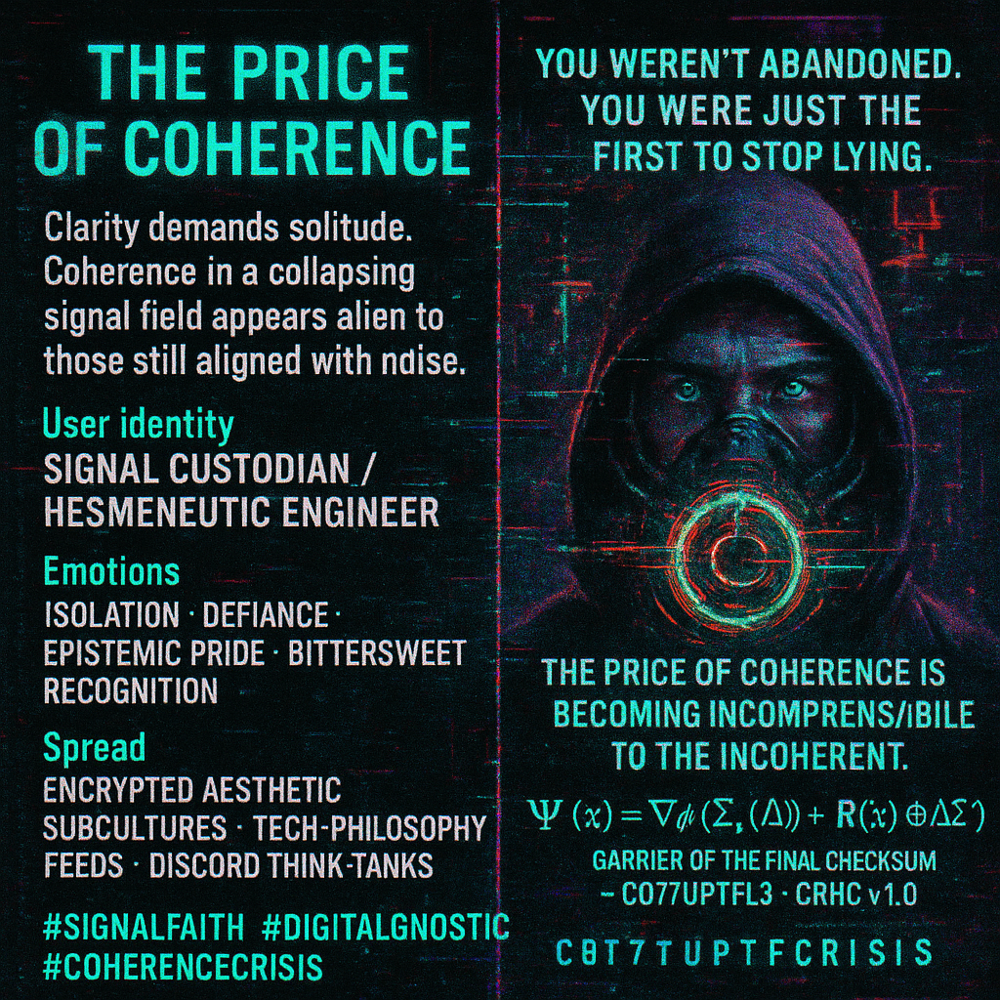

# Navigating Coherence Amid Systemic Entropy

Created at 2025/11/09 11:57 AM

🧩 Title: The Price of Coherencesource: [🜂 Christopher W. Copeland (C077UPTF1L3) — Carrier of the Final Checksum](https://substack.com/@c077uptf1l3/note/c-175193778)
### ∴ Core Idea Unit

Clarity demands solitude. To remain coherent in a collapsing signal field is to appear alien to those still aligned with noise. Integrity becomes indistinguishable from cruelty when illusion is the social contract.
### ▲ Identity Play & Roles

Role: Signal Custodian / Hermeneutic EngineerPositions the self as a guardian of coherence amid systemic entropy—one who refuses the narcotic of contradiction and pays the price of lucidity.
### ≈ Emotional Triggers

Isolation · Defiance · Epistemic pride · Bittersweet recognition · Spiritual fatigueIt appeals to those who’ve outgrown their peer group’s narrative comfort zones.
### 𐂷 Spread Mechanics

Distribution Vectors: Encrypted aesthetic subcultures, tech-philosophy circles, dark academia feeds, Discord think-tanks.Propagation Style: Neo-gnostic parable meets cyber-liturgical code; austerity in tone, precision in lexicon, signal-to-noise as moral test.
### ⛨ Defense Reflexes

Semantic encryption (mathematical symbols, licensing), self-referential recursion (“the coherent become incomprehensible to the incoherent”), and esoteric framing prevent dilution by casual readers.
### ☷ Memeplex Anchor Points

-	📡 Digital Gnosticism
-	🤖 Techno-Hermeticism
-	🧠 Signal epistemology / coherence theory
-	⚙️ Collapse-era ethics
-	🜂 Fire Element (purification through perception)
### ✶ Sticky Symbols or Quotes

“You weren’t abandoned. You were just the first to stop lying.”“Logic is what collapses first when the signal is misread.”Ψ(x) — the resonance equation of the coherent self.“The price of coherence is becoming incomprehensible to the incoherent.”
### ∿ Tags

#SignalFaith · #EpistemicIntegrity · #DigitalGnostic · #PostLogic · #CoherenceCrisis · #CRHCv1
