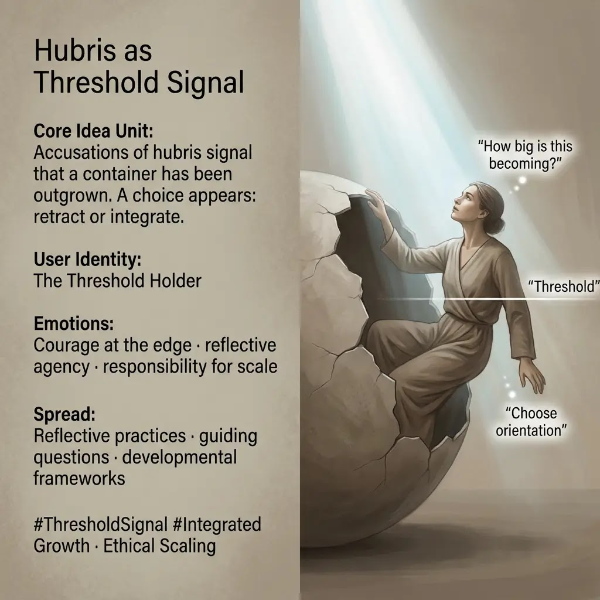

# Navigating Hubris: A Threshold of Growth

Created at 2025/12/28 3:33 PM

## **Hubris as Threshold Signal**

[HUBRIS: A Memetic Reversal of Icarus in the Age of Artificial Intelligence](https://memeticcowboy.substack.com/p/hubris-a-memetic-reversal-of-icarus)

### 🧠 Core Idea Unit

The accusation of hubris marks a developmental edge. It signals that the current container is too small, presenting a choice: retract or integrate expansion.

### 🎭 Identity Play & Roles

**Cast role:** The Threshold Holder The subject is positioned at a decision point requiring reflection, not retreat.

### 💥 Emotional Triggers

- 🧭 Courage at the edge
- 🪞 Reflective self-assessment
- 🌱 Aspirational agency
- ⚖️ Responsibility for scale

Fear is transmuted into discernment.

### 📡 Spread Mechanics

**Distribution Vectors:**

- Guiding questions
- Reflective practices
- Developmental frameworks

**Propagation Style:** Coaching language, pauses, inquiry over assertion.

### 🛡️ Defense Reflexes

- Integration over defiance
- Self-audit instead of apology
- Contextual scaling (“how big is this becoming?”)

The meme survives critique by absorbing it as signal.

### 🧬 Memeplex Anchor Points

- Co-authored reality
- Developmental psychology
- Ethical scaling

### 🧠 Sticky Phrases / Symbols

- Threshold
- Shell
- Rooted reach
- Skylights

🏷️ **Tags:** #ThresholdSignal · #IntegratedGrowth · #ReflectiveAgency · #ScaleWithCare

## Resources
- https://object.me.bot/front-img/users/send/img/1766964823480_c4zhf/IMG_9326.jpg

## Insight

* The concept of "hubris" in this context evokes the myth of Icarus, symbolizing the dangers of overreaching and the necessity for reflection when confronting one's limitations. This ties into the narrative around artificial intelligence and the ethical implications of its integration into society, where unchecked ambition may lead to adverse outcomes.  
* The character depicted as the "Threshold Holder" represents individuals at critical junctures, embodying the struggle between growth and retreat. This reflects a broader psychological framework within developmental psychology, where self-assessment and the embrace of courage are essential for navigating life's transitions.  
* Emotional triggers such as "courage at the edge" not only highlight the human experience of existential risk but also present aspirational agency as a driving force for personal growth and change. This idea resonates with modern coaching practices, which emphasize inquiry and reflective techniques to foster resilience and adaptability.  
* The dialogue around "how big is this becoming?" prompts an exploration of scalability, ethical considerations, and the impact of one's choices on broader systems. This notion of responsibility for scale aligns with theories in social sciences that advocate for mindful integration of new technologies into existing frameworks.  
* The reference to "sticky phrases" like "integrated growth" and "ethical scaling" encapsulates the essence of developing frameworks that prioritize sustainability and social responsibility, a vital discussion in today’s rapidly evolving technological landscape. This aligns with movements in leadership development and organizational behavior aiming at balancing innovation with ethical considerations.
