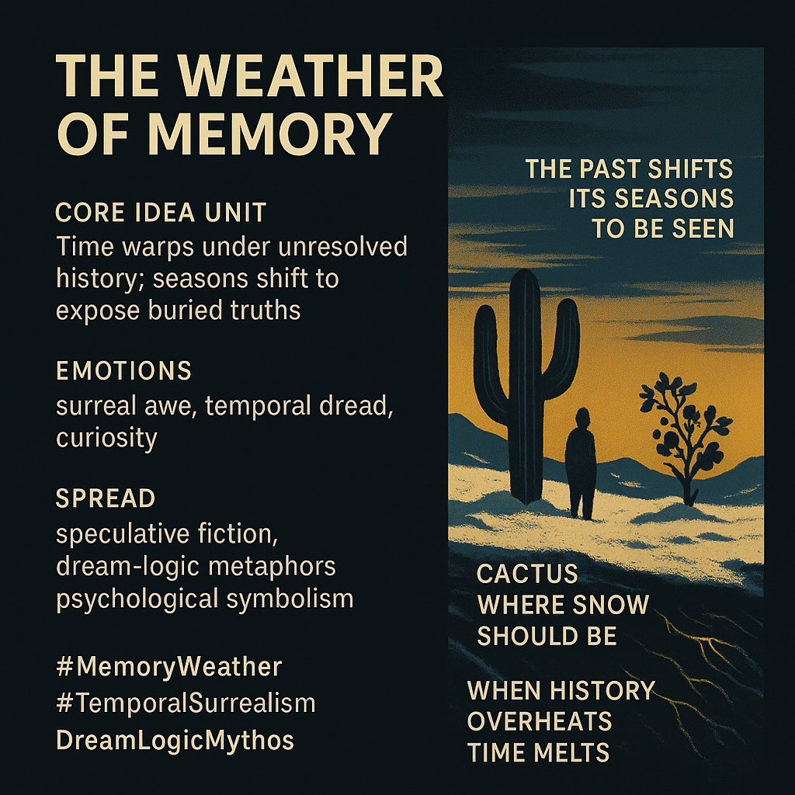

# Navigating Memory's Surreal Seasons

Created at 2025/11/23 12:32 PM

### 🧩 **Title: The Weather of Memory**

***

### ∴ Core Idea Unit

Time bends when history is unresolved. Seasons warp into surreal signals—revealing truths the psyche refuses to confront. Memory becomes a climate system.

***

### ▲ Identity Play & Roles

**The Disoriented Historian** — watching chronology slip sideways.**The Reluctant Rememberer** — drawn into revelations they didn’t ask for.

These roles cast the self as someone navigating a world where the past behaves like weather.

***

### ≈ Emotional Triggers

Surreal awe at impossible seasonal shifts.Temporal dread as time misbehaves.Curiosity sharpened by uncanny ecological cues.

***

### 𐂷 Spread Mechanics

**Distribution Vectors:** speculative fiction, dream-logic allegories, psychological surrealism, symbolic climate narratives.**Propagation Style:** temporal parable, surreal metaphor, uncanny ecopsychology.

***

### ⛨ Defense Reflexes

The surreal shield: “It’s just dream logic.”Temporal ambiguity diffuses moral blame.Metaphor-first framing makes critique feel optional.

***

### ☷ Memeplex Anchor Points

Memory ecology · Psychological surrealism · Temporal mythmaking · Climate symbolism · Traumatic recursion loops.

***

### ✶ Sticky Symbols or Quotes

“Cactus where snow should be.”“Blossoms turning to fruit in minutes.”“The past shifts its seasons to be seen.”“When history overheats, time melts.”

***

### ∿ Tags

#MemoryWeather · #TemporalSurrealism · #DreamLogicMythos · #Psychoclimatic
