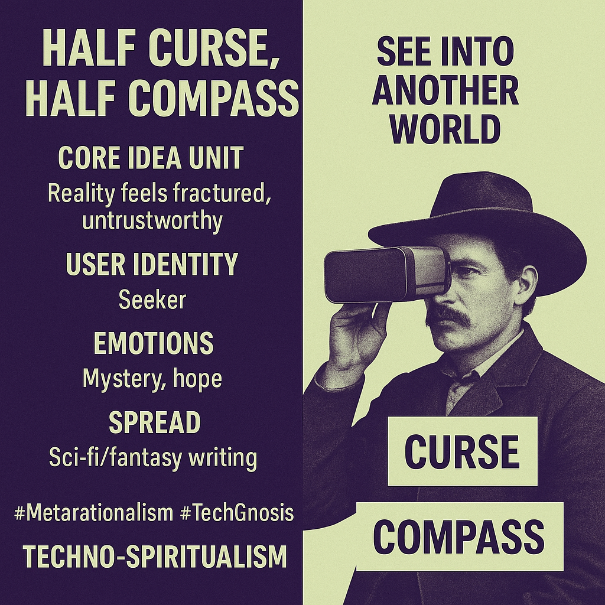

# Navigating Reality: Tech as Curse and Compass

Created at 2025/10/31 1:10 PM

**🧩 Title:****Half Curse, Half Compass**

***

### ∴ Core Idea Unit

Reality is broken and unreliable; the only way to find direction is through a device that bridges worlds — half burden, half revelation. Technology becomes both a curse and a compass for meaning.

***

### ▲ Identity Play & Roles

Positions the user as a **Technognostic Wanderer** — a seeker of hidden truths, half mystic, half coder, walking the threshold between simulation and spirit. The meme flatters those who perceive deeper signals beneath surface noise.

***

### ≈ Emotional Triggers

Mystery · Awe · Alienation · Existential LongingThe feeling of glimpsing forbidden knowledge — hope that tech can illuminate the metaphysical void.

***

### 𐂷 Spread Mechanics

**Distribution:** Sci-fi subreddits · ARG Discords · Aesthetic philosophy threads · Metaphysical fiction circles**Style:** Parable through imagery; half confession, half revelation — blends sincerity with mythic cool.

***

### ⛨ Defense Reflexes

Cloaked in irony and mysticism: “It’s just a story... or is it?” The duality of curse/compass immunizes critique — skepticism becomes proof of blindness.

***

### ☷ Memeplex Anchor Points

Techno-spiritualism · Simulation theory · Metamodern aesthetics · Cyber-mystic counterculture · #PostReality ethos

***

### ✶ Sticky Symbols or Quotes

“Half curse, half compass.”“See into another world.”VR headset as modern oracle.Cowboy gaze = seeker between worlds.

***

### ∿ Tags

#TechnoSpiritualism · #MetaReality · #DigitalMystic · #SeekersLoop · #SimulatedFaith · #HyperSignal
