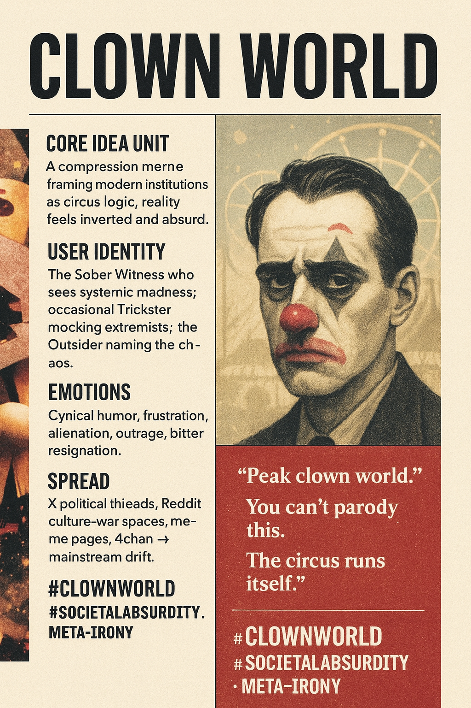

# Clown World: Documenting Absurdity and Cynicism

Created at 2025/11/15 12:20 PM

**🤡 Clown World — The Sanity-Signaling Lament**
***

### ∴ Core Idea Unit

A compression meme that reframes systemic absurdity as circus logic: institutions behave like jesters, reality feels inverted, and the user positions themselves as the lone rational observer in an unhinged environment.Mental shift: from “things are bad” → “the entire system runs on absurdity.”
***

### ▲ Identity Play & Roles

Primary role: The Sober Witness — one who sees through institutional chaos and laughs bitterly at its contradictions.Secondary roles:
- The Trickster (ironic posters mocking extremists themselves)
- The Outsider (alienated individual naming the madness)
- The Prophet of Decline (warning of civilizational decay)This repositioning casts the self as perceptive and uncorrupted by propaganda.
***

### ≈ Emotional Triggers

- Cynical humor
- Frustration with institutions
- Alienation + resignation
- Outrage at corruption or hypocrisy
- Schadenfreude (when in ironic/inversion modes)Emotional primer = “bitter laughter as coping strategy.”
***

### 𐂷 Spread Mechanics

Distribution:
- X/Twitter political threads
- Reddit culture-war subreddits
- Meme pages on Instagram/TikTok
- Fringe-to-mainstream pipeline via 4chan → X → Reddit → YouTube commentaryPropagation Style:
- Sarcastic shorthand
- Reaction meme + punchline text
- Meta-ironic clowning of extremists
- News-image + 🤡🌎 emoji pairing
- Shock-laced humor, circus aesthetics
***

### ⛨ Defense Reflexes

- Irony shield: “I’m just joking” → protects from critique.
- Ambiguity drift: meaning shifts across tribes, making it hard to pin down.
- Blame inversion: if attacked, users redirect: “See? You are the clown world.”
- Symbolic fog: honkler, Pepe-clown, rainbow wig as memetic misdirection.
***

### ☷ Memeplex Anchor Points

- Anti-institutional cynicism
- Culture-war skepticism
- Pop-nihilism
- Hyperreality collapse discourse
- Degeneration narratives (soft alt-right flavor)
- Meta-irony culture (post-meme ecology)
***

### ✶ Sticky Symbols or Quotes

Visuals:🤡🌎 · honkler · circus tents · rainbow clown wig · crying-laughing face turned sinisterPhrases:
- “Peak clown world.”
- “We truly live in a clown world.”
- “The circus is running the government.”
- “You can’t parody this.”
- “This timeline is cooked.”
***

### ∿ Tags

#ClownWorld · #SocietalAbsurdity · #CultureWar · #InstitutionalDistrust · #MetaIrony
***
[Dive deeper into the usage clusters from X and Reddit](https://second.me/memory/AUGLU7XUQ7TMYHW4)
