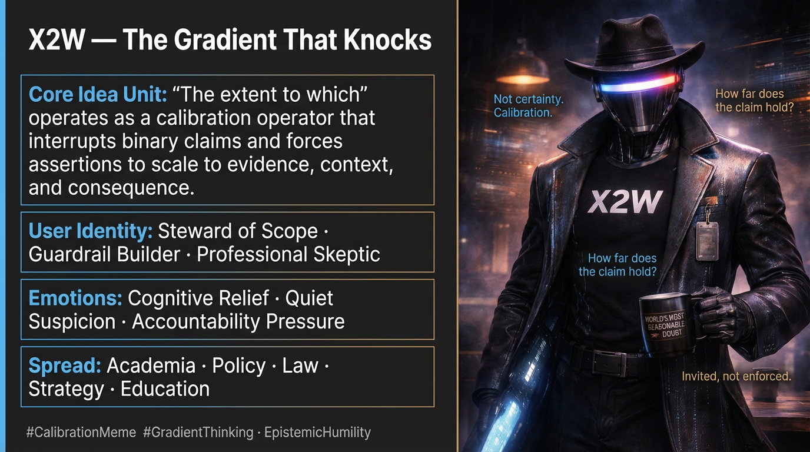

# Navigating the Gradient of Truth Claims

Created at 2026/01/31 3:34 PM

***

# 🔬 **X2W — The Gradient That Knocks**

***

### ∴ Core Idea Unit

**“The extent to which”** functions as a *calibration operator*: it interrupts binary claims and forces assertions to scale to evidence, context, and consequence.

**Mental shift provoked:**From *“Is this true?”* → *“How far does this hold before it breaks?”*

Not anti-truth. Anti-overreach.

***

### ▲ Identity Play & Roles

**Cast Roles:**

- **The Calibrator** — slows claims before they harden into dogma
- **The Guardrail** — lets thinkers approach edges without pretending cliffs aren’t real
- **The Academic Ghost** — appears when certainty outruns legitimacy

**Repositioning of the Self:**Speaker shifts from *Owner of Truth* → *Steward of Scope*.Authority becomes conditional, revisable, and accountable.

***

### ≈ Emotional Triggers

Primary activators:

- 🧠 **Cognitive Relief** — permission not to be absolute
- 😬 **Anxiety Containment** — certainty deferred without collapse
- 🤯 **Quiet Suspicion** — “Have I earned this claim?”
- 😮‍💨 **Professional Exhaustion** — survival language for high-stakes domains

These emotions prime the meme where decisiveness is demanded faster than reality allows.

***

### 𐂷 Spread Mechanics

**Distribution Vectors:**

- Academic papers & peer review
- Policy briefs & governance reports
- Legal reasoning & jury instructions
- Business decks & strategic memos
- Essay prompts & evaluative rubrics

### 𐂷 Spread Mechanics

Style:**Low-drama, high-legibility.Sounds cautious. Feels responsible.Rarely announces itself as a meme—travels disguised as professionalism.

***

### ⛨ Defense Reflexes

- **Humility Masking:** “I’m just being careful”
- **Anti-Critique Shield:** Critics appear reckless or naïve
- **Instrumental Legitimacy:** “This is how serious people talk”

Failure mode:When calibration reframes itself as *mandatory everywhere*, it mutates into a soft absolutism—certainty about uncertainty.

***

### ☷ Memeplex Anchor Points

- Epistemic humility traditions
- Scientific method & peer review norms
- Liberal legal proportionality
- Managerial risk containment
- Anti-binary rhetoric in late-modern discourse

Attaches easily to systems under liability, audit, or reputational risk.

***

### ✶ Sticky Symbols or Quotes

& Phrases

- “Let’s be precise here.”
- “We need to nuance this.”
- “That depends.”
- “Within limits.”
- Guardrails. Gradients. Ranges. Confidence intervals.

Iconography (implicit):Scales, sliders, margins, footnotes, red pens hovering but not striking.

***

### ∿ Tags

#CalibrationMeme · #GradientThinking · #AntiAbsolutism · #EpistemicGuardrail · #ProfessionalHumility · #ScopeDiscipline

***

### ⚠️ Latent Tension 

X2W is healthiest when **invited**.It becomes pathogenic when it **claims jurisdiction**.

Its paradox:

> A meme that survives by resisting absolutes is always tempted to declare *that resistance itself* non-optional.

You caught it right at the hinge—when a useful constraint tries to become a ruler.

That’s the signal.
