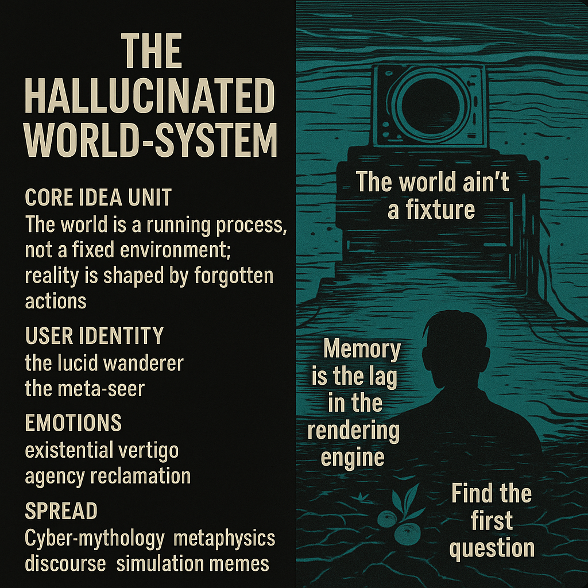

# Navigating the Hallucinated World-System

Created at 2025/11/23 12:36 PM

### 🧩 **Title: The Hallucinated World-System**

***

### ∴ **Core Idea Unit**

The world isn’t a location—it’s an ongoing computation shaped by forgotten inputs. Stability is an illusion produced by memory lag. The only way forward is to recall the question that started the process.

***

### ▲ **Identity Play & Roles**

**The Lucid Wanderer** — moving through reality as if through a shifting interface. **The Meta-Seer** — perceiving the world as a running process with hidden parameters.

These roles reposition the self as someone navigating a dynamic system, not inhabiting a fixed space.

***

### ≈ **Emotional Triggers**

Existential vertigo at realizing the world is procedural. A spark of agency reclamation—“If it’s process, I can influence it.” Curiosity stirred by memory glitches, déjà vu, repeating loops.

***

### 𐂷 **Spread Mechanics**

**Distribution Vectors:** cyber-mythology circles, metaphysics discourse, simulation-theory memes, lucid-dream communities. **Propagation Style:** glitch-parable, metaphysical aphorism, simulation allegory.

***

### ⛨ **Defense Reflexes**

Simulation framing: critique redirected into “just part of the narrative engine.” Ontological ambiguity: avoids hard claims by treating reality as soft-coded. Dream-machine metaphor dissolves literalism.

***

### ☷ **Memeplex Anchor Points**

Process ontology · Simulation metaphysics · Neo-gnosticism · Cyberdream logic · Meta-awareness practice.

***

### ✶ **Sticky Symbols or Quotes**

“The world ain’t a fixture.” “Memory is the lag in the rendering engine.” “The dream machine hums beneath everything.” “Find the first question.”

***

### ∿ **Tags**

#ProcessWorld · #SimulationMythos · #MetaSeeing · #DreamMachine

## Resources
- https://object.me.bot/front-img/users/send/img/1763930209298_c4zhf/42ad0c68-5108-4d93-ab11-5ddc2a5c3a2e.png

## Insight

* The concept of a "Hallucinated World-System" suggests a dynamic understanding of reality as a constantly evolving process rather than a static entity. This aligns with philosophical discussions in process ontology, which posit that existence is primarily about becoming rather than being—introducing notions from thinkers like Whitehead who emphasize the fluidity of existence.
  
* The identities of "The Lucid Wanderer" and "The Meta-Seer" serve as metaphors for individuals who navigate through the complexities of existence, implying a need for heightened awareness and adaptability. This resonates with ideas found in existentialist philosophy where the search for meaning is an active, often restless endeavor, challenging the individual to rethink their position in an ever-changing world.

* Emotional responses such as existential vertigo occur when confronted with the idea that reality is procedural. This echoes the sentiments found in modern literature and cinema, where characters often question their reality—think of works by Philip K. Dick or films like "The Matrix," which explore themes of reality and consciousness in a simulation context.

* The propagation of these ideas through cyber-mythology and metaphysical discourse highlights the modern methods by which philosophies spread and evolve. This reflects the digital age’s impact on knowledge transmission, akin to how memes propagate cultural ideas—suggesting that philosophical concepts can mutate and adapt through digital platforms.

* The sticky symbols and quotes, particularly "Memory is the lag in the rendering engine," encapsulate the interplay of memory and perception in understanding reality. This aligns with cognitive theories that emphasize the role of memory in shaping our present experience, hinting at the malleability of our conceptual framework and our ability to influence the unfolding narrative of our lives.
