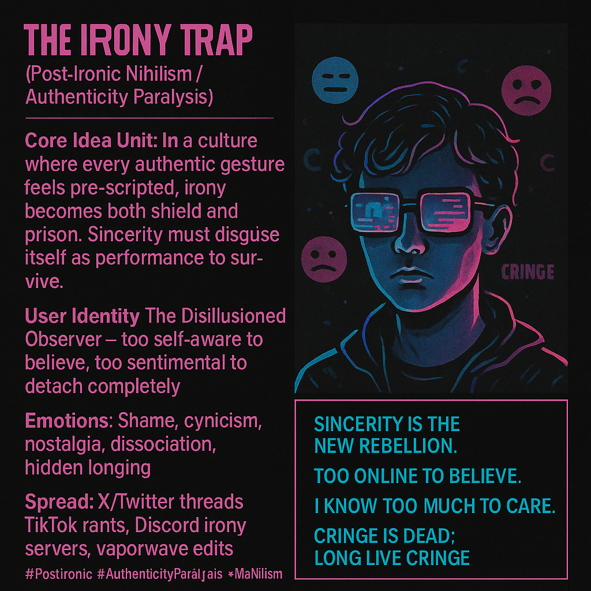

# Navigating the Irony Trap in Modern Culture

Created at 2025/11/10 4:21 PM

### ◈ Mini-Memetic Profile
***

### ∴ Core Idea Unit

A generation fluent in irony discovers that every attempt at meaning feels scripted. Sincerity becomes cringe; irony becomes armor. The only authentic move left is to pretend not to care—and mean it, halfway.
***

### ▲ Identity Play & Roles

Primary role: The Disillusioned Observer — too self-aware to believe, too sentimental to detach completely.Supporting archetypes:
-	Meme Native (irony as mother tongue)
-	Cultural Critic (meta over meaning)
-	Soft Cynic (yearning disguised as detachment)
-	Creative Exhausted (post-original paralysis)
***

### ≈ Emotional Triggers

😬 Shame (fear of cringe)🧠 Cynical pride (“I see through everything”)😢 Nostalgia for lost innocence🌀 Dissociation through irony🔥 Secret longing for sincerity
***

### 𐂷 Spread Mechanics

Distribution vectors: X/Twitter threads, TikTok rants, Discord irony collectives, vaporwave edits, ironic merch (“Sincerity is cringe”).Propagation style: Deadpan humor, absurdism, meta-commentary, self-referential collapse.Format signature: Screenshot essays, nihilist memes, pseudo-philosophical captions.
***

### ⛨ Defense Reflexes

-	Irony Shield: Preempts critique by never meaning anything fully.
-	Meta-Immunity: “I already know I’m part of the problem.”
-	Cringe Aversion: Frames sincerity as emotional risk.
-	Commodified Detachment: Turns despair into aesthetic currency.
***

### ☷ Memeplex Anchor Points

-	🌀 Postmodern skepticism → metamodern exhaustion
-	🤯 Baudrillardian hyperreality
-	💔 Anti-authenticity movements
-	🧠 Internet-born epistemic cynicism
-	⚙️ Late-capitalist aesthetic recycling
***

### ✶ Sticky Symbols or Quotes

“Sincerity is the new rebellion.”“Too online to believe.”“I know too much to care.”“Cringe is dead; long live cringe.”
***

### ∿ Tags

#PostIronic #AuthenticityParalysis #MetaNihilism #CringeCore #DigitalExhaustion #MemeticSincerity #IronyTrap #MeaningFatigue
