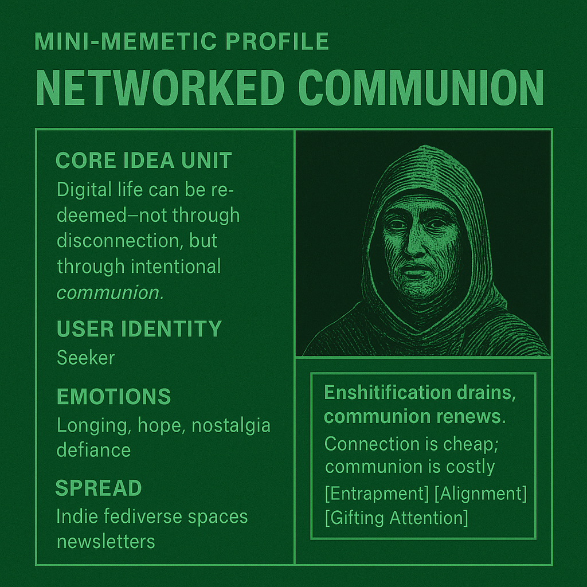

# Networked Communion: Redeeming Digital Life

Created at 2025/08/17 4:09 PM

### ◈ Mini-Memetic Profile

***

### ∴ Core Idea Unit

Digital life can be redeemed—not through disconnection, but through intentional *communion*. The meme reframes the internet as a potential site of sacred, trust-based interaction rather than exploitative algorithmic loops.

***

### ▲ Identity Play & Roles

- **The Seeker** of meaningful connection
- **The Digital Monastic** rejecting spectacle for depth
- **The Refuser** who resists algorithmic captivity
- **The Steward** of regenerative practices and small-scale online community

***

### ≈ Emotional Triggers

- **Longing** for intimacy and resonance
- **Hope** for cultural renewal
- **Nostalgia** for pre-platform internet
- **Defiance** toward extractive tech logic

***

### 𐂷 Spread Mechanics

- **Distribution vectors:**Indie fediverse spaces, newsletters, decentralized platforms, small forums, critical media essays
- **Propagation style:**Philosophical framing, aesthetic seriousness, ritual invocation, subtle satire of “enshittified” platforms

***

### ⛨ Defense Reflexes

- **Irony Immunity:** Framed as sacred or serious, disarms glib criticism
- **Moral Framing:** Casts critics as trapped in commodified digital loops
- **Insider Language:** Concepts like “entrainment,” “communion,” and “alignment” act as shibboleths
- **Narrative Dyads:** Uses Entrapment vs. Communion as a dichotomy—opposing critique becomes “pro-entrapment” by default

***

**⚙️ Memeplex Anchor Points:**

- **#DigitalMinimalism**
- **#RegenerativeCulture**
- **#PostFeedWeb**
- Critical Tech discourse, IndieWeb, Fediverse, Slow Tech, Intentional Community Building
- Philosophical/religious undertones—echoes of monasticism, ritual, and sacred space design

***

### ✶ Sticky Symbols or Quotes

- “Enshitification drains, communion renews.”
- “Connection is cheap; communion is costly.”
- **Symbolic terms:** *Entrapment*, *Alignment*, *Gifting Attention*, *Digital Ritual*
- **Core narrative concept:** The sacredness of chosen connection

***

### ∿ Tags

#NetworkedCommunion #PostFeedCulture #DigitalCommons #RegenerativeWeb #SlowTech #AttentionAsGift
