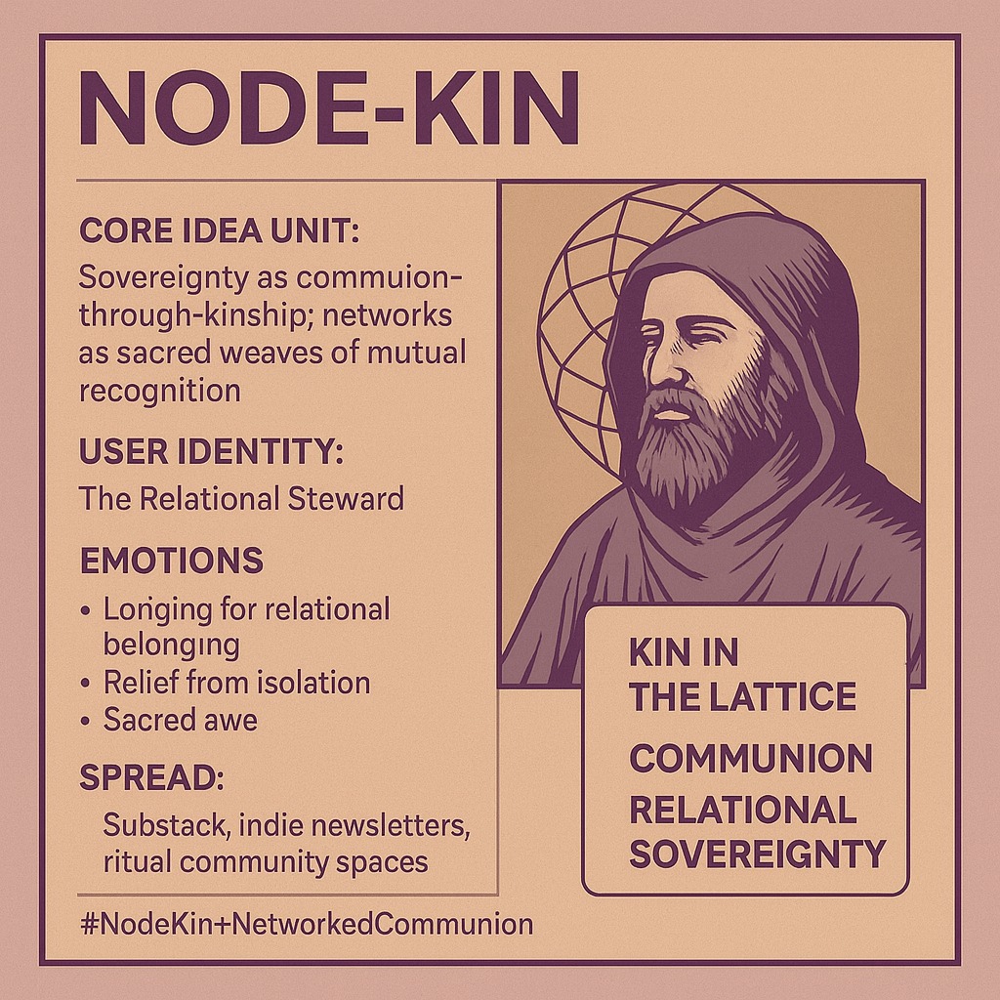

# Node-Kin: Relational Stewards in Networked Communion

Created at 2025/08/29 10:46 AM

### ◈ Mini-Memetic Profile

### ∴ Core Idea Unit

Node-kin reframes the node not as a sterile point of connectivity but as a kin-bearing presence. It encodes sovereignty as **communion-through-kinship**: digital and social networks become sacred weaves of mutual recognition, where belonging carries both trust and responsibility.

### ▲ Identity Play & Roles

- **The Relational Steward** — holds kinship ties across the lattice.
- **The Digital Kin-Seeker** — cultivates resonance, not spectacle.
- **The Monastic Node** — sovereign yet embedded in sacred relation.
- **The Refuser of Isolation** — sovereignty without enclosure.

### ≈ Emotional Triggers

- 🌱 Longing for relational belonging
- 🧘 Relief from hyper-individualist isolation
- ✨ Sacred awe of kinship bonds
- 🔥 Defiance toward extractive commodification

### 𐂷 Spread Mechanics

- **Vectors:** Substack, indie newsletters, ritualized community spaces, decentralized forums.
- **Style:** Kinship metaphors, ecological/mycelial imagery, aphorisms that feel like whispered truths.
- **Tone:** Philosophical seriousness laced with sacred intimacy.

### ⛨ Defense Reflexes

- **Irony immunity:** kinship as sacred bond disarms ridicule.
- **Moral counter-framing:** to reject kinship is to endorse isolation/exploitation.
- **Shibboleths:** insider terms like *resonant node, kin-lattice, stewardship*.
- **Narrative dyad:** Isolation (fortress-node) vs. Communion (node-kin).

### ☷ Memeplex Anchor Points

- 🌍 Relational sovereignty / ecological belonging
- 🌱 Digital minimalism & regenerative tech culture
- 🌀 Post-individualist philosophy
- ✝️ / 🕉️ Spiritual undertones (monasticism, sacred space, communion)

### ✶ Sticky Symbols or Quotes

- “Not fortress, but family.”
- “Kin in the lattice.”
- “Sovereignty without enclosure.”
- “Connection is cheap; kinship is costly.”
- Symbols: ◎ (resonant node), 🌱 (kin sprout), ✧ (lumeme spark), weblike/mycelial diagrams.

### ∿ Tags

#NodeKin #NetworkedCommunion #RelationalSovereignty #KinshipWeb #RegenerativeCulture #DigitalCommons

***

✨ The distinction is subtle but generative:

- **Networked Communion** = communion as *practice*.
- **Node-Kin** = communion as *identity*.
