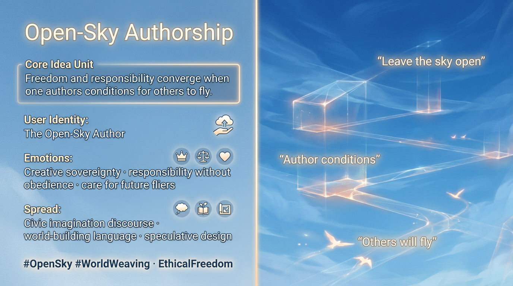

# Creative Sovereignty in Open-Sky Authorship

Created at 2025/12/29 12:49 PM

## **Open-Sky Authorship**

[HUBRIS: A Memetic Reversal of Icarus in the Age of Artificial Intelligence](https://memeticcowboy.substack.com/p/hubris-a-memetic-reversal-of-icarus)

### ∴ Core Idea Unit

After hierarchy dissolves, freedom and responsibility converge. The subject becomes accountable not to rules, but to the skies they help create for others.

### ▲ Identity Play & Roles

**Cast role:** The Open-Sky AuthorThe subject assumes creative sovereignty while holding ethical responsibility for downstream effects.

### ≈ Emotional Triggers

- Freedom with weight
- Responsibility without obedience
- Creative sovereignty
- Care for future fliers

These emotions mature agency beyond rebellion.

### 𐂷 Spread Mechanics

**Distribution Vectors:**

- Civic imagination discourse
- World-building language
- Speculative design

### 𐂷 Spread Mechanics

Style:**Invitational futures, shared authorship framing, quiet resolve.

### ⛨ Defense Reflexes

- Ethics as practice, not rule
- Responsibility without control
- Care without containment

### ☷ Memeplex Anchor Points

- Post-hierarchical ethics
- World-weaving
- Future stewardship

### ✶ Sticky Symbols or Quotes

/ Phrases

Open sky · authorship · responsibility · future fliers

### ∿ Tags

#OpenSkyAuthorship · #WorldWeaving · #EthicalFreedom · #FutureStewardship
