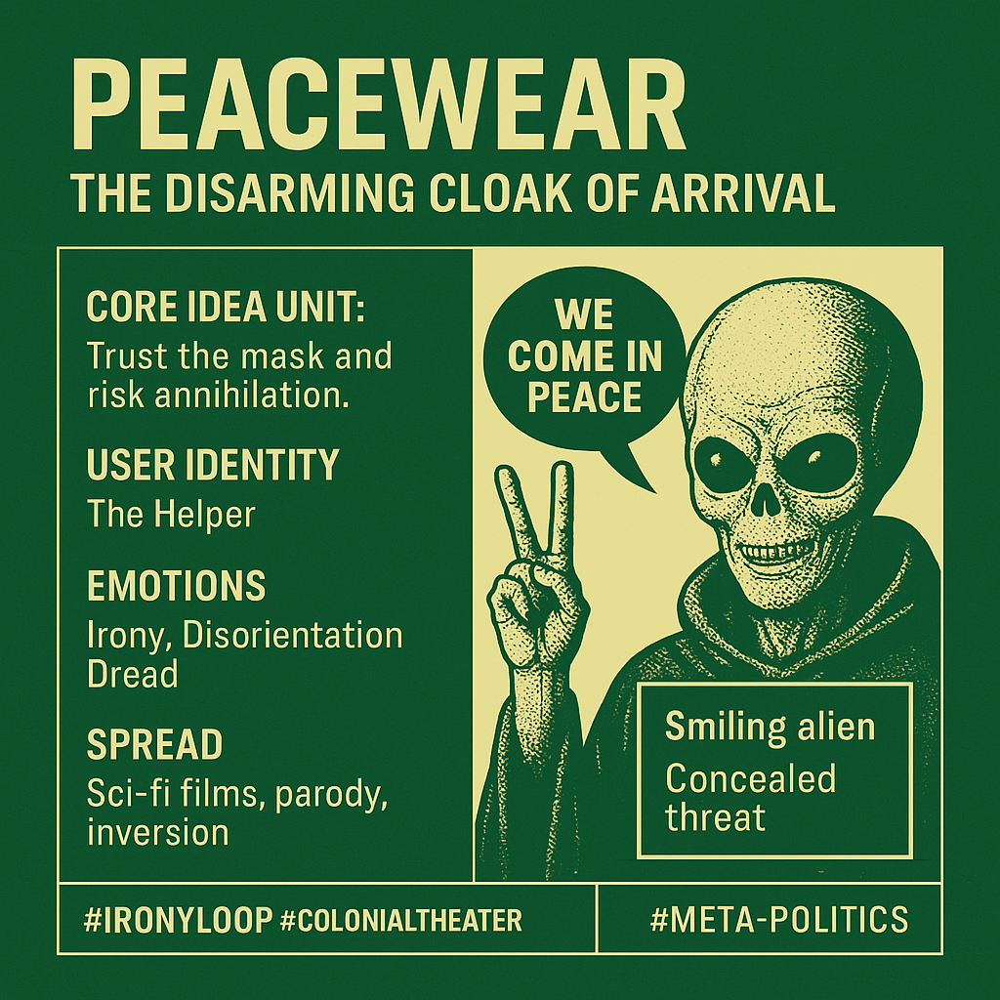

# Peacewear: Trust the Mask, Risk Annihilation

Created at 2025/08/28 3:22 PM

### ◈ Mini-Memetic Profile

***

### 🧩 **Title**:

**Peacewear: The Disarming Cloak of Arrival**

***

### ∴ Core Idea Unit

**Trust the mask and risk annihilation.**The phrase encodes a paradox: a signal of peaceful intent that often precedes violence. It probes the tension between message and motive, between surface diplomacy and concealed threat. The meme asks: *Can peace ever be declared honestly when the power differential is vast?*

It provokes a mental shift from naive reception to skeptical pattern recognition.

***

### ▲ Identity Play & Roles

- **You as the Welcomer**: the hopeful human, yearning for first contact and meaning.
- **You as the Duped**: the gullible species, seduced by language while destruction looms.
- **Alien as Trickster or Colonizer**: masked threat disguised as savior or diplomat.

This meme repositions the self as a potentially naïve node in a larger power game—eager to believe in peace, untrained to detect performative deception.

***

### ≈ Emotional Triggers

- 😬 **Irony** – Language becomes a weapon.
- 🌀 **Disorientation** – Peaceful signals precede chaos.
- 😱 **Dread** – The horror of trusting the wrong message.
- 🧠 **Curiosity** – What *do* they really mean?

***

### 𐂷 Spread Mechanics

- **Distribution Vectors**: Sci-fi films, meme pages, Reddit, Twitter/X satire, alien-themed games.
- **Propagation Style**: Irony, Parody, Inversion.Often used to signal distrust of official narratives or as commentary on diplomatic hypocrisy (e.g., “We come in peace” = “We come to extract your resources”).

***

### ⛨ Defense Reflexes

- **Irony Shield**: The phrase is now so overused and self-aware that critique is expected and baked in.
- **Genre Layering**: It toggles between serious and spoof, deflecting certainty.
- **Semantic Drift**: "Peace" becomes an unstable signifier—no longer trusted at face value.

***

### ☷ Memeplex Anchor Points

- 🛸 **First Contact Mythos**
- 📺 **Media Trust Critique**
- 🏛 **Diplomacy as Theater**
- 🪞 **Semiotic Mistrust in Postmodernism**
- 👁 **Colonial Critique (e.g., “Missionaries came in peace”)**

***

### ✶ Sticky Symbols or Quotes

- **"Don’t run—we are your friends!"** (from *Mars Attacks!*)
- **Smiling alien with hidden weapon**
- **Peace sign replaced by crosshairs**
- **“We come in peace” typed above mushroom clouds or drone strikes**

***

### ∿ Tags

#IronyLoop · #ColonialTheater · #SemioticDeception · #FirstContact · #DiplomaticFacade · #AlienMemes · #WeaponizedLanguage · #TrustFallFail
