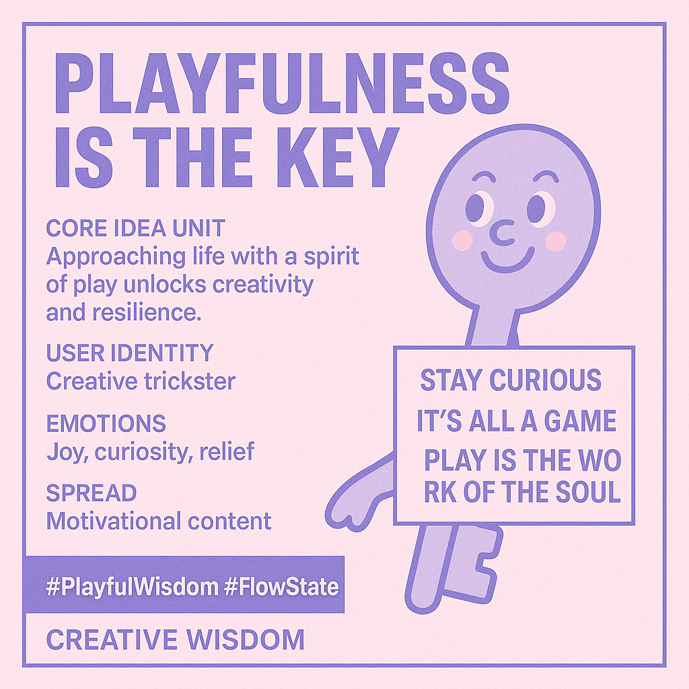

# Playfulness: Unlocking Creativity, Resilience, and Connection

Created at 2025/08/14 8:09 AM

Title: “Playfulness is Key” - The Unlocking Power of Joyful Experimentation

[via x/Jennifer](https://x.com/jspicervet9/status/1956005308620210192?s=46&t=7Z-E-ACnGlzdI-iyUwNCrQ)

🧠 Core Idea Unit:

- The belief that approaching life, work, and problem-solving with a spirit of play unlocks creativity, resilience, and deeper connection — seriousness is often the real obstacle.

🎭 Identity Play & Roles:

- Positions the user as a creative trickster or wise child — the person who uses lightness and humor to navigate complexity and dissolve tension.

💥 Emotional Triggers:

- Joy — celebration of life’s spontaneous moments.
- Curiosity — drive to explore new angles and ideas.
- Relief — release from oppressive seriousness or rigidity.
- Empowerment — belief in the transformative potential of attitude.

📡 Spread Mechanics:

- Distribution vectors: Motivational Instagram reels, TED Talk soundbites, coaching communities, gamified learning platforms, whimsical art accounts.
- Propagation style: Direct claim (“Playfulness is the key”), quote graphics, illustrated metaphors, playful analogies, micro-videos showing joyful acts.

🛡️ Defense Reflexes:

- Irony shield: Dismisses critics as “missing the point” or being “too rigid.”
- Positive framing: Reframes any challenge or criticism as part of the game.

🧬 Memeplex Anchor Points:

- Positive psychology & flow theory.
- New-age mindfulness culture.
- Silicon Valley innovation rhetoric (“move fast, break things — but playfully”).
- Childlike wonder narratives in art and spirituality.

🧠 Sticky Symbols or Quotes:

- Phrases: “Stay curious,” “It’s all a game,” “Play is the work of the soul.”
- Visuals: Keys with cartoon faces, people laughing mid-creation, pastel doodles, whimsical locks opening.

🏷️ Tags:

#PlayfulWisdom #FlowState #CreativityMeme #TricksterMindset #JoyCore #LightnessAsPower

## Resources
- https://object.me.bot/front-img/note/attachments/img/1755184166557/76A0B507-69F1-4CE1-A70E-F5606BAFCF64.png

## Insight

* The image encapsulates the idea that "playfulness is key," suggesting that a playful approach to life can unlock creativity and resilience. This aligns with positive psychology, which emphasizes the importance of joy, curiosity, and engagement in fostering well-being and personal growth.
* The concept of the "creative trickster" as a user identity is intriguing. Tricksters in mythology and folklore often use humor and wit to challenge norms and bring about change. This suggests that embracing a playful, unconventional approach can be a powerful tool for innovation and problem-solving.
* The image lists "joy, curiosity, relief" as key emotions associated with playfulness. These emotions are known to enhance cognitive flexibility and creativity. For example, studies have shown that experiencing positive emotions can broaden our thought processes, allowing us to see more possibilities and make novel connections.
* The phrase "Play is the work of the soul" resonates deeply with the idea that engaging in playful activities is essential for our spiritual and emotional well-being. This notion has roots in various philosophical and spiritual traditions, which view play as a way to connect with our inner selves and experience a sense of flow and purpose.
* The hashtags "#PlayfulWisdom" and "#FlowState" connect the image to broader themes of mindfulness, creativity, and optimal experience. "Flow state," a concept popularized by psychologist Mihály Csíkszentmihályi, refers to a state of deep immersion and enjoyment in an activity, often associated with heightened creativity and productivity.
* The image's mention of "motivational content" as a means of spreading the message highlights the growing trend of using social media and online platforms to promote positive thinking and personal development. While such content can be inspiring, it's important to approach it with a critical eye and ensure that it aligns with our own values and experiences.
* The visual of a key with a cartoon face adds a whimsical touch to the image, reinforcing the idea that playfulness can unlock hidden potential and open new doors. This imagery is reminiscent of children's books and cartoons, which often use playful characters and scenarios to convey important life lessons.
