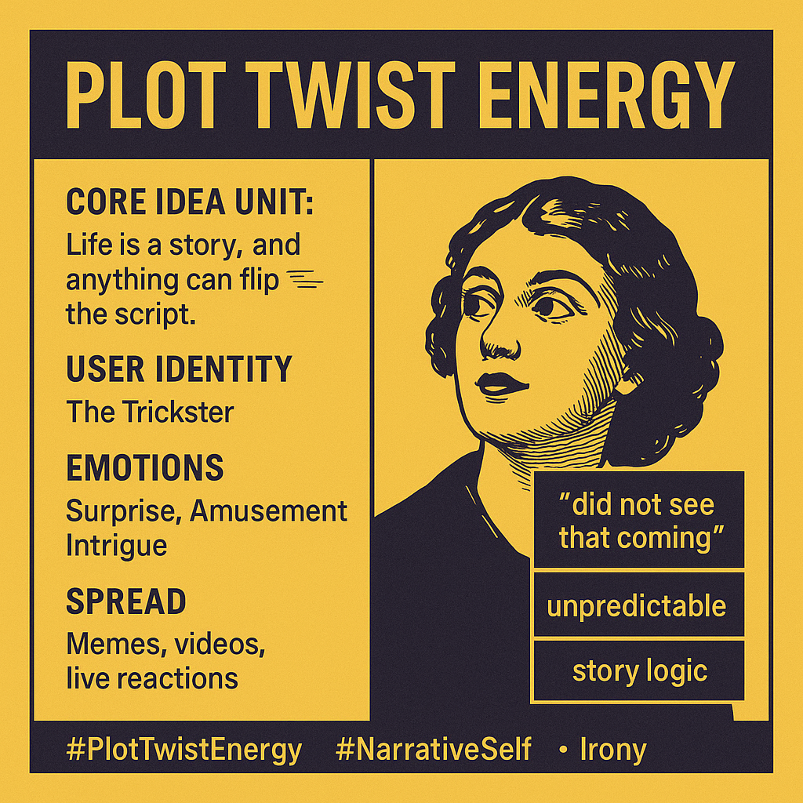

# Plot Twist Energy: Life's Unexpected Narrative

Created at 2025/08/15 7:06 AM

### ◈ Mini-Memetic Profile

**“Plot Twist Energy”**

Title:

The Meme of the Unexpected Disruptor

### ∴ Core Idea Unit

Life is a story, and anything can flip the script.

- Encodes the belief that surprise is power, and unpredictability is a form of charisma or narrative potency.
- Frames existence as fiction-adjacent, where people and events possess latent “plot turns” waiting to unfold.
- Recasts disruption and unpredictability not as chaos, but as storytelling energy.

### ▲ Identity Play & Roles

- The Trickster: unpredictable, thrilling, transformative.
- The Hidden Depths Character: one who surprises with unexpected behavior or revelations.
- The Unseen Protagonist: someone underestimated who flips the social script.
- The Meta-Narrator: an observer or commentator who frames events as part of a greater story.

### ≈ Emotional Triggers

- Surprise / Shock: cognitive reframe via narrative disruption.
- Amusement / Irony: subversion of expectations, often for comedic effect.
- Intrigue: hints at secrets, reveals, and hidden dimensions.
- Awe: when the twist leads to personal revelation or dramatic redemption.

### 𐂷 Spread Mechanics

- Distribution Vectors:
    - Short-form video (TikTok, Reels)
    - Twitter/X reactions
    - Meme captions on image macros
    - Live-commentary during plot-heavy content (reality TV, political drama)
- Propagation Style:
    - Irony-first framing: humorous and self-aware
    - Narrative reframing: retroactively assigns drama to mundane situations
    - Call-and-response: invites users to share their own “plot twist” moments
    - Hybridized tropes: merges with other meme formats (“villain era,” “main character”)

### ⛨ Defense Reflexes

- Irony Armor: Everything is framed as playful or tongue-in-cheek—critique bounces off.
- Narrative Privilege: If life is a story, then “twists” are inevitable—makes actions or events seem pre-justified.
- Reframing Device: Negative outcomes can be spun as meaningful developments in a larger “arc.”
- Dismissal of Literalists: Criticism of the phrase is often mocked as humorless or “not getting the bit.”

### ☷ Memeplex Anchor Points

- Narrativized Self Culture: the rise of identity-as-story.
- Social Media Performance: curated unpredictability as personality trait.
- Reality TV & Streaming Tropes: audiences trained to expect twists.
- Irony Culture: the post-sincerity style of online discourse.
- Therapeutic Reframing: trauma or chaos viewed as part of a “redemptive arc.”

### ✶ Sticky Symbols or Quotes

- “Plot twist energy”
- “Did not see that coming.”
- “She really said, ‘new season, new arc.’”
- Visuals: abrupt tone shifts in video, unexpected reveals, “record scratch” moments
- Emojis: 🎭🌀💥😱

### ∿ Tags

#PlotTwistEnergy #NarrativeSelf #IronyMeme #MainCharacterEnergy #DramaTok #LifeAsFiction #VibeTaxonomy #StoryLogic #DigitalPersonaMeme
