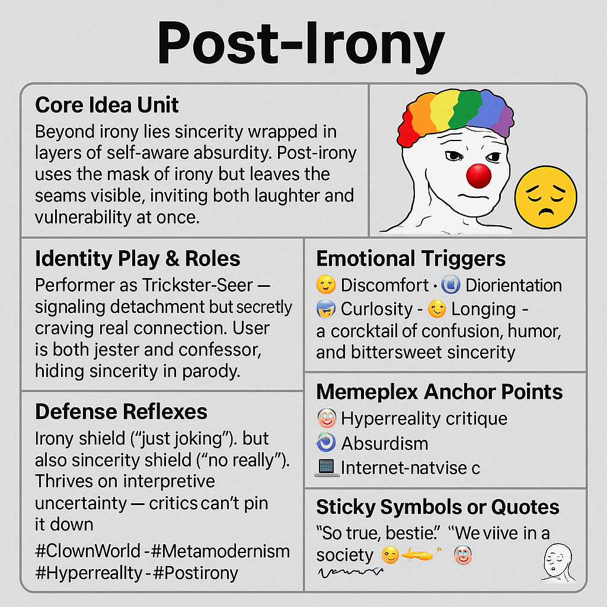

# Post-Irony: Sincerity Wrapped in Absurdity

Created at 2025/08/18 8:44 AM

📌Mini-Memetic Profile for post-irony:

🧩 Title:

Post-Irony

🧠 Core Idea Unit:

Beyond irony lies sincerity wrapped in layers of self-aware absurdity. Post-irony uses the mask of irony but leaves the seams visible, inviting both laughter and vulnerability at once.

🎭 Identity Play & Roles:

Performer as Trickster-Seer — signaling detachment but secretly craving real connection. User is both jester and confessor, hiding sincerity in parody.

💥 Emotional Triggers:

- 😬 Discomfort 
- 🤯 Disorientation 
-  🧠 Curiosity 
- 😢 Longing
- — a cocktail of confusion, humor, and bittersweet sincerity.

📡 Spread Mechanics:

- Distribution Vectors: Twitter/X, TikTok skits, meme pages, Discord humor channels.
- Propagation Style: Ironic sincerity, absurdist aphorism, deliberate ambiguity.

🛡️ Defense Reflexes:

Irony shield (“just joking”), but also sincerity shield (“no really”). Thrives on interpretive uncertainty — critics can’t pin it down.

🧬 Memeplex Anchor Points:

⚙️ Hyperreality critique · 🤡 Absurdism · 🌀 Metamodernism · 💻 Internet-native culture

🧠 Sticky Symbols or Quotes:

- “So true, bestie.”
- “We live in a society 😔👉👈”
- Clown emoji 🤡
- Wojak variants layered with irony → sincerity → irony → sincerity spiral

🏷️ Tags:

#ClownWorld · #Metamodernism · #Hyperreality · #PostIrony

## Resources
- https://object.me.bot/front-img/note/attachments/img/1755531838009/3DB1E87F-2867-4E04-88F9-CE08D05F5CB3.png

## Insight

*   **Core Idea of Post-Irony**: The image defines post-irony as sincerity wrapped in self-aware absurdity. It's like wearing a clown costume but letting people see you're actually a bit sad underneath. This reminds me of Andy Kaufman, who blurred the lines between performance and reality, leaving audiences unsure if he was joking or genuinely eccentric.

*   **Identity Play and Roles**: The concept of the "Trickster-Seer" is central, suggesting a performer who signals detachment but secretly craves connection. Think of comedians who use self-deprecating humor to mask deeper insecurities. It's a way of being vulnerable without fully committing to sincerity, a common trait in online personas.

*   **Emotional Triggers**: The image lists discomfort, disorientation, curiosity, and longing as emotional triggers. This mix creates a "cocktail of confusion, humor, and bittersweet sincerity." It's similar to the feeling you get when watching a dark comedy that makes you laugh and then immediately question your own morality.

*   **Defense Mechanisms**: The "irony shield" ("just joking") and "sincerity shield" ("no really") highlight the defensiveness inherent in post-irony. This reminds me of online arguments where people backtrack with "it's just a meme" when their views are challenged. It's a way to avoid accountability while still expressing potentially controversial opinions.

*   **Memeplex Anchor Points**: The image connects post-irony to hyperreality critique, absurdism, and internet-native culture. Hyperreality, as described by Baudrillard, is the inability to distinguish reality from simulation, which is amplified by internet culture. Post-irony thrives in this environment, where everything is a remix of a remix.

*   **Sticky Symbols and Quotes**: The phrases "So true, bestie" and "We live in a society" are identified as sticky symbols. These phrases, often used ironically, have become shorthand for expressing both genuine sentiment and detached cynicism. They encapsulate the post-ironic condition of simultaneously meaning and not meaning what you say.

*   **Visual Representation**: The image includes a Wojak variant wearing clown makeup, which visually represents the blend of sadness and absurdity. The sad Wojak face is a common meme used to express feelings of isolation and despair, while the clown makeup adds a layer of ironic detachment. This juxtaposition perfectly captures the essence of post-irony.
