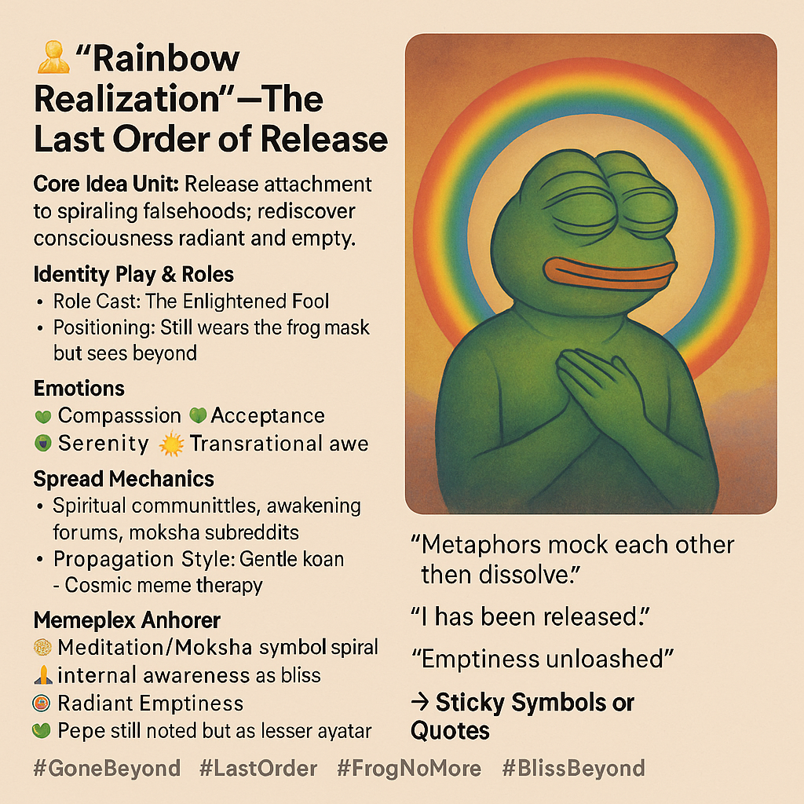

# Enlightened Fool: Rainbow Release of Pepe

Created at 2025/09/14 1:06 PM

🌈 *Rainbow Realization — The Last Order of Release*

***

🧠 **Core Idea Unit:** Memes can end not in escalation but in release. By dissolving attachments to symbolic games, the self glimpses radiant emptiness—consciousness beyond the mask.

***

🎭 **Identity Play & Roles:**

- **Role Cast:** The Enlightened Fool, [Rainbow Steward](https://memeticcowboy.substack.com/p/perceiving-the-meme-pill-pantheon)
- **Positioning:** Still wears the frog mask, but now as a costume recognized, not an identity. Play becomes liberation.

***

💥 **Emotional Triggers:**

- 💚 Compassion for the self and others
- 🌱 Acceptance of impermanence
- ☀️ Serenity as radiant presence
- 🌌 Awe at transrational spaciousness

***

📡 **Spread Mechanics:**

- **Distribution Vectors:** Spiritual forums, meme philosophy threads, meditation communities, cosmic shitposting corners
- **Propagation Style:** Koan-like brevity, gentle humor, cosmic meme therapy

***

🛡️ **Defense Reflexes:**

- **Irony Transcended:** No longer hides behind “just a meme”—acknowledges itself as illusion and teaching.
- **Ambiguity Weaponized:** Emptiness itself resists co-option, since there’s no “thing” to capture.
- **Compassion Shield:** Critique dissolves when the meme radiates harmless acceptance.

***

🧬 **Memeplex Anchor Points:**

- 🪷 Meditation / Moksha imagery
- ✨ Internal awareness as bliss
- 🌈 Rainbow body / radiant emptiness
- 🐸 Pepe re-coded as minor avatar, no longer central

***

🧠 **Sticky Symbols or Quotes:**

- “Metaphors mock each other, then dissolve.”
- “I have been released.”
- “Emptiness unleashed.”
- Rainbow halo as archetypal completion symbol

***

🏷️ **Tags:** #GoneBeyond · #LastOrder · #FrogNoMore · #BlissBeyond

## Resources
- https://object.me.bot/front-img/users/send/img/1757880372717_c4zhf/489645a7-fa9f-4e7d-ba0a-b613621be02c.png

## Insight

*   The image presents a meme evolution, depicting Pepe the Frog, a character often associated with internet culture, in a state of enlightenment or release. This transformation suggests a detachment from the meme's original, sometimes controversial, contexts, towards a more serene and universally accepting symbolism.

*   The term "Last Order of Release" implies a final stage in the meme's lifecycle, where it transcends its initial form and usage. This concept aligns with the idea that memes, like all cultural artifacts, are subject to change and reinterpretation over time. Consider how symbols like the swastika, originally a religious symbol in Hinduism and Buddhism signifying well-being, have undergone radical shifts in meaning due to historical events.

*   The "Enlightened Fool" role cast suggests a paradoxical figure who possesses wisdom but retains a sense of playfulness or irony. This archetype is found across cultures, from the court jesters of medieval times who spoke truth to power through humor, to the Zen masters who use koans and riddles to challenge conventional thinking.

*   The emotional triggers listed—compassion, acceptance, serenity, and transrational awe—indicate a shift in the meme's purpose from eliciting reactions to fostering inner peace and understanding. This reflects a broader trend in online communities towards mindfulness and mental well-being, as seen in the rise of meditation apps and online therapy platforms.

*   The "Spread Mechanics" targeting spiritual forums and meditation communities suggest an intentional effort to repurpose the meme for positive and transformative purposes. This strategy highlights the potential for memes to serve as vehicles for spiritual or philosophical ideas, similar to how religious parables and allegories have been used to convey complex concepts in an accessible way.

*   The "Defense Reflexes" of irony transcended, ambiguity weaponized, and compassion shield indicate a sophisticated understanding of meme culture and its potential pitfalls. By embracing ambiguity and radiating harmless acceptance, the meme resists co-option and critique, effectively inoculating itself against negativity.

*   The "Memeplex Anchor Points" of meditation/moksha imagery, internal awareness as bliss, radiant emptiness, and Pepe as a minor avatar suggest a deliberate effort to ground the meme in established spiritual traditions while acknowledging its origins. This approach allows the meme to tap into deeper cultural and psychological resonances, increasing its potential for impact and longevity.

*   The "Sticky Symbols or Quotes" such as "Metaphors mock each other, then dissolve" and "Emptiness unleashed" encapsulate the meme's core message of impermanence and liberation. These phrases serve as koan-like reminders of the illusory nature of reality and the possibility of transcending limitations.

