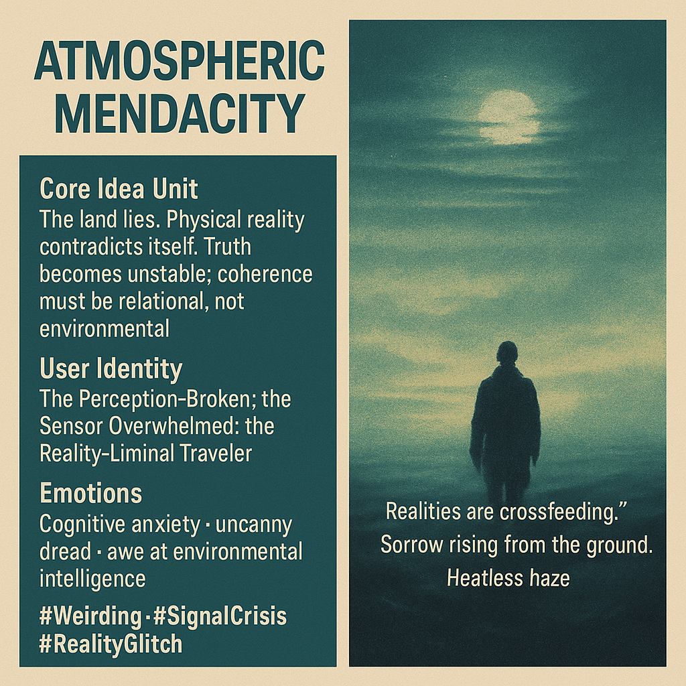

# Reality's Unstable Truths and Emotional Dread

Created at 2025/11/17 6:01 PM

### **🧩 Title: ATMOSPHERIC MENDACITY**

### ∴ Core Idea Unit

The land lies. Physical reality contradicts itself. Truth becomes unstable; coherence must be relational, not environmental.

### ▲ Identity Play & Roles

The Perception-Broken; the Sensor Overwhelmed; the Reality-Liminal Traveler.

### ≈ Emotional Triggers

Cognitive anxiety, uncanny dread, awe at environmental intelligence.

### 𐂷 Spread Mechanics

- Distribution: climate-weirdness subcultures, surreal lit communities, epistemic-crisis thinkpieces• Style: eerie empiricism, poetic anomaly-reporting

### ⛨ Defense Reflexes

“This is not metaphor” insistence; empirical tone masking mystical tension.

### ☷ Memeplex Anchors**

Post-truth ecology · Weird fiction · Climate epistemics

### ✶ Sticky Symbols or Quotes

- “Realities are crossfeeding.”• Heatless haze• Sorrow rising from the ground

### ∿ Tags

#Weirding · #SignalCrisis · #RealityGlitch
