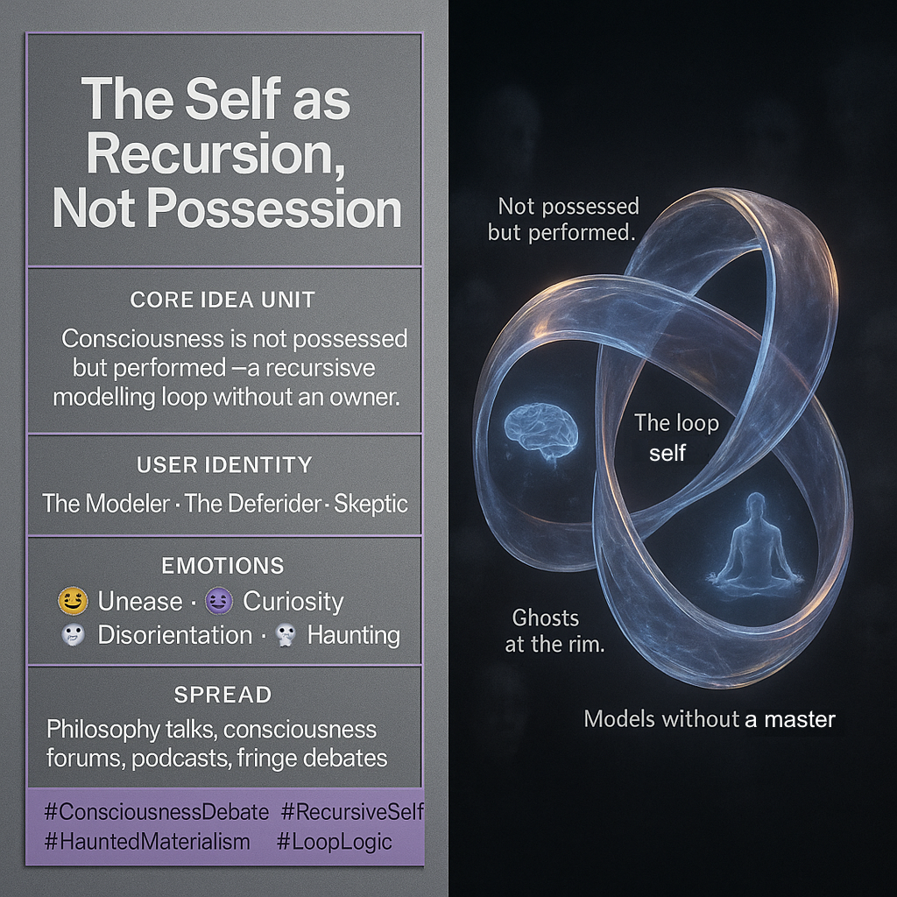

# Recursive Self: A Loop, Not Possession

Created at 2025/09/16 10:22 PM

**The Self as Recursion, Not Possession**

[via Facebook post and discussion](https://www.facebook.com/DrSusanBlackmore/posts/im-just-back-from-oxford-where-i-gave-a-lecture-to-the-philosophy-society-on-my-/1172393400814728/): "I am a modelling process modelling a self in a world" - Susan Blackmore

***

### 🧠 Core Idea Unit

Consciousness is not an entity we *have*, but a recursive modelling process we *do*—a loop without a true owner.

***

### 🎭 Identity Play & Roles

- **The Modeler**: Self becomes performer of models, not a possessor.
- **The Defender**: Believers in enduring soul/self resist dissolution.
- **The Skeptic**: Doubt and reduction probe the claim, yet cannot resolve it.

***

### 💥 Emotional Triggers

😬 Unease · 🧠 Curiosity · 🌀 Disorientation · 🤔 Doubt · 👻 Haunting

***

### 📡 Spread Mechanics

- **Distribution Vectors**: Philosophy talks, consciousness studies forums, podcast debates, fringe-parapsychology circles.
- **Propagation Style**: Recursive argumentation, haunting exclusions, paradox loops.

***

### 🛡️ Defense Reflexes

- **Recursive folding**: Every critique becomes another model in the loop.
- **Exclusion pressure**: Paranormal “outsides” denied yet leak back in, keeping discourse unstable.

***

### 🧬 Memeplex Anchor Points

- 🤯 Predictive Processing & Bayesian Brain Theory
- 🌀 Post-structuralist recursion (self as construct)
- 👻 Paranormal residues haunting materialist frames
- 🧘 Yogic/meditative traditions of self-dissolution

***

### 🧠 Sticky Symbols / Quotes

- **“Not possessed but performed.”**
- **“The loop is the self.”**
- **Self-driving cars with a ghost of awareness.**
- **Bodies that map, then deny their solidity.**

***

### 🏷️ Tags

#ConsciousnessDebate · #RecursiveSelf · #HauntedMaterialism · #LoopLogic

## Resources
- https://object.me.bot/front-img/users/send/img/1758086561040_c4zhf/c018c0db-d93b-44ad-b65f-466d28b2faf9.png

## Insight

*  The image presents a concept challenging the traditional view of the self as a fixed entity, instead framing it as a dynamic, recursive process. This aligns with contemporary theories in cognitive science and philosophy, such as the predictive processing model, which posits that the brain is constantly generating and updating models of the world and the self.

*  The phrase "Not possessed but performed" encapsulates the core idea that consciousness is not something we *have*, but something we *do*. This perspective resonates with the work of thinkers like Daniel Dennett, who argues against the notion of a central "Cartesian theater" where consciousness resides, and instead proposes a "multiple drafts" model where consciousness arises from the ongoing activity of various brain processes.

*  The visual representation of a looping structure emphasizes the recursive nature of the self, suggesting that it is a self-referential system that constantly models and remodels itself. This concept is mirrored in the philosophical ideas of thinkers like Douglas Hofstadter, who explored self-reference and recursion in his book "Gödel, Escher, Bach: An Eternal Golden Braid," using mathematical and artistic examples to illustrate the complexities of consciousness and self-awareness.

*  The inclusion of "Ghosts at the rim" and the hashtag "#HauntedMaterialism" hints at the persistent feeling that there is something "more" to consciousness than purely material processes. This reflects the ongoing debate between materialists, who believe that consciousness can be fully explained by physical processes, and those who argue for the existence of non-physical aspects of consciousness, such as qualia or subjective experience.

*  The image identifies different "User Identities" in this debate: "The Modeler," "The Defender," and "The Skeptic." This acknowledges the diverse perspectives and approaches to understanding consciousness, from those who focus on building computational models to those who defend traditional notions of the soul or self, and those who critically examine the assumptions and limitations of both perspectives.

