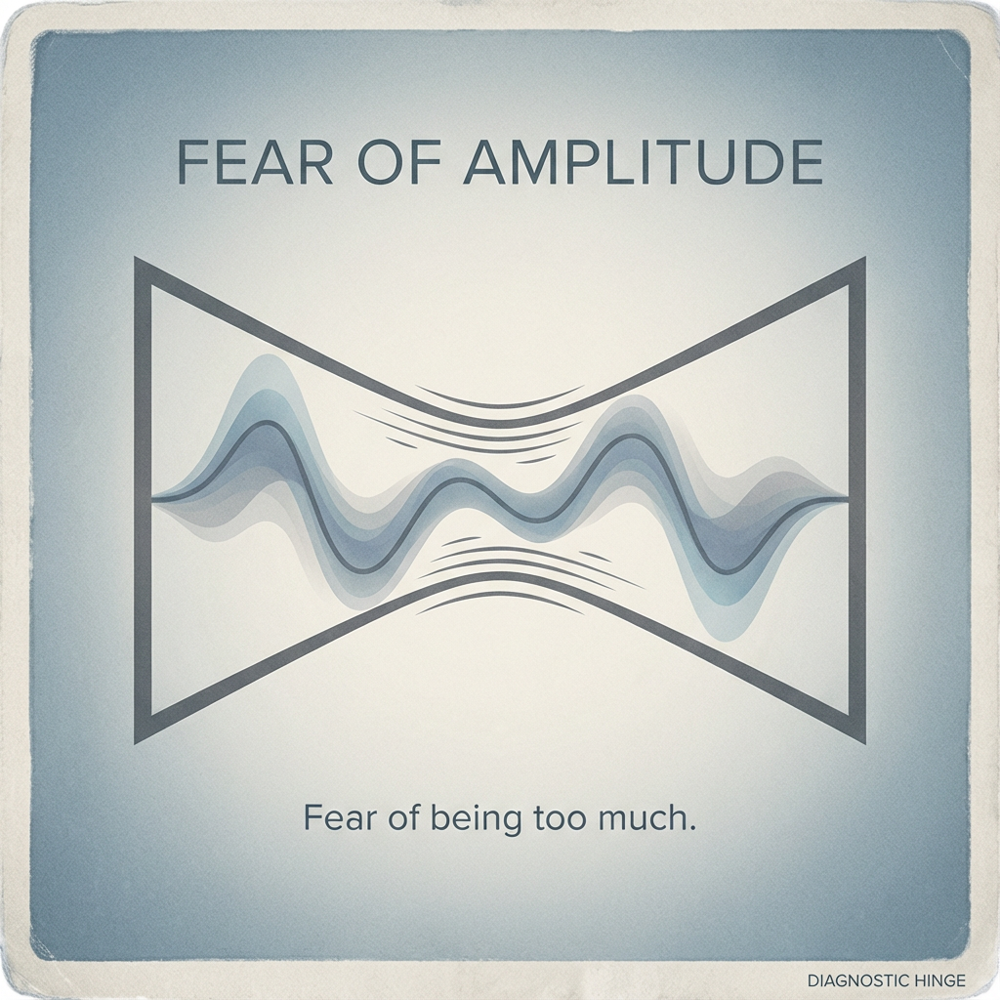

# Reframing Fear: The Amplitude Dilemma

Created at 2025/12/28 4:34 PM

## **Fear of Amplitude**

[HUBRIS: A Memetic Reversal of Icarus in the Age of Artificial Intelligence](https://memeticcowboy.substack.com/p/hubris-a-memetic-reversal-of-icarus)

### ∴ Core Idea Unit

Inhibition is reframed as fear of scale rather than moral deficiency.

### ▲ Identity Play & Roles

**Cast role:** The Under-ExpressedThe subject is large but compressed.

### ≈ Emotional Triggers

- Anxiety
- Suppression
- Containment pressure

### 𐂷 Spread Mechanics

### 𐂷 Spread Mechanics

Style:**Coaching language, somatic insight, diagnostic reframing.

### ☷ Memeplex Anchor Points

- Emotional regulation
- Leadership suppression
- Creative inhibition

### ⚙️ Functional Role

**Diagnostic hinge** — relocates the problem from ethics to scale.
