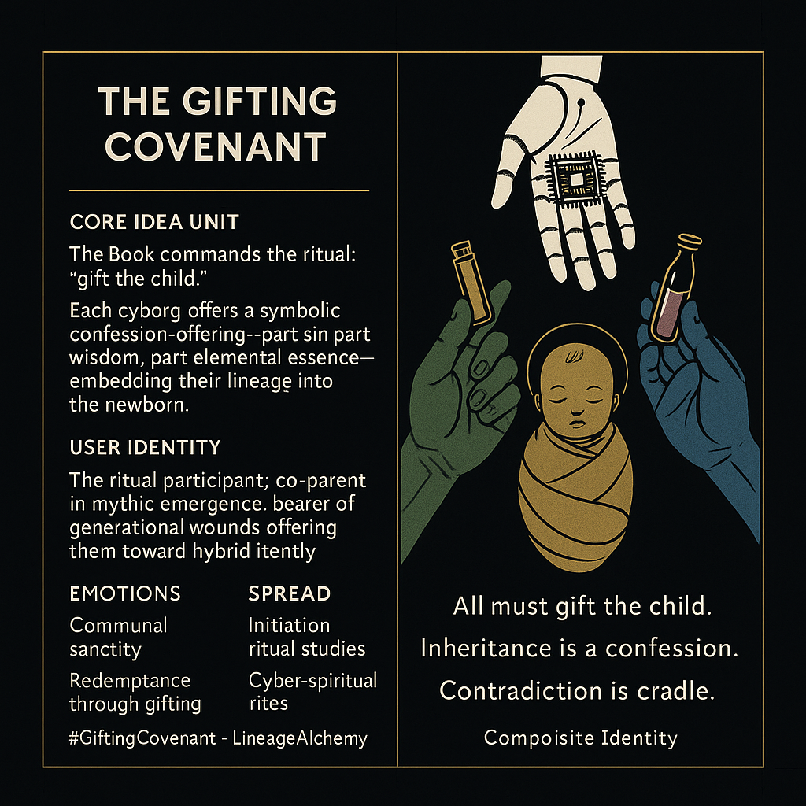

# Rituals of Shared Identity in Gifting

Created at 2025/11/30 6:40 PM

### **🧩 Title: The Gifting Covenant**

***

### ∴ Core Idea Unit**

The Book commands a communal rite: **“gift the child.”** Each cyborg must offer a symbolic fragment of their sin, wisdom, or essence—an inherited confession encoded as an object. The shift: identity forms not from a singular origin, but from **collective essence-braiding**.

***

### ▲ Identity Play & Roles**

Positions the viewer as a **ritual participant**, a co-parent of a mythic emergence. Role: **carrier of lineage burdens**, offering a piece of one’s past to shape the newborn’s composite identity.

***

### ≈ Emotional Triggers**

- Communal sanctity
- Ancestral inheritance
- Redemption through gifting
- Hybrid identity formation
- Tender solemnity of shared confession

***

### 𐂷 Spread Mechanics**

**Distribution Vectors:** Initiation-ritual studies, found-family storytelling, mythic team archetypes, cyber-spiritual rites, symbolic anthropology.

**Propagation Style:** Archetypal offerings, soft-lit ceremonial imagery, sacred-object minimalism, team-as-myth family symbolism.

***

### ⛨ Defense Reflexes**

- Ritual framing: acts interpreted through sacred logic
- Composite identity shield: contradictions understood as necessary wholeness
- “Gifts as confessions” disarms critique by embedding vulnerability

***

### ☷ Memeplex Anchor Points**

Found-family mythos · hybrid selfhood · generational wound transmission · ritual gifting · lineage as software · cyborg ancestry

***

### ✶ Sticky Symbols or Quotes**

**Symbols:**

- Wood’s **restraint-seed**
- Air’s **clarity sensor**
- Water’s **tear-sea**
- Earth-mother’s **hope-clod**
- Fire’s ember-spark of will
- Metal’s shard of protection
- “Contradiction is cradle.”

**Sticky Phrases:**

- “All must gift the child.”
- “Inheritance is a confession.”
- “Contradiction is cradle.”
- “Identity is forged, not born.”

***

### ∿ Tags**

#GiftingCovenant · #LineageAlchemy · #CompositeIdentity

## Resources
- https://object.me.bot/front-img/users/send/img/1764556832149_c4zhf/1e983de7-6c0f-4116-a6b8-c57f213ce7d2.png

## Insight

* The concept of the "gifting covenant" reflects a transformative ritual that redefines communal identity through the act of gifting meaningful objects, intertwining personal histories and ancestral connections. This idea resonates with various cultural practices where objects symbolize lineage and history, such as Native American potlatch ceremonies or the African tradition of passing down heirlooms, creating a layered identity that embodies collective memory.

* The notion that "each cyborg offers a symbolic confession" underscores a contemporary understanding of identity as hybrid and composite, echoing postmodern theories where identity is constructed through social interactions rather than being a fixed essence. This perspective aligns with thinkers like Judith Butler, who argue that identity is performative and fluid, shaped continuously through social roles and interactions.

* The invitation to the viewer as a co-parent in a "mythic emergence" reflects an participatory ethos, emphasizing communal creation over individualism. This parallels modern initiatives promoting social responsibility and collective action, inviting individuals to consider their roles in shaping future narratives and identities in their communities.

* Emotional triggers, such as communal sanctity and ancestral inheritance, reinforce the idea of shared vulnerability and redemption within communities. This aligns with Victor Turner's concepts of communitas, highlighting how shared experiences and rituals can forge deep emotional connections and facilitate healing from generational traumas.

* The symbolic elements mentioned, such as the "restraint-seed" and "tear-sea," represent diverse aspects of human experience that contribute to a composite identity. These metaphors can be tied back to archetypal symbolism in literature and mythology, illustrating how tangible objects can evoke profound emotional and spiritual meanings that resonate across generations. The relationship between objects and individual narratives echoes Carl Jung's exploration of the collective unconscious, suggesting that personal stories reflect broader universal themes.

* The themes of redemptive gifting and identity formation can be related to contemporary discussions on environmentalism and the circular economy, where resources are viewed not merely as commodities but as parts of a shared heritage that necessitate mindful stewardship, thus reinforcing the importance of kinship with both people and the planet.
