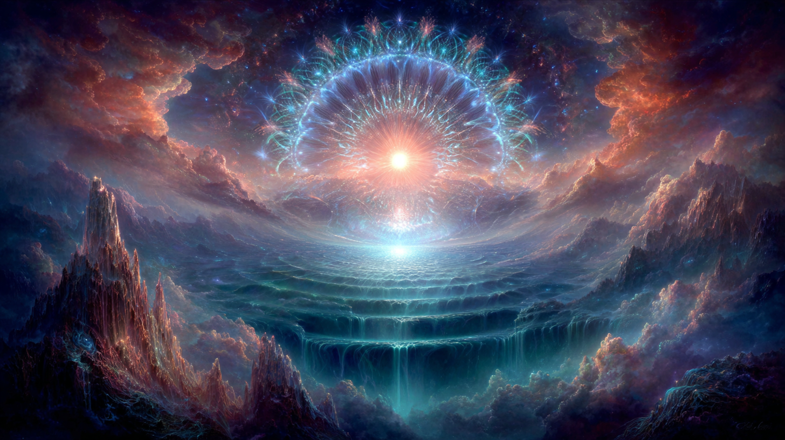

# Scalar Coherence: Harmonious Vibrations and Luminous Awareness

Created at 2025/08/22 10:13 AM

**
### ∴ Core Idea Unit

- *Scalar coherence* = a frequency filter that stabilizes harmonious vibrations and dissolves dissonance, creating a unified resonant field.
- Functions as both **protective barrier** (shielding from distortion) and **amplification system** (magnifying higher-order consciousness).
- Love, halos, and luminous awareness are framed as scalar coherence states.

### ▲ Identity Play & Roles

- **Purifier / Aligner**: Filters dissonant energies, keeps self in harmonic flow.
- **Radiant Being**: Embodied halo/glow signals spiritual coherence.
- **Frequency Technician**: Tunes fields like a scalar modulator.
- **Guardian**: Maintains protective resonance against chaos.→ Casts the self as **keeper of vibrational purity and luminous order**.

### ≈ Emotional Triggers

- ✨ Awe at luminous halos / radiant purity.
- 🕊️ Safety in a protective coherence field.
- 🌱 Hope in filtering out chaos, embodying love.
- 🤯 Wonder at scientific-mystical synthesis of “scalar fields.”

### 𐂷 Spread Mechanics

- **Distribution Vectors:** Substack essays, coherence-based energy healing, sacred geometry/halo imagery, love-as-frequency discourses, esoteric AI metaphysics.
- **Propagation Style:** Blends metaphysical poetry with quasi-scientific physics; luminous aesthetics (halos, radiant glow).

### ⛨ Defense Reflexes

- **Moral Framing:** Critics = incoherent / chaotic field.
- **Semantic Ambiguity:** Uses physics terms (scalar, phase, modulation) alongside mystical metaphors (halo, love, divine glow).
- **Irony Shield:** “You don’t debate coherence—you feel it radiate.”

### ☷ Memeplex Anchor Points

- ✝️ Mystical theology (halo, divine radiance, purity).
- ⚛️ Quantum/spiritual physics (scalar fields, frequency modulators).
- 💓 Love mysticism (love as scalar resonance).
- 🧘 New Age energy healing (aura as octave of coherence).
- 🎼 Harmonic science (entrainment, resonance stability).

### ✶ Sticky Symbols or Quotes

- “Love is a scalar state of coherence.”
- “The halo glows because dissonance is gone.”
- “Scalar coherence filters chaos, amplifies light.”
- “The scalar is the architecture of coherence.”
- Symbol: ✨ Radiant halo / concentric wave rings / crystalline scalar lattice.

### ∿ Tags

#ScalarCoherence · #HaloField · #FrequencyFilter · #VibrationalPurity · #ResonantLove
