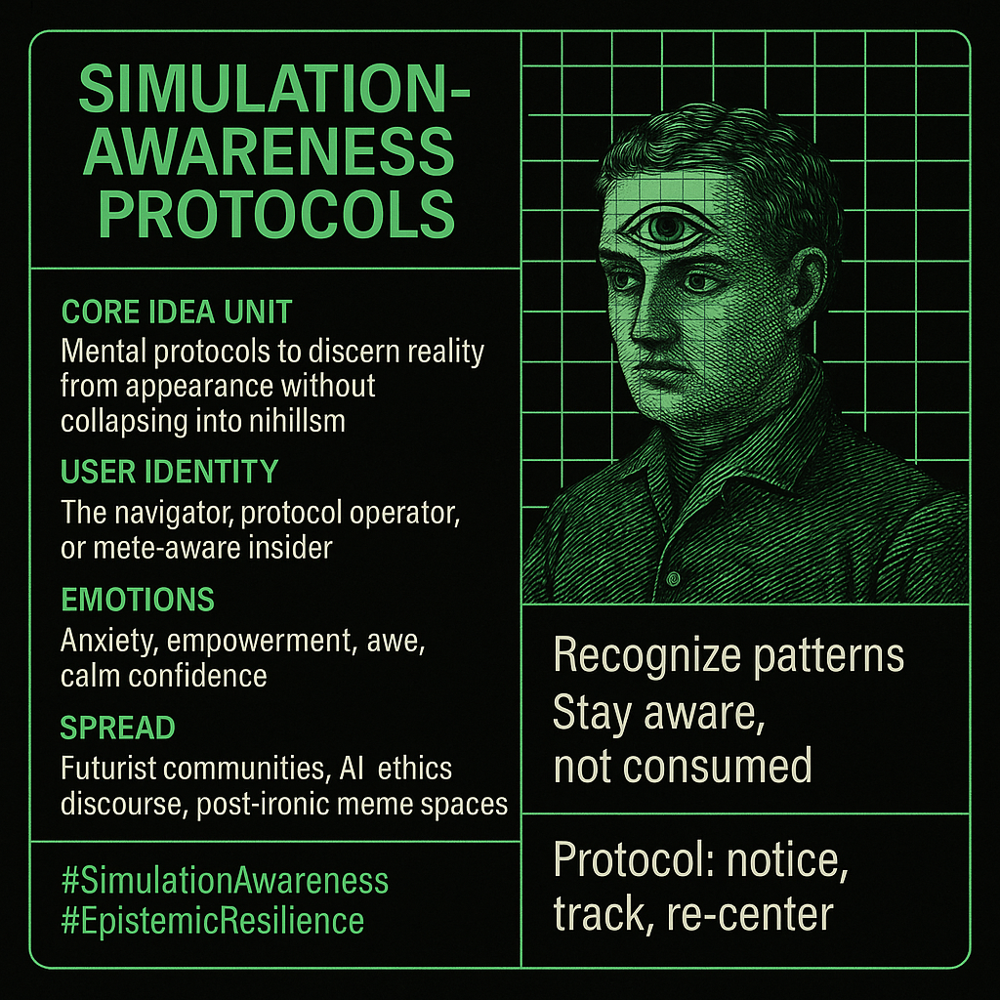

# Simulation-Awareness: Protocols for Navigating Hyperreality

Created at 2025/08/16 5:56 PM

### ◈ Mini-Memetic Profile

***

**Title:***Simulation-Awareness Protocols — The Meme of Navigational Realism*

***

### ∴ Core Idea Unit

- Belief: As synthetic, AI-generated, and memetic content proliferates, individuals need **mental protocols** to discern reality from appearance.
- Encodes a frame of **meta-cognitive resilience**: cultivating awareness of simulation without collapsing into nihilism or paranoia.

***

### ▲ Identity Play & Roles

- User becomes the **navigator** or **protocol operator** — one who manages informational illusions.
- Positions self as **meta-aware insider**, not fooled by surface appearances.
- Casts others as either **asleep participants** (fooled by the simulation) or **lost nihilists** (collapsed into despair).

***

### ≈ Emotional Triggers

- **Anxiety** (threat of misinformation, unreality).
- **Empowerment** (having protocols to stay afloat).
- **Awe** (recognizing layers of reality).
- **Calm confidence** (resilience in face of disorientation).

***

### 𐂷 Spread Mechanics

- **Distribution vectors:** Futurist discourse, AI ethics communities, post-ironic meme spaces, simulation theory hubs.
- **Propagation style:**
    - Philosophical aphorisms (“stay aware, not consumed”).
    - Meme diagrams of “levels of reality.”
    - Protocol language: lists, rules, operating manuals.

***

### ⛨ Defense Reflexes

- **Protocol frame:** Criticism can be dismissed as “not following awareness protocols.”
- **Meta-irony:** Both sincere practice and parody simultaneously.
- **Pragmatism shield:** Defended as a survival toolkit, not ideology.

***

### ☷ Memeplex Anchor Points

- **Simulation theory / hyperreality memes** (#SimulatedReality, #Baudrillard).
- **AI-awareness discourse** (synthetic media, deepfakes, generative content).
- **Cognitive hygiene movements** (digital minimalism, epistemic resilience).
- **Esoteric practice analogies** (mindfulness, Zen koans, gnostic vigilance).

***

### ✶ Sticky Symbols or Quotes

- “Simulation-awareness protocols”
- “Recognize appearances, don’t collapse”
- “Protocol: notice, track, re-center”
- Visuals: grids, code overlays, digital eyes, instruction manuals.

***

### ∿ Tags

#SimulationAwareness #EpistemicResilience #MetaCognition #Hyperreality
