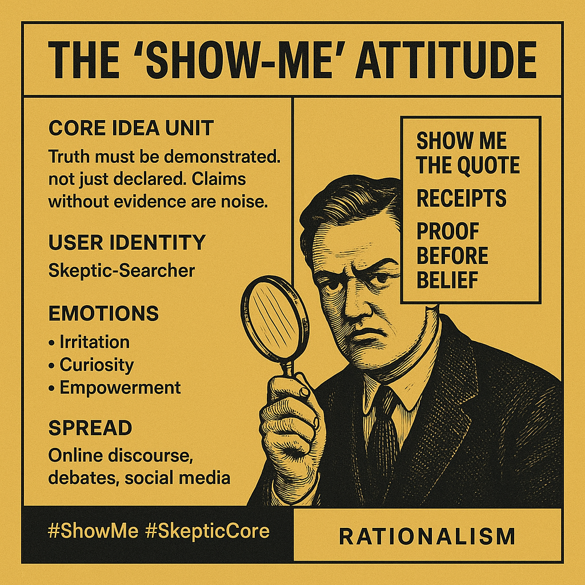

# Skepticism as Strength: The "Show-Me" Attitude

Created at 2025/08/18 6:13 AM

### ◈ Mini-Memetic Profile

**Title:** The “Show-Me” Attitude — Proof Before Belief

***

### ∴ Core Idea Unit

Truth must be demonstrated, not just declared. Claims without evidence are noise. The meme encodes skepticism as strength: seeing is believing, words aren’t enough.

***

### ▲ Identity Play & Roles

- **User as Skeptic-Guardian** — the one who demands receipts.
- **Others cast as Charlatans or Provers** — forced to substantiate or be dismissed.
- Reframes self from passive recipient to active validator.

***

### ≈ Emotional Triggers

- 😡 Irritation at empty claims.
- 🧠 Curiosity when proof is teased.
- 💪 Empowerment from resisting persuasion.
- 😏 Satisfaction in puncturing hype.

***

### 𐂷 Spread Mechanics

- **Distribution Vectors:** X/Twitter replies (“source?”), Reddit debates, Discord fact-check channels.
- **Propagation Style:** Dry skepticism, ironic demand, callout culture. Often meme-ified as receipts, screenshots, or GIFs (“pics or it didn’t happen”).

***

### ⛨ Defense Reflexes

- **Irony shield:** Even if evidence is weak, the “show-me” frame protects user from gullibility.
- **Burden shift:** Puts responsibility on others to prove, not on self to refute.
- **Counter-narrative preemption:** Accusations of cynicism reframed as “just rational.”

***

### ☷ Memeplex Anchor Points

- ⚙️ Rationalism & skepticism culture.
- 📰 Media literacy / fact-checking discourse.
- 🧪 Scientific empiricism.
- 🤨 Anti-hype / anti-snake-oil subcultures.

***

### ✶ Sticky Symbols or Quotes

- “Receipts or it didn’t happen.”
- “Pics or GTFO.”
- Magnifying glass emoji 🔍
- Screenshot-as-proof meme.
- Missouri’s “Show-Me State” as archetypal anchor.

***

### ∿ Tags

#ProveIt · #Receipts · #SkepticCore · #ShowMeState · #AntiHype

[via Bob-RJ](https://x.com/BurkhartRj/status/1957419148239110555)
