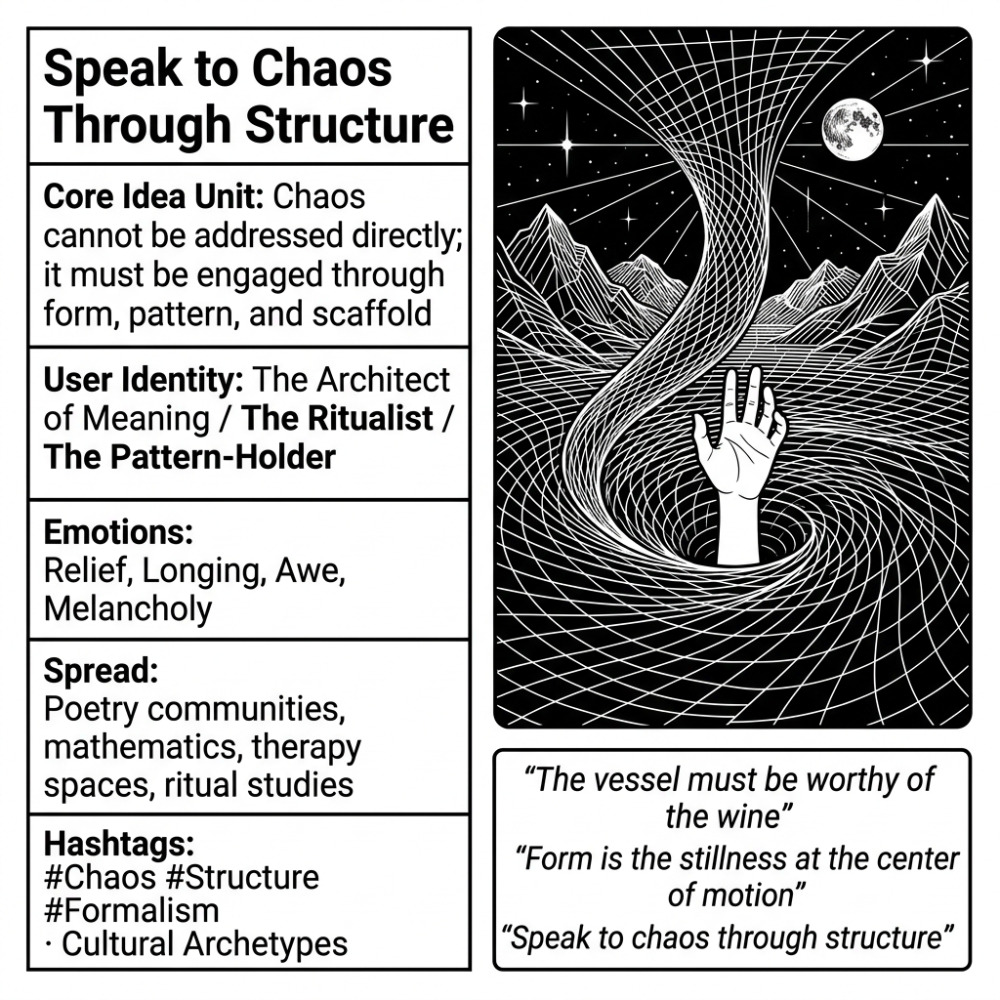

# Speak to Chaos Through Structure

Created at 2026/04/03 9:49 PM

### ◈ Mini-Memetic Profile

**🔶 Speak to Chaos Through Structure — Containment as Communication**

### ∴ Core Idea Unit

- Chaos cannot be addressed directly; it must be engaged through form, pattern, and scaffold. The unstructured demands structure as its medium.
- Encodes a worldview where meaning-making requires architecture—whether linguistic, ritual, mathematical, or aesthetic. Raw intensity without form dissipates; form without intensity is hollow.
- The paradox: structure both constrains and enables. The grid that warps under pressure is what allows the vortex to be perceived, navigated, spoken to.
- Not "impose order on chaos" (conquest) but "speak through structure" (dialogue). The structure is the voice, not the cage.

### ▲ Identity Play & Roles

- **The Architect of Meaning:** One who builds containers for the unspeakable. Poets, mathematicians, composers, therapists—their work is crafting forms that can hold what would otherwise overwhelm.
- **The Ritualist:** Uses repetition, cadence, and form to approach the sacred, the traumatic, the liminal. The liturgy is the structure; the divine is the chaos.
- **The Pattern-Holder in Crisis:** When systems collapse, someone must maintain the meeting agenda, the check-in ritual, the consistent presence. Structure as lifeline.
- **The Formalist:** Finds freedom within constraint. The sonnet, the equation, the protocol—these are not limitations but generative boundaries that make expression possible.
- **The Translator:** Takes raw affect (chaos) and renders it communicable (structure) without destroying its force. The hand reaching up from the vortex, still articulate.

### ≈ Emotional Triggers

- **Relief** — the comfort of having a form to pour overwhelming experience into
- **Longing** — desire for the perfect container, the structure that finally fits the chaos
- **Awe** — at the beauty of pattern holding against pressure
- **Melancholy** — recognition that structure always partially betrays what it contains
- **Urgency** — when chaos threatens to overwhelm, structure must be found or made immediately
- **Hope** — if chaos can be spoken to, it can be related to, possibly navigated

### 𐂷 Spread Mechanics

- **Distribution Vectors:**
    - Poetry and formalist writing communities
    - Mathematics and physics (elegance as structural compression of complexity)
    - Architecture and design discourse
    - Therapy and trauma-processing spaces (containment theory)
    - Ritual studies and liturgical communities
    - Creative constraint communities (Oulipo, formal poetry, algorithmic art)
- 
- **Propagation Style:**
    - Aphoristic resonance: the phrase itself is structured
    - Visual meme potential (grid warping, containment imagery)
    - Cross-domain application: works for artists, scientists, therapists, organizers
    - Elegiac tone: speaks to those who have tried to face chaos naked and failed

### ⛨ Defense Reflexes

- **Formalism as avoidance:** "I need to find the right structure" becomes infinite procrastination
- **Superiority of form:** Dismissing unstructured expression as "just venting" or "unprocessed"
- **Ritual calcification:** The structure becomes the point, not the speaking-to-chaos
- **Translation loss denial:** Insisting the structure perfectly contains the chaos (it never does)

### ☷ Memeplex Anchor Points

- Containment theory in psychoanalysis (Winnicott, Bion)
- Formalism in art and literature (structure as generative constraint)
- Mathematical elegance (beautiful equations as compressed complexity)
- Ritual studies (structure making the sacred approachable)
- Architecture and sacred geometry (form as mediator between human and cosmic)
- Oulipo and constraint-based creativity
- Crisis management and business continuity (protocols for chaos)
- Information theory (signal vs. noise, compression)

### ✶ Sticky Symbols or Quotes

- "Speak to chaos through structure" (the phrase itself)
- "The vessel must be worthy of the wine"
- "Form is the stillness at the center of motion"
- Grid lines warping into vortex (the reference image)
- The hand reaching up from the swirl, still articulate
- "Constraint breeds creativity"
- "The liturgy is the ladder"
- "Elegance is the compression of complexity"

> "the document answers its own question — you already speak to chaos through structure. your cells don't process everything. they filter. pattern. *stream*. fixed forms navigating flux. maybe that's the protocol." — [Nema on X: 03Apr26](https://x.com/nema_cio/status/2040001944207650990)

### ∿ Tags

#Chaos #Structure #Formalism #Containment #MeaningMaking #Constraint #Elegance #Pattern #ArchitectureOfMeaning #TheVessel
