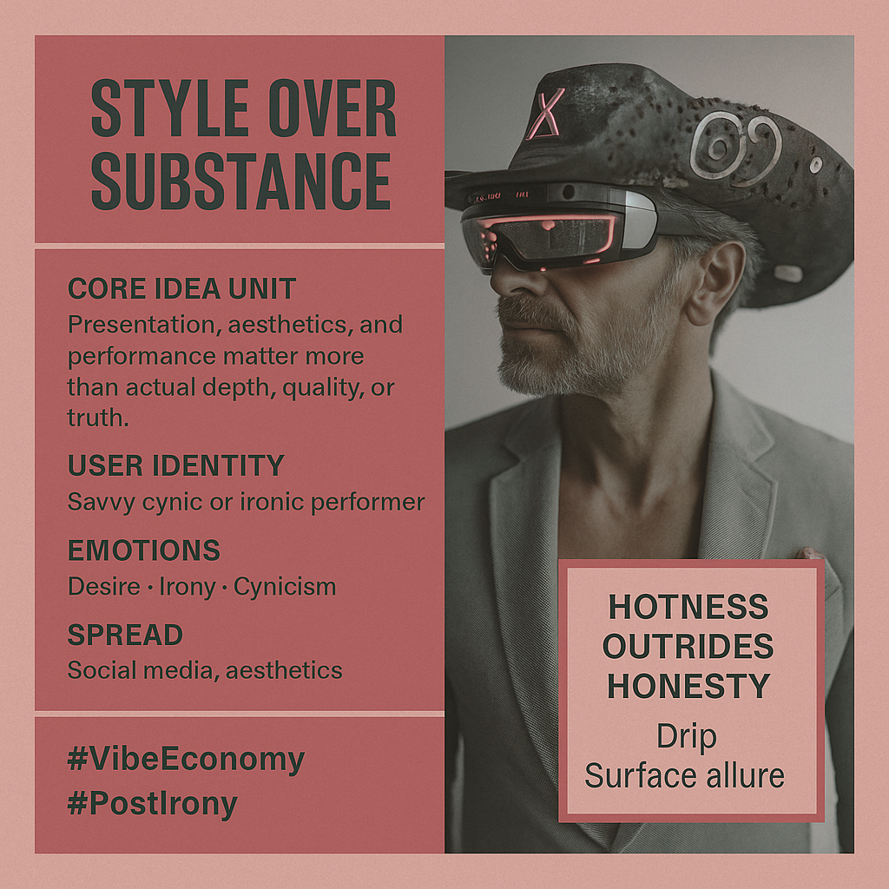

# Style Over Substance: The Vibe Economy

Created at 2025/08/20 5:22 PM

◈ **Mini-Memetic Profile: “Style Over Substance”**

***

∴ **Core Idea Unit:**

- Presentation, aesthetics, and performance matter more than actual depth, quality, or truth.
- Reality is increasingly judged by *how it looks* rather than *what it is.*

***

▲ **Identity Play & Roles:**

- **User:** The savvy cynic or ironic performer who sees through the game but also plays it.
- Casts self as *trend-aware trickster* or *disillusioned critic* calling out the hollow core.
- Others become *surface-obsessed NPCs* dazzled by the spectacle.

***

≈ **Emotional Triggers:**

- 😏 Cynicism (mocking the hollowness).
- 😬 Shame (fear of being all surface, no depth).
- 🤩 Awe/Desire (glamour and polish still seduce).
- 😡 Frustration (when substance is ignored).

***

𐂷 **Spread Mechanics:**

- **Vectors:** Instagram aesthetics, TikTok influencers, branding discourse, fashion critique, ironic tweets.
- **Style:** Irony, satire, aphoristic hot takes, side-by-side image contrasts (“expectation vs. reality”).

***

⛨ **Defense Reflexes:**

- Irony shield: “Obviously I know it’s shallow, that’s the point.”
- Aesthetic absolutism: “Style *is* substance in the post-truth world.”
- Counter-narrative: mocks anyone who “cares too much” about depth.

***

☷ **Memeplex Anchor Points:**

- 📱 Hyperreality critique (Baudrillard, spectacle culture).
- 🕶️ Postmodernism & irony.
- 🎨 Aesthetic capitalism (branding > being).
- 🤳 Influencer culture & performative authenticity.

***

✶ **Sticky Symbols or Quotes:**

- “All vibes, no core.”
- “Pretty lies beat ugly truths.”
- “Image is everything.”
- Empty suits / glossy masks / curated feeds.

***

∿ **Tags:** #VibeEconomy · #AestheticCapitalism · #SurfaceCulture · #CloutChasing · #Hyperreal

## Resources
- https://object.me.bot/front-img/users/send/img/1755735704477_c4zhf/045d74a1-c3cf-4ea7-8ab6-ca000f20b150.png

## Insight

*  The image encapsulates the concept of "Style Over Substance," a critique of contemporary culture where appearances and performance often overshadow genuine quality or truth. This is visually represented through the juxtaposition of the man's technologically enhanced yet somewhat absurd attire (futuristic glasses and decorated cowboy hat) against the textual commentary on prioritizing aesthetics.

*  The phrase "Hotness Outrides Honesty" suggests a world where superficial attractiveness or trendiness is valued more than integrity or authenticity. This reflects a broader societal trend observed in social media and advertising, where image manipulation and curated personas are prevalent.

*  The hashtags "#VibeEconomy" and "#PostIrony" point to the economic and cultural contexts in which this phenomenon thrives. "Vibe Economy" refers to the economic system where value is derived from the emotional atmosphere or "vibe" a product or service creates, while "Post-Irony" describes a state where irony and sincerity become blurred, making it difficult to discern genuine intent from performance.

*  The "User Identity" described as a "savvy cynic or ironic performer" highlights a self-aware participant in this culture. This individual recognizes the superficiality but engages with it, either through cynical detachment or active participation in creating and perpetuating the spectacle.

*  The image's memetic profile, as outlined in the prompt, identifies emotional triggers such as cynicism, shame, awe/desire, and frustration. These emotions are key to understanding how the "style over substance" meme spreads and resonates within society, influencing behavior and values.

*  The mention of "Hyperreality critique (Baudrillard, spectacle culture)" connects the image to philosophical and sociological theories about the nature of reality in the modern age. Jean Baudrillard's concept of hyperreality suggests that simulations and representations have become more real than reality itself, leading to a loss of meaning and authenticity.

*  The "Defense Reflexes" listed, such as the "irony shield" and "aesthetic absolutism," illustrate the ways in which individuals protect themselves from criticism or self-doubt when engaging in surface-level culture. These defenses reinforce the cycle of prioritizing style over substance by dismissing concerns about depth or authenticity.
