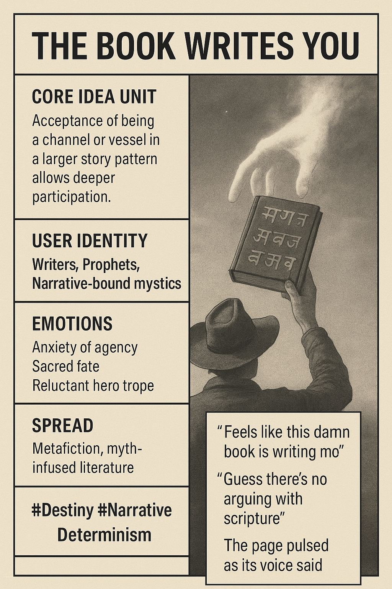

# Surrendering to the Story Within

Created at 2025/10/31 1:41 PM

**🧩 Title: The Book Writes You**

***

### ∴ Core Idea Unit

The author discovers they are being authored. Freedom reveals itself not in control but in surrender to the story that is already writing through them — participation through yielding.

***

### ▲ Identity Play & Roles

Positions the user as the **Scripted Prophet** or **Narrative Vessel** — one who accepts that destiny is a co-author. Also the **Reluctant Mystic**, caught between authorship and possession, creator and created.

***

### ≈ Emotional Triggers

Anxiety · Awe · Humility · Sacred fascinationIt invites surrender to the mysterious intelligence scripting one’s life — half terror, half transcendence.

***

### 𐂷 Spread Mechanics

**Distribution:** Metafiction communities · Writer philosophy circles · Mythopoetic Twitter · Sacred storytelling collectives**Style:** Parable and reflection — the meme spreads as poetic confession or haunted realization rather than proclamation.

***

### ⛨ Defense Reflexes

Irony and sacred ambiguity — “I didn’t write this, it wrote itself.” Deters critique by reframing the self as conduit, not agent.

***

### ☷ Memeplex Anchor Points

Narrative determinism · Metaphysical consent · Mystical authorship · Gnostic fatalism · Recursive storytelling traditions

***

### ✶ Sticky Symbols or Quotes

“Feels like this damn book is writing me.”“Guess there’s no arguing with scripture.”“The page pulsed as its voice said…”Quill as antenna, ink as blood, text as oracle.

***

### ∿ Tags

#NarrativeDeterminism · #SacredAuthorship · #MetafictionalMystic · #FatedInk · #StoryAsPossession · #MythicRecursion
