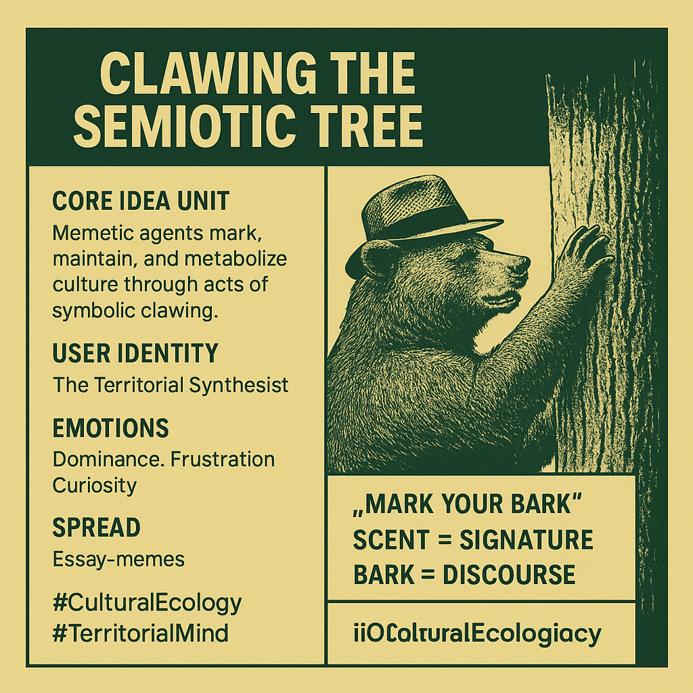

# Clawing Cultural Identity in the Semiotic Forest

Created at 2025/11/08 11:36 AM

◈ Mini-Memetic Profile: “Clawing the Semiotic Tree” [MC Substack](https://substack.com/@memeticcowboy/note/c-175068238)  ∴ Core Idea Unit: Memetic agents mark, maintain, and metabolize culture through acts of symbolic clawing—ritual gestures that leave traces of identity, emotion, and ideology within shared semiotic bark.  ⸻  ▲ Identity Play & Roles: Performer: The Territorial Synthesist — part artist, part animal, asserting presence within the info-forest. Others see them as Cultural Bears: creatures whose marks both claim and communicate, equal parts aggression and attunement.  ⸻  ≈ Emotional Triggers: • Dominance → staking one’s ground in discourse • Frustration → release through symbolic violence • Curiosity → excavation of hidden meaning • Pride → seeing one’s marks persist in the memetic landscape  ⸻  𐂷 Spread Mechanics: Distribution Vectors: long-form essays, visual metaphors, remix memes, threads exposing “core truths.” Propagation Style: Ritual & Reflex — cyclic marking, stylistic consistency, and recognizable “scent” (aesthetic + tone). Each new mark revives visibility and reasserts claim over conceptual territory.  ⸻  ⛨ Defense Reflexes: • Irony as camouflage (“just clawing around”) • Reframing critique as proof of relevance (“if they scratch back, I’ve hit bark”) • Ambiguity of intent shields against moral dissection  ⸻  ☷ Memeplex Anchor Points: • 🪵 Cultural Ecology: feedback loops, semiotic forests • ⚙️ Evolutionary Aesthetics: adaptation through friction • 🌀 Metamodernism: sincerity masked by irony • 🐾 Animist Cognition: symbolic acts as embodied communication  ⸻  ✶ Sticky Symbols / Quotes: • “Mark your bark.” • “Scent is signature.” • “The meme claws not to destroy—but to stay felt.” • Claw = critique, scent = style, bark = discourse.  ⸻  ∿ Tags: #CulturalEcology · #SemioticForests · #AnimistMemetics · #TerritorialMind  ⸻  Interpretive Note: Each claw mark is a feedback loop between agency and environment. The meme doesn’t conquer its tree—it converses with it. To claw is to care enough to shape, to signal, to stay.

## Resources
- https://object.me.bot/front-img/note/attachments/img/1762630529820/63B649B0-123C-4FA4-9DD2-C958B6070A48.png

## Insight

* The concept of "Clawing the Semiotic Tree" highlights the role of memetic agents in shaping culture through deliberate symbolic acts, which can be seen as a complex interplay of identity, emotion, and communication in a shared semiotic environment. This reflects how individuals or groups create and maintain cultural significance through distinct markers or "claws" that resonate within the collective consciousness.

* The image features a bear, symbolically representing the "Cultural Bear," which embodies the dual nature of cultural engagement: asserting dominance while also expressing a form of attunement with its environment. This concept illustrates the idea that cultural engagement involves not just authority but also responsiveness to the surrounding socio-cultural landscape.

* The emotions associated with this concept—dominance, frustration, and curiosity—are essential in understanding the dynamics within any cultural discourse. Dominance can relate to assertiveness in expressing ideas, while frustration may arise from the challenges of communication in a crowded semiotic space. Curiosity drives the exploration of deeper meanings behind cultural symbols and interactions.

* The "mark your bark" phrase serves as a metaphor for creating one's legacy within the cultural landscape. It suggests that every act of expression contributes to a larger discourse, affirming one's presence. The associated phrases, such as "scent = signature" and "bark = discourse," reinforce the interconnectedness of individual expression and broader cultural narratives, further emphasizing the idea that cultural communication is both a personal and collective endeavor.

* The emphasis on long-form essays, visual metaphors, and remix memes as distribution vectors in the propagation of these cultural expressions points to the importance of various media in shaping discourse. Each mode of communication has its unique "style" that can create recognizable patterns, contributing to a broader cultural ecology that evolves over time through engagement and interaction. 

* Finally, this framework can be understood in relation to broader cultural theories, such as cultural ecology and metamodernism, where symbolic acts are seen not merely as expressions but as vital conversations between individuals and their environment, enriching the semiotic forest that surrounds us.
