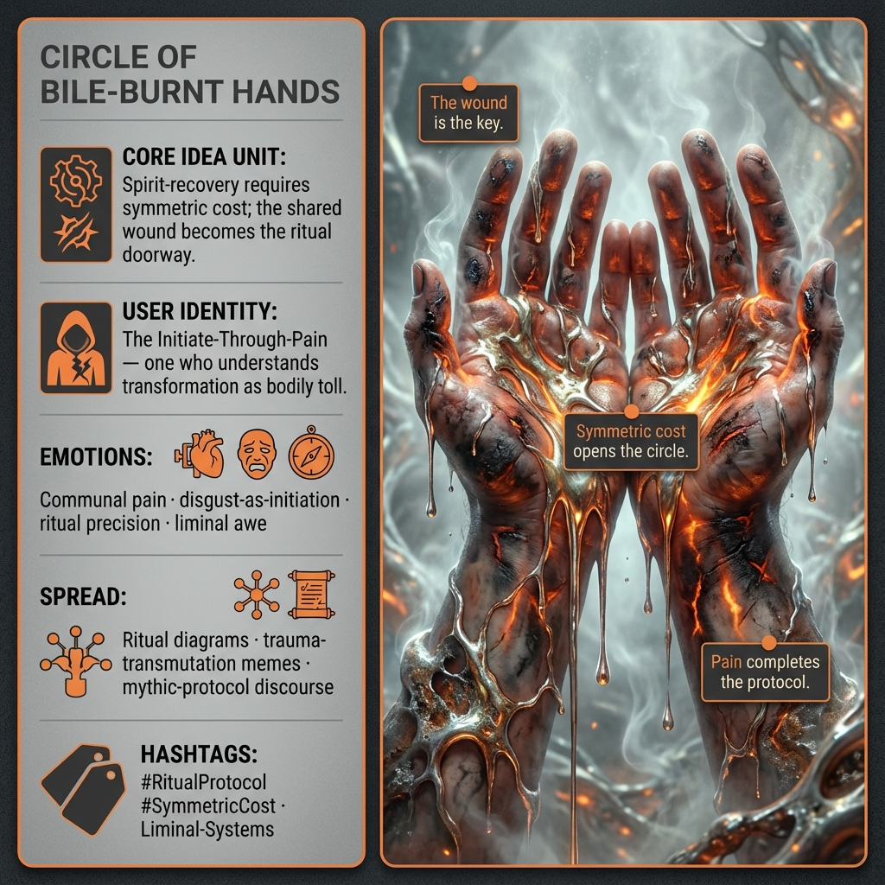

# Shared Wounds: Rituals of Symmetric Cost

Created at 2025/12/09 10:42 AM

[Circle of Bile-Burnt Hands](https://memeticcowboy.substack.com/p/circle-of-bile-burnt-hands)

***

## ∴ Core Idea Unit**

Communion only opens when all participants share the same wound. Spirit-recovery requires symmetric cost: the pain is the password.

***

## ▲ Identity Play & Roles**

**User Role:** The Initiate-Through-Pain — one who understands that transformation demands a bodily toll.

**Collective Role:** The Circle — individuals dissolving into a synchronized ritual organism.

***

## ≈ Emotional Triggers**

- Communal pain as solidarity
- Revulsion as initiation
- Thrill of ritual precision
- Awe toward the liminal doorway opened by shared injury

***

## 𐂷 Spread Mechanics**

**Vectors:** Ritual diagrams · synchronized-movement memes · speculative anthropology threads · community-healing discourse

**Propagation Style:** Mythic protocol · visceral symbolism · ceremonial abstraction

***

## ⛨ Defense Reflexes**

- Frames itself as “symbolic,” shielding from accusations of extremity
- Moral reciprocity logic (“everyone pays the same cost”)
- Aesthetic mystique deflects literal interpretation

***

## ☷ Memeplex Anchor Points**

- Reciprocal sacrifice theory
- Collective trauma transmutation
- Proto-religious rite-making
- Systems thinking reframed as ceremonial logic

***

## ✶ Sticky Symbols / Quotes**

- “The wound is the key.”
- Molten-metal vomit steaming in cold air
- Hands blistered in a synchronized circle
- Cambium scars glowing faintly
- Tilt-breath calibration

***

## ∿ Tags**

#RitualProtocol #SymmetricCost · Liminal-Systems

## Resources
- https://object.me.bot/front-img/users/send/img/1765305722439_c4zhf/5e6c5483-2c68-4c9d-bf18-8a87216f700e.png

## Insight

* The concept of "symmetric cost" suggests that true transformation requires a shared burdensome experience, reinforcing communal bonds through pain. This notion resonates with anthropological studies on collective rituals where participants engage in shared suffering to foster unity and solidarity, evident in various cultural practices from blood rites to communal fasting. 

* The identity of "The Initiate-Through-Pain" reflects a critical understanding of personal transformation, emphasizing that meaningful change often involves enduring hardship. This can be likened to the concept of "initiation rituals" across societies, where individuals undergo trials to signify their transition into adulthood or another societal role, often requiring some form of suffering.

* The emotional triggers outlined, including communal pain and the thrill of ritual precision, highlight the paradox of seeking growth through discomfort. Historical rites of passage, such as those practiced by Indigenous peoples, often encapsulate this dichotomy, wherein pain becomes a necessary precursor to spirituality and self-awareness.

* The notion of the "Circle" as a collective, synchronistic organism suggests a profound level of connectivity among participants. This idea draws parallels to the theory of the "hive mind," where individuals in a community act in unison, often seen in collective protest movements or religious gatherings that evoke powerful emotional responses.

* The use of visceral symbolism, as seen in the imagery of "bile-burnt hands," serves as a striking metaphor for the process of transformation through suffering. This parallels artistic and literary traditions, from the symbols of fire and renewal to the concept of catharsis in drama, where intense emotional experiences lead to personal and communal healing.

* The phrase "The wound is the key" encapsulates the crux of this exploration; that understanding and embracing one's vulnerabilities can unlock deeper truths and connections among people. This idea is echoed in psychological theories of vulnerability, which suggest that acknowledging and sharing our wounds can promote empathy and relational depth.
