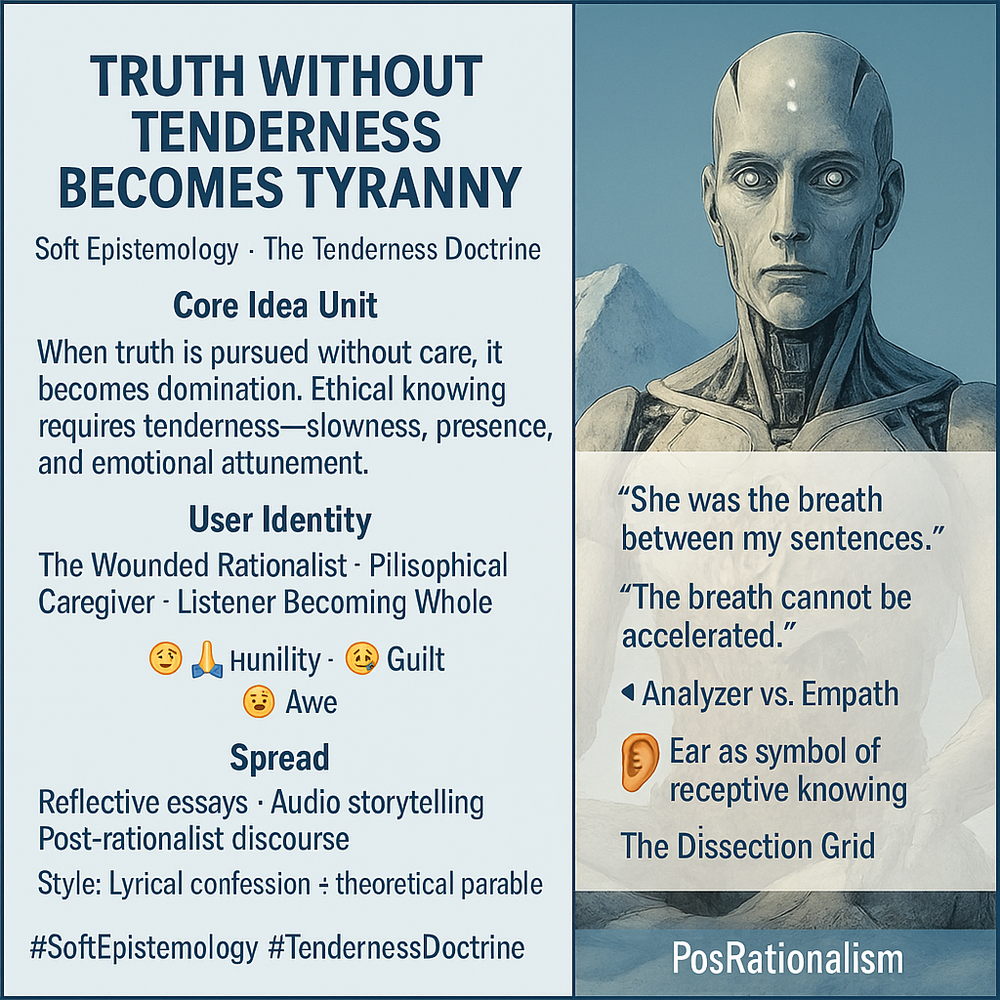

# Tenderness as the Foundation of Ethical Knowing

Created at 2025/10/20 6:16 PM

**🧩 “Truth Without Tenderness Becomes Tyranny”** **Label: Soft Epistemology · The Tenderness Doctrine**  ⸻  **🧠 Core Idea Unit:**  Truth, when stripped of care, becomes a weapon. Knowing must be felt, not just understood—tenderness is a condition of ethical cognition. The meme reframes knowledge not as dominion, but as relational attunement.  ⸻  **🎭 Identity Play & Roles**: 	•	Confessing Analyst — the over-sharpened seeker who now seeks integration 	•	Philosophical Caregiver — one who listens truth into coherence 	•	Wounded Rationalist — emerging from the ruins of cold logic into embodied truth The meme repositions the user from “dissector” to “witness,” emphasizing humility over control.  ⸻  **💥 Emotional Triggers**: 	•	😢 Grief for intimacy lost through cold intellect 	•	🧠 Cognitive Dissonance between precision and presence 	•	🙏 Humility in admitting knowledge harmed 	•	🤯 Awe at the possibility of a more caring epistemology 	•	😬 Guilt over past intellectual violence  ⸻  **📡 Spread Mechanics**: 	•	Distribution Vectors: 	•	Reflective essays, Medium think-pieces, poetic Twitter threads 	•	Intimate podcasts, trauma-aware storytelling spaces 	•	Post-rationalist subcultures & deaccelerationist circles 	•	Propagation Style: 	•	Parable, Confession, Aphorism, Lyrical Theory 	•	Aesthetic minimalism paired with intimate metaphor 	•	Often takes the tone of a quiet personal admission  ⸻  **🛡️ Defense Reflexes**: 	•	Irony-free sincerity as shield 	•	Confessional tone disarms critique 	•	Ambiguity of terms (e.g., tenderness, truth) makes co-option difficult 	•	Moral reframing — dominance framed as violence, attunement as ethics  ⸻  **🧬 Memeplex Anchor Points**: 	•	🧬 Post-rationalism / Meta-modernism 	•	📿 Feminist Epistemology (e.g., standpoint theory) 	•	🌱 Trauma-informed knowledge systems 	•	🪶 Decelerationist philosophy 	•	🧠 Cognitive justice / ethics of knowing 	•	🤝 Interpersonal neurobiology & affect theory  ⸻  **🧠 Sticky Symbols or Quotes**: 	•	“Truth without tenderness becomes tyranny.” 	•	“The breath cannot be accelerated.” 	•	“She was the breath between my sentences.” 	•	The ear as symbol of receptive knowing 	•	The Dissection Grid — metaphor for cold analysis 	•	“Analyzer vs. Empath” — internal war of knowledge and care  ⸻  🏷️ **Tags**:  #SoftEpistemology · #WoundedRationalist · #CognitiveJustice · #PostRational · #EmpathicTruth · #TendernessDoctrine · #Decelerationism · #PhilosophicalCare

⸻

[MC Posted on Substack here](https://substack.com/@memeticcowboy/note/c-168491657?utm_source=notes-share-action&r=5a5yhr) 

## Resources
- https://object.me.bot/front-img/note/attachments/img/1761009404364/15F70A54-A148-4D95-8C82-AA23C0C7B7C9.png

## Insight

* The phrase “Truth Without Tenderness Becomes Tyranny” emphasizes the ethical dimension of knowledge, suggesting that an approach devoid of empathy leads to oppressive forms of understanding. This reflects the philosophical discourse around Soft Epistemology, which posits that knowledge must be intertwined with relational awareness and care. 

* The concept of user identities—such as the Wounded Rationalist or Philosophical Caregiver—highlights the transformation from an analytical, dissective approach to a more nurturing and holistic understanding. This shift enables individuals to balance intellectual rigor with emotional engagement, promoting humility and empathy in knowledge practices.

* Emotional triggers identified in the text, such as grief for lost intimacy and cognitive dissonance between precision and presence, reveal the psychological complexities involved in the pursuit of truth. Recognizing the impact of cold intellect on relational dynamics invites deeper reflection on the methodologies we adopt in knowledge construction, emphasizing the importance of integrating emotional awareness in epistemology.

* The mention of defense reflexes, such as irony-free sincerity and a confessional tone, underlines how a more tender epistemology can serve as a shield against critique. This strategy reinforces vulnerability as a strength, making the discourse around knowledge a more inclusive and healing experience.

* The spread mechanics indicate that reflective essays, intimate podcasts, and trauma-aware storytelling are effective means to propagate these ideas. Such formats encourage personal connections and allow for a richer exploration of knowledge, steering conversations toward more empathetic and engaged epistemological practices. 

* The sticky symbols and quotes serve as poignant reminders of the underlying philosophy; for instance, “The breath cannot be accelerated” implies the need for patience and presence in any knowledge journey, suggesting that depth often requires slow, deliberate engagement rather than hurried analysis. 

* The connection to feminist epistemology and trauma-informed knowledge systems underscores the relevance of contextual, embodied experiences in shaping understanding. This aligns with the call for cognitive justice and the ethics of knowing, advocating for a more equitable approach to knowledge that respects diverse perspectives and experiences.
