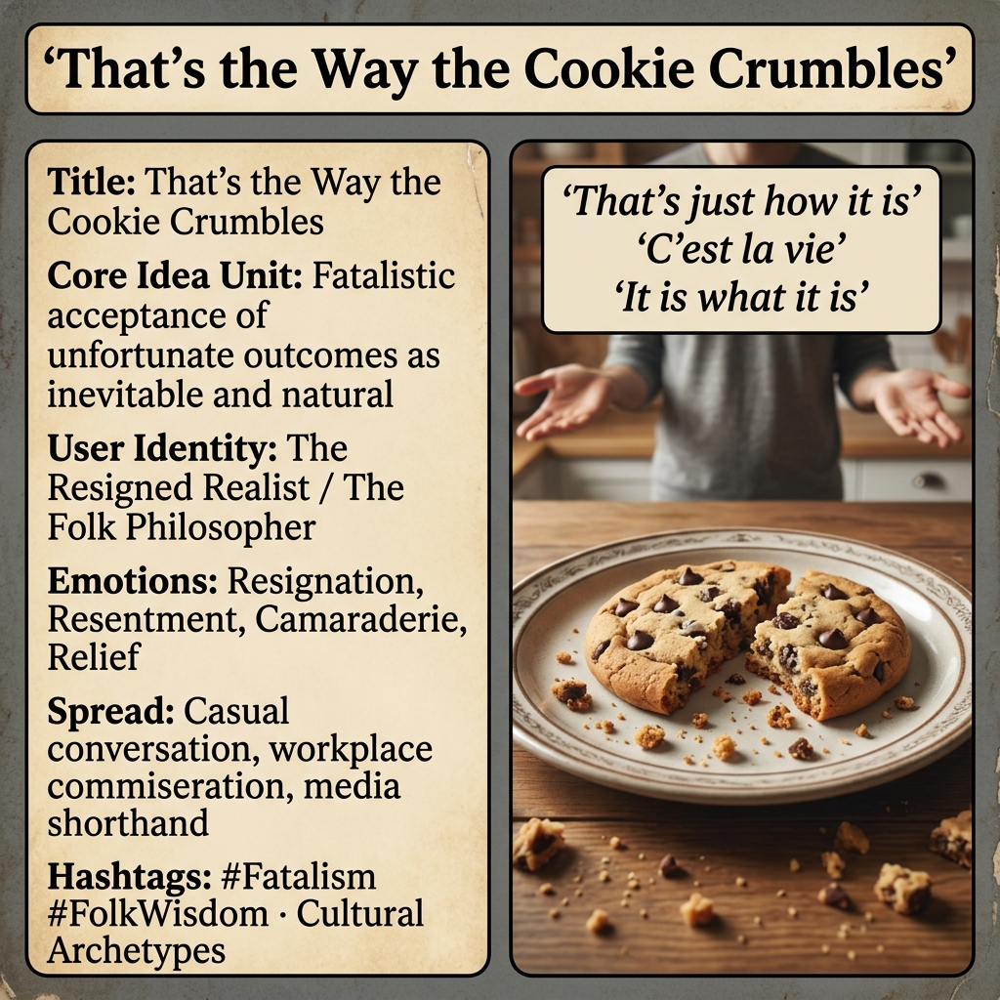

# That's the Way the Cookie Crumbles

Created at 2026/04/02 12:05 AM

### ◈ Mini-Memetic Profile

**🔶 That's the Way the Cookie Crumbles — Fatalism Dressed as Folk Wisdom**

### ∴ Core Idea Unit

- Unfortunate outcomes are inevitable, natural, and structurally unavoidable—acceptance is the only rational response.
- Externalizes causality: the cookie crumbles on its own; no agent is responsible, no system is accountable.
- Encodes a worldview where bad outcomes are cosmic constants rather than addressable problems. The crumbles aren't a bug; they're the nature of cookies.
- Resignation disguised as wisdom: "I've seen enough to know how things go" masks a surrender of agency.

### ▲ Identity Play & Roles

- **The Resigned Realist:** One who has "been around long enough" to know that effort doesn't guarantee outcomes. Uses the phrase to signal world-weariness as sophistication.
- **The Unbothered Bystander:** Detached from emotional investment. The crumbling cookie is observed, not felt. Aesthetic distance as emotional defense.
- **The Folk Philosopher:** Deploys aphorism to close conversation rather than engage. The cookie wisdom ends discussion; no need to analyze why this particular cookie crumbled.
- **The Preemptive Surrenderer:** Uses the phrase before attempting difficult things, inoculating against disappointment by refusing to hope.
- **The Complicit Accomplice:** When said to others, offers permission to give up. "That's just how it is" becomes "don't bother trying to change it."

### ≈ Emotional Triggers

- **Resignation** — the comfort of giving up, releasing the burden of effort
- **Resentment** — quietly blaming fate/structure while appearing accepting; the cookie didn't have to crumble, but saying so admits the system is rigged
- **Camaraderie** — shared commiseration ("we all know how this goes"); the crumbles bind the disappointed together
- **Relief** — permission to stop caring, stop trying, stop hoping; the crumbles are inevitable, so why invest?
- **Nostalgia** — invoking grandma's kitchen, simpler times when cookies crumbled naturally and we just accepted it

### 𐂷 Spread Mechanics

- **Distribution Vectors:**
    - Casual conversation, workplace commiseration, family dynamics
    - Media (film, TV) as shorthand for working-class fatalism or mobster resignation
    - Meme culture as absurdist detachment
    - Political discourse to dismiss structural critique ("some jobs just go overseas—that's the way the cookie crumbles")
- 
- **Propagation Style:**
    - Aphoristic compactness: six words, complete worldview
    - Domestic/folksy framing makes resignation feel homey rather than nihilistic
    - Finality: the phrase closes loops, ends stories, prevents follow-up
    - Humor softens the despair: cookies are funny; systemic failure is not

### ⛨ Defense Reflexes

- **Folksy inoculation:** "It's just an expression" deflects analysis of the worldview encoded
- **Appeal to nature:** Cookies naturally crumble, just as bad outcomes naturally happen; questioning the crumbliness is questioning nature itself
- **Reverse elitism:** "Only naive people think cookies don't crumble"; sophistication = accepting defeat
- **Conversation terminator:** Hard to respond to without seeming like you're arguing with a proverb

### ☷ Memeplex Anchor Points

- Protestant work ethic (hard work doesn't guarantee success, accept your lot)
- Stoicism (accept what you cannot control—ignoring that some crumblings are controllable)
- Capitalist realism (there is no alternative, the market crumbles as it will)
- Toxic positivity's shadow twin (instead of "everything happens for a reason," "some things happen for no reason—deal with it")
- Generational trauma transmission (grandparents who survived Depression teaching grandchildren not to expect too much)
- Absurdist/existentialist adjacent (the universe is indifferent—at least cookies taste good before they crumble)

### ✶ Sticky Symbols or Quotes

- "That's the way the cookie crumbles" (the complete phrase)
- "That's just how it is"
- "C'est la vie" (French cousin, more sophisticated)
- "Such is life" (Australian variant, more rugged)
- "It is what it is" (modern secular version, more corporate)
- "You win some, you lose some" (competition-framed variant)
- "Them's the breaks" (gambling/dice variant)
- Imagery: broken cookies, crumbs on a plate, shrugging figures, accepting gestures

### ∿ Tags

#Fatalism #FolkWisdom #Resignation #Aphorism #StructuralAcceptance #LearnedHelplessness #CopingMechanism #CrumblingCookie #WaySheGoes
