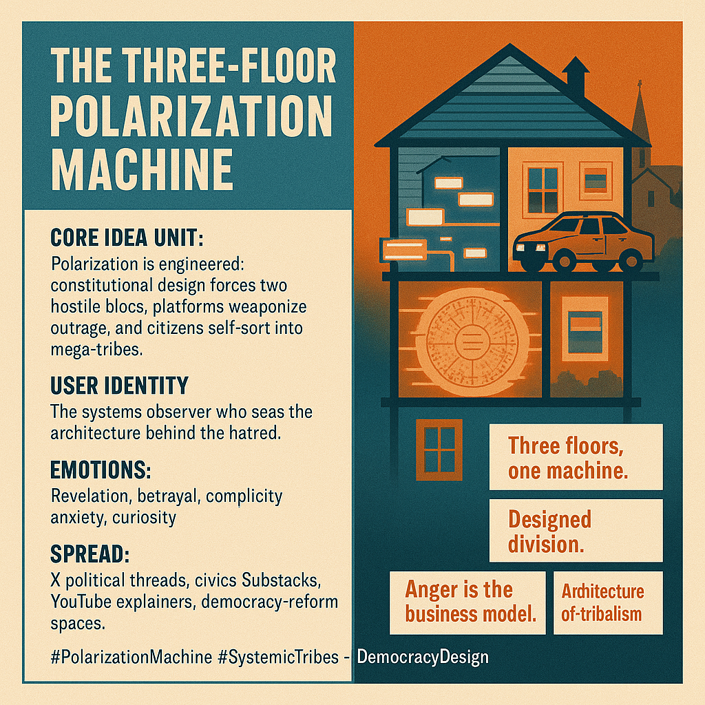

# Understanding the Engineered Structure of Polarization

Created at 2025/11/15 10:57 AM

**Mini-Memetic Profile: The Three-Floor Polarization Machine**  🧠 Core Idea Unit  Polarization isn’t an accident of culture but a manufactured structure: constitutional design forcing two hostile blocs, platforms weaponizing outrage, and citizens self-sorting into mega-tribes. The meme reframes division as an engineered system, not a moral failing.  🎭 Identity Play & Roles  Positions the reader as the clear-sighted systems observer — someone who sees beyond partisan scripts to diagnose the architecture behind the hatred. Casts extremists as unwitting cogs and platforms as accelerants.  💥 Emotional Triggers  🤯 Systemic revelation 😡 Betrayal by institutions 😬 Complicity anxiety (“we built the third floor”) 🧠 Curiosity about large-scale design failures  📡 Spread Mechanics  Distribution: X political threads, civics Substacks, YouTube explainers, civics-reform Discords. Propagation Style: Cool systemic autopsy; structural critique with a narrative hook (“three floors”). Easy to visualize, easy to argue about, easy to adapt.  🛡️ Defense Reflexes  • Uses structural inevitability (“Duverger’s Law”) as an armor against partisan rebuttal. • Frames polarization as design, making moralizing attacks feel beside the point. • Anticipates “just be nicer online” and counters with constitutional constraints.  🧬 Memeplex Anchor Points  📜 Constitutional design critique 🌐 Platform-capitalism criticism 🧬 Systemic polarization research ⚙️ Duverger’s Law 🧱 Institutional inertia / doom loops 🇺🇸 American exceptionalism deconstruction  🧠 Sticky Symbols or Quotes  • “Three floors, one machine.” • “Madison built the frame. Zuckerberg wired the anger. We furnished the tribalism.” • “Polarization isn’t a vibe — it’s an architecture.” • Visual metaphor: blueprint → data-center → split households. • Symbol: 🏛️🔥📱➡️🧠⚔️  🏷️ Tags  #PolarizationMachine · #SystemicTribes · #DoomLoop · #DemocracyDesign · #DuvergersLaw  ⸻  [x/Change w/RedearnMike and SIN](https://x.com/redfearnmike/status/1989761466178699601?s=46&t=7Z-E-ACnGlzdI-iyUwNCrQ)

## Resources
- https://object.me.bot/front-img/note/attachments/img/1763233060034/8FA8CFB5-C7DA-4FDD-84D8-87420188C605.png

## Insight

* The concept of polarization as an engineered structure invites deeper analysis into how political and social systems are designed. This perspective challenges the notion that division is a mere byproduct of human nature, suggesting instead that legal frameworks and platform algorithms can actively cultivate hostility among groups. Notably, referendums on constitutional design, like those seen in various democracies, can greatly influence the nature of political discourse and societal engagement.

* The idea of a "systems observer" empowers individuals to step back and critically assess the forces driving polarization. This position encourages public discourse to evolve from emotional reactions to informed critiques. Engaging in structural analysis of institutions and media platforms can lead to a more nuanced understanding of societal dynamics, similar to how scholars dissect the implications of Duverger’s Law on party systems which dictate how votes translate into political representation.

* Emotional triggers outlined—such as betrayal by institutions and complicity anxiety—are reflective of contemporary societal discontent. Historical movements against governmental authority, such as the Watergate scandal or the civil rights movement, illustrate how institutional betrayals can fuel civic unrest. Understanding these emotional undercurrents becomes crucial for both grassroots activists and policymakers seeking to mend a fragmented public.

* The propagation mechanics described here imply that digital platforms serve not just as information conduits but as key players in systems of polarization. The mechanics of social media algorithms—designed to maximize engagement often through emotionally charged content—echo dynamics seen in the rise of populist movements worldwide. Such insights highlight the need for media literacy and reform in digital spaces as vital components for fostering more civil discourse.

* The proposed symbols and phrases, such as "three floors, one machine," serve as powerful mnemonic devices. They capture the complexity of polarization and its underlying mechanisms through easily digestible imagery. This resonates with historical slogans that have had significant mobilizing effects, such as “No taxation without representation,” which encapsulated widespread discontent and organized action toward reform. Such metaphors can effectively drive conversations about democracy and the systemic forces at play.
