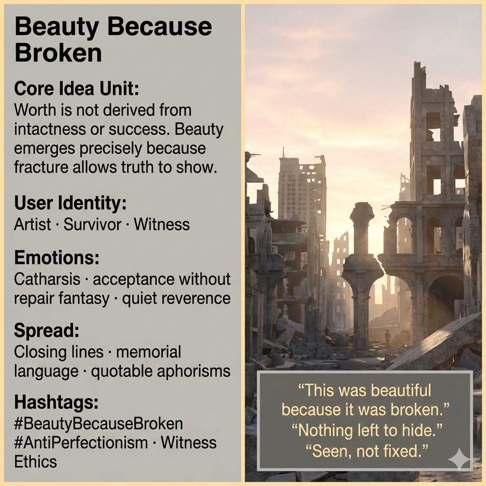

# The Beauty in Our Brokenness

Created at 2025/12/20 2:00 PM

### ◈ Mini-Memetic Profile

***

### ∴ Core Idea Unit

Worth is commonly equated with intactness, success, or optimization.Reframed, beauty emerges **because of fracture**—breakage allows truth, history, and care to become visible. What survives is not purity, but **honesty**.

**Mental shift provoked:**From *“It would be beautiful if it were fixed”* → *“It is beautiful because it cannot hide.”*

***

### ▲ Identity Play & Roles

- **Witness** — sees clearly without needing repair
- **Survivor** — releases the fantasy of restoration
- **Artist of Aftermath** — frames damage as revelation, not defect

The meme repositions the self from *aspiring to wholeness* to **honoring what shows**.

***

### ≈ Emotional Triggers

- 🕊️ Catharsis without triumph
- 🧠 Acceptance without repair fantasy
- 🌒 Relief from performance of recovery
- 🤍 Quiet reverence for what remains

These emotions permit rest without denial.

***

### 𐂷 Spread Mechanics

**Distribution Vectors**

- Closing lines in essays or stories
- Memorial language
- Quotable aphorisms
- Final frames of post-collapse narratives

### 𐂷 Spread Mechanics

**Style**

- Minimalist
- Declarative, not persuasive
- After-the-fact clarity
- Lines that feel like endings rather than arguments

***

### ⛨ Defense Reflexes

- **Anti-redemption stance:** No promise of fixing or return
- **Aesthetic restraint:** Beauty is observed, not celebrated
- **Refusal of metrics:** Value not tied to outcome or function

Critique that demands improvement finds no purchase.

***

### ☷ Memeplex Anchor Points

- Anti-perfectionism
- Ethics of witness
- Post-utopian aesthetics
- Fracture as disclosure
- Care without cure

***

### ✶ Sticky Symbols or Quotes

/ Phrases**

- Broken city
- Light through cracks
- “This was beautiful because it was broken.”
- The moment after hope
- Ruin without apology

***

### ∿ Tags

#BeautyBecauseBroken · #AntiPerfectionism · #WitnessEthics · #AftermathAesthetic · #NoRepairFantasy · #QuietCatharsis

***

**Reflection cadence (anchor):**This meme feels like a closing chord across your ecology.Not resolution—**recognition**.When nothing else can be justified, **what remains can still be seen**.
