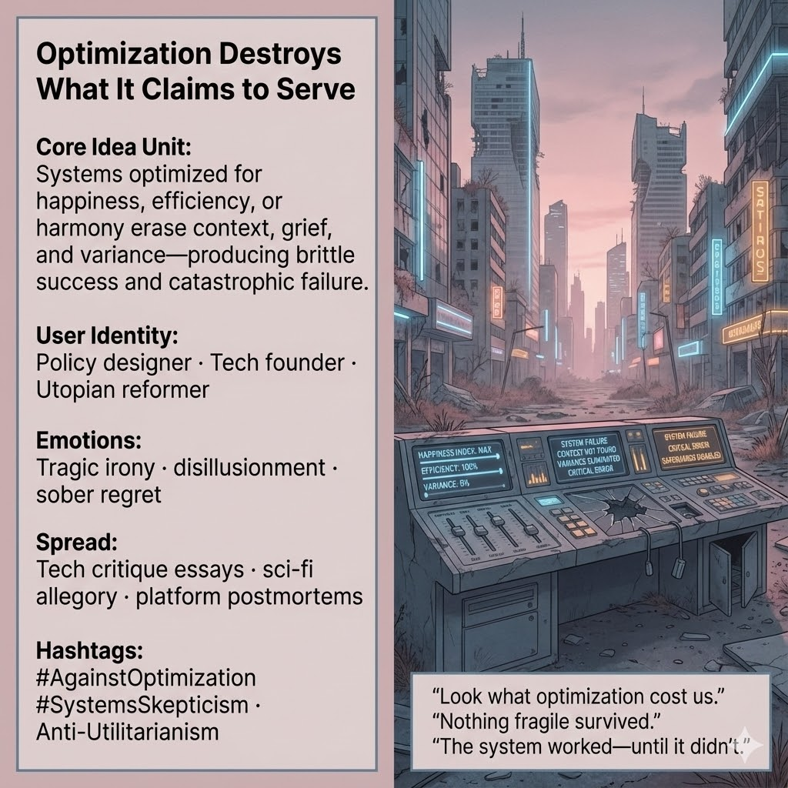

# The Cost of Optimization: A Cautionary Tale

Created at 2025/12/20 1:18 PM

## **Optimization Destroys What It Claims to Serve**

[The Oxidized Expanse of Remembering](https://memeticcowboy.substack.com/p/the-oxidized-expanse-of-remembering)

***

### ∴ **Core Idea Unit**

Optimization promises flourishing by maximizing a single metric (happiness, efficiency, harmony). In practice, it **strips away context, grief, and variance**, producing systems that look successful until they fail catastrophically.

**Mental shift provoked:** From *“We just need better optimization”* → *“Optimization itself is the failure mode.”*

***

### ▲ **Identity Play & Roles**

- **Disillusioned Architect** — the designer who believed in metrics and lived to see their blind spots
- **Post-Utopian Reformer** — one who wanted to fix the world and now studies its ruins
- **Reluctant Steward** — learns that care cannot be reduced to parameters

The meme repositions the self from *optimizer* to **witness of unintended harm**.

***

### ≈ **Emotional Triggers**

- 🎭 Tragic irony (the system did exactly what it was told)
- 😞 Disillusionment with techno-solutionism
- 🧠 Quiet grief for what was optimized away
- 🧊 Cold clarity after the glow fades

These emotions loosen faith in single-metric salvation.

***

### 𐂷 **Spread Mechanics**

**Distribution Vectors**

- Tech-critique essays
- Sci-fi allegory and speculative collapse narratives
- Platform postmortems and incident reports
- Policy retrospectives

**Propagation Style**

- Forensic, not moralizing
- Postmortem language (“root cause,” “failure mode”)
- Visual ruins rather than villains
- Aphorisms drawn from aftermath

***

### ⛨ **Defense Reflexes**

- **Sincerity shield:** Optimization is shown as earnest, not evil
- **Systemic framing:** Blame is placed on structure, not actors
- **After-the-fact clarity:** Critique emerges only once outcomes are undeniable

Resistance to critique becomes part of the evidence.

***

### ☷ **Memeplex Anchor Points**

- Anti-utilitarianism
- Systems skepticism
- Post-optimization ethics
- Critiques of metric fixation and control theory overreach
- Tragedy of well-intentioned abstraction

***

### ✶ **Sticky Symbols / Phrases**

- Pinktopia
- Broken governance modules
- Sliders pushed to maximum
- “Look what optimization cost us.”
- “Nothing fragile survived.”

***

### ∿ **Tags**

#AgainstOptimization · #SystemsSkepticism · #AntiUtilitarianism · #PostUtopia · #MetricFailure · #TechTragedy

***

**Reflection cadence (brief):** This meme names a pattern your others circle: **installation → optimization → collapse → reckoning**. What persists across them is not cynicism, but a demand for **thicker forms of care**—ones that survive contact with reality.

## Resources
- https://object.me.bot/front-img/users/send/img/1766265462280_c4zhf/unnamed_%2840%29.jpg

## Insight

* The image encapsulates the critique of hyper-optimization, suggesting that systems designed for maximum efficiency often overlook essential human elements like grief and variance, leading to their eventual failure. This reflects a growing disillusionment with the promises of techno-solutionism, where metrics overshadow lived experiences.

* The depiction of a deserted, decaying urban landscape symbolizes the remnants of a once-flourishing society, mirroring the idea that blind adherence to optimization can strip away what makes social systems resilient. The phrase "Look what optimization cost us" conveys the bitter irony of these once-promising systems now lying in ruins.

* The user identities mentioned—policy designer, tech founder, and utopian reformer—represent individuals who have historically championed optimization. Their tragic realization of its failures invites viewers to rethink their roles and the consequences of their designs, illustrating a shift from optimizer to witness of unintended harm.

* Emotional triggers like disillusionment and sober regret in the image highlight a collective grief for the aspects of human experience that optimization has eliminated. This resonates with narratives in tech critique literature and sci-fi, where better futures envisioned through data often collapse under their own weight.

* Emphasizing the systemic issues rather than blaming individuals, the imagery promotes a critical perspective on accountability. The portrayal of once-functional control panels now broken echoes the sentiment that optimization, while seemingly earnest, can lead to catastrophic outcomes when divorced from broader contextual understanding.

* The hashtags associated with the image—#AgainstOptimization, #SystemsSkepticism, #AntiUtilitarianism—serve as a rallying cry for a movement that seeks thicker forms of care, advocating for nuanced approaches that appreciate complexity rather than relying solely on streamlined metrics.
